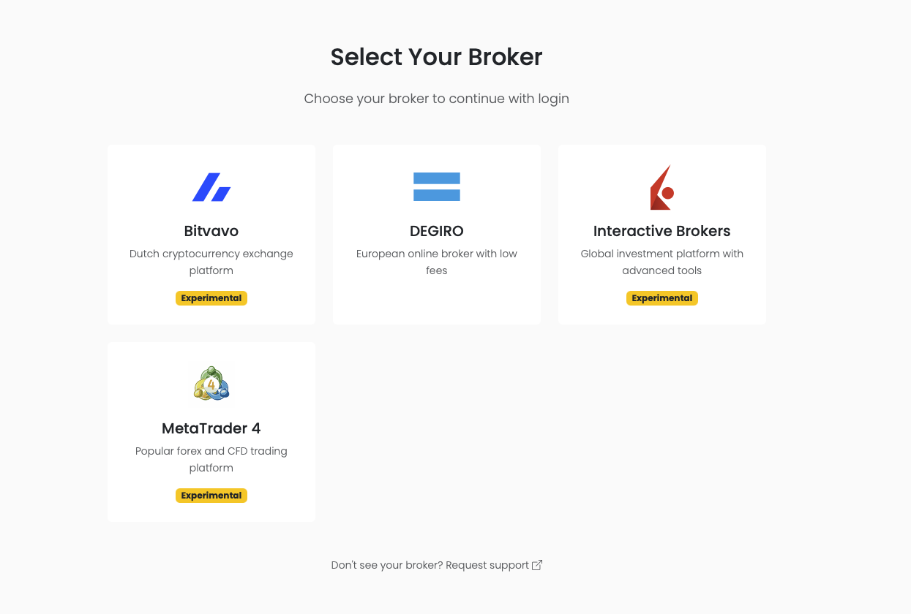
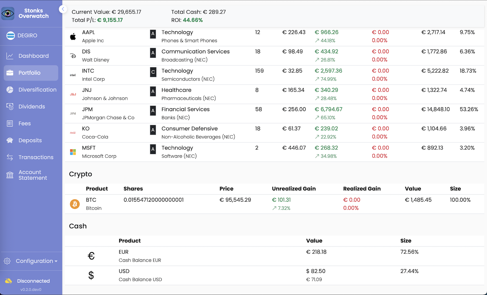
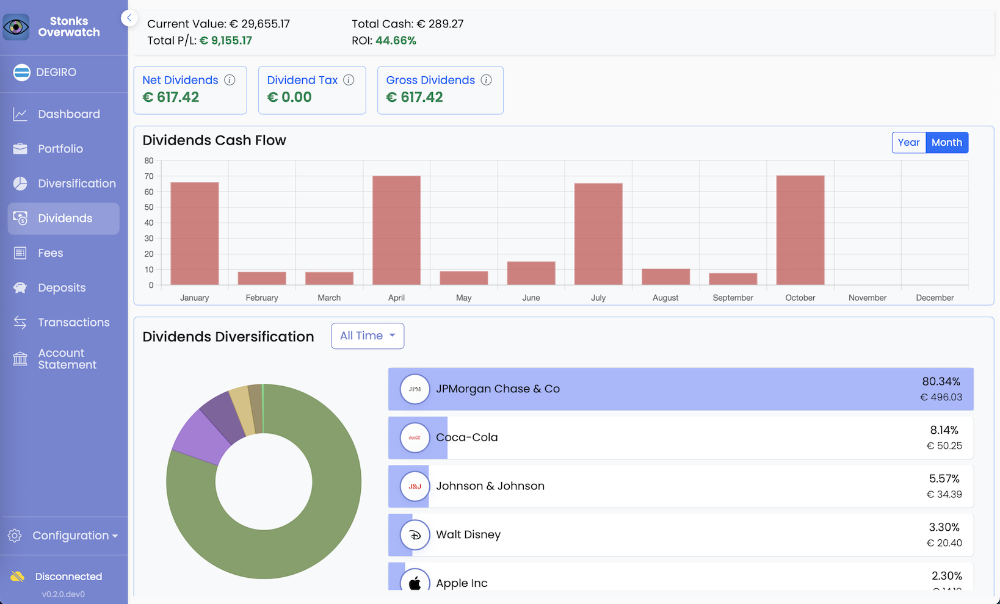
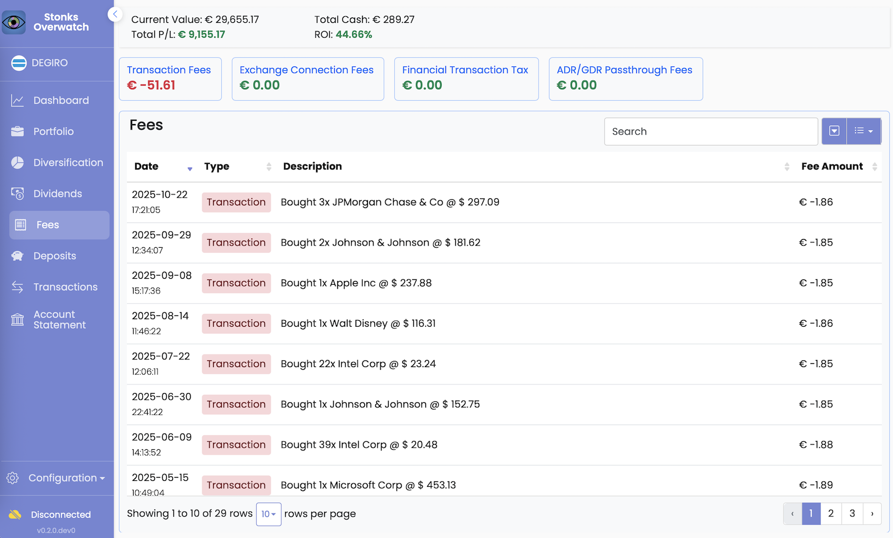

# Stonks Overwatch


**A privacy-first, open-source investment portfolio tracker**

[](https://opensource.org/licenses/MIT)
[](https://www.python.org/downloads/)
[](https://www.djangoproject.com/)
[](https://github.com/sponsors/ctasada)

[Quickstart](docs/Quickstart.md) • [Documentation](docs/Home.md) • [Contributing](CONTRIBUTING.md) • [Sponsor](https://github.com/sponsors/ctasada)

---

## Overview

**Stonks Overwatch** is an open-source investment dashboard that helps you track and manage your portfolio across multiple brokers. Built with privacy and extensibility in mind, all your data stays local on your machine—no cloud services, no data sharing.

### Why Stonks Overwatch?

- **🔒 Privacy First**: Your financial data never leaves your computer
- **📊 Multi-Broker Support**: Unified view across DEGIRO, Bitvavo, IBKR and more to come
- **🎯 Real-Time Tracking**: Live portfolio values, dividends, and performance metrics
- **🔌 Extensible Architecture**: Plugin system for adding new brokers
- **💻 Cross-Platform**: Available on Windows, macOS, and Linux (native and web versions)
- **🆓 100% Free**: No subscriptions, no hidden costs, no data selling

## Features

### Portfolio Management

- **Real-time portfolio tracking** with automatic updates
- **Multi-broker consolidation** for a unified view
- **Performance analytics** with historical data
- **Dividend tracking** and forecasting
- **Fee analysis** across all brokers
- **Asset diversification** visualization

### Supported Brokers

- **DEGIRO** - Full support with real-time data
- **Bitvavo (beta)** - Cryptocurrency exchange integration
- **IBKR (beta)** (Interactive Brokers) - International markets

### Technical Features

- **Local-first architecture** - All data stored locally
- **Modern web UI** - Built with Bootstrap and Charts.js
- **Native applications** - Desktop apps for all major platforms
- **Offline mode** - Work without internet connection
- **Automated backups** - Never lose your data
- **Demo mode** - Try it out with sample data

## Screenshots


*Broker Selector and login dialog.*

*Dashboard view showing portfolio overview and performance metrics.*

*Detailed portfolio breakdown with asset allocation and recent transactions.*

*Visual representation of asset diversification across different classes.*

*Dividend tracking and upcoming payments overview.*

*Calendar view of upcoming dividend payments.*

*Analysis of fees incurred across different brokers.*

## Quick Start

### Prerequisites

- Python 3.13 or higher
- Poetry 2.2.1 or higher (for development)
- Git

### Installation

1. **Clone the repository**

   ```bash
   git clone https://github.com/ctasada/stonks-overwatch.git
   cd stonks-overwatch
   ```

2. **Configure your brokers** (optional, can be done later)

   ```bash
   cp config/config.json.template config/config.json
   # Edit config.json with your broker credentials
   ```

3. **Install dependencies and start the application**

   ```bash
   make start
   ```

   This command will:
   - Install all Python and Node.js dependencies
   - Initialize the database
   - Collect static files
   - Start the development server

   The application will be available at [http://127.0.0.1:8000](http://127.0.0.1:8000)

> **Alternative**: If you prefer step-by-step setup, you can run `make install` first, then `make collectstatic migrate`, and finally `make run`. However, `make start` handles all of this automatically.

For detailed installation instructions, see the [Quickstart Guide](docs/Quickstart.md).

## Documentation

- **📘 [User Documentation](docs/Home.md)** - Complete guide to using Stonks Overwatch
- **🚀 [Quickstart Guide](docs/Quickstart.md)** - Get up and running in minutes
- **🖥️ [Desktop App Guide](docs/Application.md)** - Native application installation and updates
- **🔧 [Developer Guide](docs/Developing-Stonks-Overwatch.md)** - Contributing and development setup
- **🤖 [AI Agent Guide](AGENTS.md)** - Guidelines for AI assistants working on this project
- **🏦 Broker Setup**: [DEGIRO](docs/DEGIRO.md) • [Bitvavo](docs/Bitvavo.md) • [IBKR](docs/IBKR.md)
- **❓ [FAQ](docs/FAQ.md)** - Frequently asked questions

## Contributing

We welcome contributions from the community! Whether you're fixing bugs, adding features, or improving documentation, your help is appreciated.

- **🐛 [Report a Bug](https://github.com/ctasada/stonks-overwatch/issues/new?template=bug_report.md)** - Found an issue? Let us know
- **💡 [Request a Feature](https://github.com/ctasada/stonks-overwatch/issues/new?template=feature_request.md)** - Have an idea? Share it
- **👨‍💻 [Contribute Code](CONTRIBUTING.md)** - Ready to code? Check our guidelines
- **📝 [Improve Docs](CONTRIBUTING.md)** - Documentation improvements are always welcome

Please read our [Contributing Guidelines](CONTRIBUTING.md) and [Code of Conduct](CODE_OF_CONDUCT.md) before getting started.

## Community & Support

- **📚 [Documentation](docs/Home.md)** - Comprehensive guides and tutorials
- **💬 [Discussions](https://github.com/ctasada/stonks-overwatch/discussions)** - Ask questions and share ideas
- **🐛 [Issue Tracker](https://github.com/ctasada/stonks-overwatch/issues)** - Report bugs and request features
- **📧 [Email](mailto:carlos.tasada@gmail.com)** - Direct contact for sensitive issues

## Future Development

Stonks Overwatch is under active development. Planned features under consideration:

- Dynamic plugin architecture for brokers
- Mobile app support
- Advanced analytics and reporting
- Additional broker integrations
- Community-driven enhancements

Check the [CHANGELOG](CHANGELOG.md) for release history and [GitHub Issues](https://github.com/ctasada/stonks-overwatch/issues) to track upcoming features.

## License

Stonks Overwatch is released under the [MIT License](LICENSE). You're free to use, modify, and distribute this software.

## Acknowledgments

Built with these amazing open-source projects:
- [Django](https://www.djangoproject.com/) - Web framework
- [DEGIRO Connector](https://github.com/Chavithra/degiro-connector) - DEGIRO API client
- [Bitvavo API](https://github.com/bitvavo/python-bitvavo-api) - Bitvavo integration
- [iBind](https://github.com/Voyz/ibind) - IBKR API client
- [Bootstrap](https://getbootstrap.com/) - UI framework
- [Charts.js](https://www.chartjs.org/) - Data visualization

Special thanks to all [contributors](https://github.com/ctasada/stonks-overwatch/graphs/contributors) who help make this project better!

---

**⭐ If you find Stonks Overwatch useful, please star the project! ⭐**

Made with ❤️ by the Stonks Overwatch community

---

## ❤️ Why Sponsor Me?

Hi, I'm Carlos—the creator and maintainer of Stonks Overwatch. Let me share why I built this project and why your support matters.

### The Story Behind Stonks Overwatch

Like many investors, I found myself juggling multiple broker accounts—DEGIRO for stocks, Bitvavo for crypto, IBKR for international markets. Each broker had its own interface, its own way of presenting data, and none of them gave me the unified view I needed to truly understand my portfolio.

The commercial alternatives? They either charged monthly fees I couldn't justify, collected and sold my financial data, or required me to trust third-party cloud services with my most sensitive information. That didn't sit right with me.

So I built Stonks Overwatch—a privacy-first, open-source solution that runs entirely on your machine. Your data never leaves your computer. No subscriptions. No data selling. Just honest, transparent portfolio tracking.

### The Reality of Maintaining This Project

**Time Investment:** I spend a lot of my free time over the last year to build an improve Stonks Overwatch:
- Fixing bugs and responding to issues
- Improving the UI/UX based on feedback
- Writing documentation and guides
- Building native desktop applications for all platforms

**What I've Built So Far:**
- ✅ Full integration with DEGIRO (real-time data)
- ✅ Beta support for Bitvavo and IBKR
- ✅ Native desktop apps for Windows, macOS, and Linux
- ✅ Comprehensive portfolio analytics and visualization
- ✅ Dividend tracking and forecasting
- ✅ Fee analysis across all brokers
- ✅ Complete documentation and developer guides
- ✅ Plugin architecture design (ready for implementation)

**What's Coming Next:**
- 🚀 Dynamic plugin system for easy broker additions
- 📱 Mobile app support (iOS and Android)
- 📊 Advanced analytics and reporting
- 🔌 Community-driven broker plugins
- 🌍 Support for more international brokers
- ⚡ Performance optimizations and caching improvements

### What Sponsorship Enables

Your sponsorship directly enables me to:

1. **Dedicate More Time** - Currently, I work on this in evenings and weekends. Sponsorship would allow me to allocate more focused development time.

2. **Faster Broker Integrations** - Each new broker integration requires significant research, API exploration, testing, and documentation. Sponsorship helps prioritize these features.

3. **Better Infrastructure** - Covering costs for CI/CD, testing infrastructure, code signing certificates for native apps, and hosting for documentation.

4. **Community Growth** - Supporting community initiatives, hackathons, and contributor recognition programs.

5. **Long-term Sustainability** - Ensuring Stonks Overwatch remains free, open-source, and privacy-focused for years to come.

### Your Support Makes a Difference

Every contribution, no matter the size, helps sustain this project. Whether you're:
- A casual investor who found value in the tool
- A developer who appreciates the clean architecture
- Someone who believes in privacy-first software
- A company using Stonks Overwatch internally

Your sponsorship shows that open-source, privacy-focused tools matter—and that independent developers can build something meaningful without compromising on values.

### How to Support

**GitHub Sponsors** (Recommended):
👉 [Sponsor me on GitHub](https://github.com/sponsors/ctasada)

**Other Ways to Help:**
- ⭐ **Star the repository** - Helps others discover the project
- 🐛 **Report bugs** - Help improve stability
- 💡 **Suggest features** - Shape the roadmap
- 📝 **Contribute code** - See [Contributing Guide](CONTRIBUTING.md)
- 📢 **Share with others** - Spread the word

---

**Thank you for considering supporting Stonks Overwatch. Your sponsorship helps keep financial privacy accessible to everyone.** 🙏
