# Stonks Overwatch - Authentication Architecture

> **Audience:** Developers working on authentication systems
>
> **Purpose:** Detailed documentation of the authentication architecture, focusing on DEGIRO's complex authentication flows
>
> **Related Documentation:**
>
> - **[← Architecture Overview](ARCHITECTURE.md)** - System architecture and design patterns
> - **[← Broker Integration Guide](ARCHITECTURE_BROKERS.md)** - For implementing broker authentication
> - **[Pending Tasks →](PENDING_TASKS.md)** - Current improvements and technical debt

---

## Overview

This document describes the authentication architecture for broker integrations in Stonks Overwatch, featuring unified factory patterns, dependency injection, interface-based design, and performance optimizations.

**Primary Focus**: DEGIRO authentication (most complex implementation with TOTP and In-App authentication)

**Also Covers**: General authentication patterns applicable to all brokers

## Key Architecture Features

✅ **Factory Pattern with DI**: Unified AuthenticationFactory with automatic dependency injection
✅ **Interface-Based Design**: Type-safe contracts for all authentication services
✅ **Service Locator Optimization**: High-performance caching and access patterns
✅ **Centralized Registration**: Single-point service registration and configuration
✅ **Enhanced Error Handling**: Professional exception hierarchy and recovery mechanisms

> **📖 Context:** See [Architecture Overview](ARCHITECTURE.md#exception-management) for details on the exception hierarchy.

## Architecture

### Factory Architecture

The authentication system uses a sophisticated factory pattern with dependency injection:

```mermaid
graph TD
    subgraph "Authentication Architecture"
        AL["AuthenticationLocator<br/>🎯 Service Access"] --> AF["AuthenticationFactory<br/>🏭 Dependency Injection"]
        AS_SETUP["AuthenticationSetup<br/>⚙️ Service Registration"] --> AF

        AF --> ASM_I["SessionManagerInterface<br/>📄 Contract"]
        AF --> ACS_I["CredentialServiceInterface<br/>📄 Contract"]
        AF --> AS_I["AuthenticationServiceInterface<br/>📄 Contract"]

        ASM_I -.-> ASM["AuthenticationSessionManager<br/>💾 Implementation"]
        ACS_I -.-> ACS["AuthenticationCredentialService<br/>🔐 Implementation"]
        AS_I -.-> AS["AuthenticationService<br/>🎪 Implementation"]

        MW["DEGIROAuthMiddleware"] --> AL
        LV["Login View"] --> AL

        AS --> DS["DEGIROService<br/>🌐 API Client"]

        ASM --> SS["Session Storage<br/>💾 Django Sessions"]
        ACS --> DB["Database<br/>🗄️ BrokersConfiguration"]
        ACS --> CFG["Configuration Files<br/>📁 JSON/YAML"]

        DS --> API["DEGIRO API<br/>🌍 External Service"]
    end

    classDef factory fill:#e1f5fe,stroke:#01579b,stroke-width:2px
    classDef interface fill:#f3e5f5,stroke:#4a148c,stroke-width:2px
    classDef implementation fill:#e8f5e8,stroke:#1b5e20,stroke-width:2px
    classDef external fill:#fff3e0,stroke:#e65100,stroke-width:2px

    class AL,AF,AS_SETUP factory
    class ASM_I,ACS_I,AS_I interface
    class ASM,ACS,AS,MW,LV implementation
    class DS,API,SS,DB,CFG external
```



### Core Components

The authentication system consists of three main service layers:

1. **Service Factory Layer**: AuthenticationFactory with dependency injection
2. **Interface Layer**: Type-safe contracts for all services
3. **Implementation Layer**: Concrete service implementations

> **📖 Pattern Details:** See [Architecture Overview](ARCHITECTURE.md#3-factory-pattern) for more on the factory pattern implementation.

#### Service Interfaces

- **AuthenticationServiceInterface**: Main authentication contract
- **SessionManagerInterface**: Session management contract
- **CredentialServiceInterface**: Credential handling contract

### Service Responsibilities

#### AuthenticationService

- **Location**: `src/stonks_overwatch/services/utilities/authentication_service.py`
- **Purpose**: Main authentication orchestrator
- **Key Methods**:
  - `authenticate_user()`: Handle username/password authentication
  - `handle_totp_authentication()`: Handle 2FA flow
  - `handle_in_app_authentication()`: Handle in-app authentication flow
  - `check_degiro_connection()`: Verify DEGIRO connectivity
  - `logout_user()`: Clear authentication state

#### AuthenticationSessionManager

- **Location**: `src/stonks_overwatch/services/utilities/authentication_session_manager.py`
- **Purpose**: Session state management
- **Key Methods**:
  - `is_authenticated()`: Check authentication status
  - `store_credentials()`: Store credentials for TOTP flow
  - `get_credentials()`: Retrieve stored credentials
  - `set_totp_required()`: Manage 2FA state

#### AuthenticationCredentialService

- **Location**: `src/stonks_overwatch/services/utilities/authentication_credential_service.py`
- **Purpose**: Credential validation and storage
- **Key Methods**:
  - `validate_credentials()`: Validate credential format
  - `get_effective_credentials()`: Resolve credentials from multiple sources
  - `store_credentials_in_database()`: Handle "remember me" functionality

#### AuthenticationHelper

- **Location**: `src/stonks_overwatch/core/authentication_helper.py`
- **Purpose**: Centralized broker authentication readiness checks
- **Pattern**: Stateless utility class with class methods
- **Key Methods**:
  - `is_broker_ready()`: Check if broker is enabled and has valid credentials
  - `get_first_ready_broker()`: Find first broker ready for auto-authentication
  - `has_configured_brokers()`: Check if any brokers are usable
  - `clear_broken_session()`: Clean up invalid session state

The `AuthenticationHelper` provides a unified interface for checking broker authentication status across middleware and views. It encapsulates complex logic for determining if a broker is ready for use, eliminating duplication across the codebase.

**Architecture Position:**

The helper sits between the presentation layer (views/middleware) and the service layer (authentication services). It provides a simplified API for common authentication checks without requiring direct service instantiation.

```text
Views/Middleware
      ↓
AuthenticationHelper  ← Simplified API for readiness checks
      ↓
AuthenticationService ← Full service layer
      ↓
BrokerFactory/Configs
```

**Usage Pattern:**

```python
from stonks_overwatch.core.authentication_helper import AuthenticationHelper
from stonks_overwatch.constants import BrokerName

# Check if broker is ready for use
if AuthenticationHelper.is_broker_ready(BrokerName.DEGIRO):
    # Broker is enabled and has valid credentials
    pass

# Clear broken session data
AuthenticationHelper.clear_broken_session(request, BrokerName.DEGIRO)
```

**Generic Credential Support:**

The helper works with any broker's credential class through polymorphic validation. As of Task 39, authentication interfaces use generic `object` types for credentials instead of broker-specific types, supporting the future plugin architecture where each broker provides its own credential class.

### Service Access Patterns

#### Service Locator Pattern (Recommended)

The optimized service locator provides high-performance access with caching:

```python
from stonks_overwatch.core.authentication_locator import get_authentication_service

# Get cached service instance (optimal performance)
auth_service = get_authentication_service()
```

#### Factory Pattern (Advanced Usage)

Direct factory access for custom configurations or dependency injection:

```python
from stonks_overwatch.core.factories.authentication_factory import AuthenticationFactory

# Create factory instance (singleton)
factory = AuthenticationFactory()

# Get service with automatic dependency injection
auth_service = factory.get_authentication_service()

# Custom configuration injection
auth_service = factory.get_authentication_service(config=custom_config)
```

#### Interface-Based Usage (Type Safety)

All services implement interfaces for type safety and testing:

```python
from stonks_overwatch.core.interfaces.authentication_service import AuthenticationServiceInterface

def process_authentication(auth_service: AuthenticationServiceInterface):
    # Guaranteed to have all required methods
    result = auth_service.authenticate_user(request, username, password)
    return result
```

## Authentication Flows

### Initial Authentication Flow

1. **User submits credentials** → Login View
2. **Extract and validate** → AuthenticationCredentialService
3. **Store in session** → AuthenticationSessionManager
4. **Attempt DEGIRO connection** → DEGIROService
5. **Handle result** → AuthenticationService

### TOTP (2FA) Flow

1. **DEGIRO returns TOTP required** → AuthenticationService
2. **Store credentials and set TOTP flag** → Session Manager
3. **Redirect with preserved session** → Middleware
4. **User submits 2FA code** → Login View
5. **Retrieve stored credentials** → Session Manager
6. **Complete authentication** → DEGIROService

### In-App Authentication Flow

When 2FA is not enabled, DEGIRO automatically triggers In-App authentication requiring mobile app confirmation:

1. **DEGIRO returns In-App auth required** → AuthenticationService detects `status == 12` or `inAppTOTPNeeded`
2. **Store credentials with in_app_token** → Session Manager stores token from error details
3. **Set in_app_auth_required flag** → Session Manager sets UI state
4. **Redirect to login with In-App UI** → Middleware preserves session
5. **User sees "Open DEGIRO app" message** → Login template shows waiting UI
6. **JavaScript auto-submits form** → Browser automatically posts `in_app_auth=true`
7. **View delegates to service** → Login View calls `auth_service.handle_in_app_authentication()`
8. **Service orchestrates authentication** → AuthenticationService handles the complete flow
9. **Service uses DEGIROService** → Proper service layer integration with credential management
10. **Continuous polling** → `_wait_for_in_app_confirmation()` calls `degiro_service.connect()` every 5 seconds
11. **Check connection status** → Handle different error statuses:
    - `status == 3`: Continue waiting (user hasn't confirmed yet)
    - Success: Get session ID via `degiro_service.get_session_id()`
    - Other errors: Unrecoverable, show error
12. **On success** → Service clears session flags, sets authenticated, returns session ID
13. **On error** → Service clears session state, returns error response

### Connection Check Flow (Middleware)

1. **Check if authenticated** → Session Manager
2. **If not authenticated, check DEGIRO** → AuthenticationService
3. **Handle TOTP/In-App/errors** → Preserve or clear session
4. **Allow or redirect** → Based on result

## In-App Authentication

### Overview

In-App authentication is DEGIRO's security mechanism that requires users to confirm login attempts through their mobile app. This feature is automatically enabled when traditional 2FA (TOTP) is not configured on the account.

### Technical Architecture

#### Error Detection

The system detects In-App authentication requirements through DEGIRO API responses:
- **Status Code**: `error_details.status == 12`
- **Status Text**: `error_details.status_text == "inAppTOTPNeeded"`
- **In-App Token**: `error_details.in_app_token` contains the authentication token

#### Session Management

```python
# Storing In-App authentication state
self.session_manager.store_credentials(
    request=request,
    username=username,
    password=password,
    in_app_token=degiro_error.error_details.in_app_token,
    remember_me=remember_me
)
self.session_manager.set_in_app_auth_required(request, True)
```

#### UI State Management

The login template supports four states:
- **Initial**: Username/password form
- **TOTP**: 2FA code input
- **In-App**: Waiting for mobile app confirmation
- **Loading**: Portfolio update in progress

#### Waiting Loop Implementation

```python
def _wait_for_in_app_confirmation(self, credentials) -> Optional[str]:
    """Wait for user confirmation in DEGIRO mobile app."""
    # Create credentials with in_app_token
    degiro_credentials = DegiroCredentials(
        username=credentials.username,
        password=credentials.password,
        in_app_token=credentials.in_app_token,
        # ... other fields
    )

    # Initialize DEGIROService with credentials
    credentials_manager = CredentialsManager(degiro_credentials)
    self.degiro_service.set_credentials(credentials_manager)

    while True:
        sleep(5)  # Wait 5 seconds between attempts
        try:
            self.degiro_service.connect()
            # Get session ID using service method
            session_id = self.degiro_service.get_session_id()
            return session_id  # Success - return session ID
        except DeGiroConnectionError as retry_error:
            if retry_error.error_details.status == 3:
                continue  # Still waiting for confirmation
            else:
                raise retry_error  # Unrecoverable error
```

### Error Status Codes

| Status | Meaning | Action |
|--------|---------|---------|
| `3` | Waiting for user confirmation | Continue polling |
| `12` | In-App authentication required | Start In-App flow |
| `4` | Account blocked | Show error, stop |
| Other | Various authentication errors | Show error, stop |

### User Experience Flow

1. **Login Form**: User enters username/password
2. **API Response**: DEGIRO returns In-App auth required
3. **UI Update**: Page shows "Open the DEGIRO app" message with spinner
4. **Auto-Submit**: JavaScript automatically submits form with `in_app_auth=true`
5. **Backend Polling**: Server starts 5-second polling loop
6. **Mobile Confirmation**: User approves login in DEGIRO mobile app
7. **Success**: Automatic redirect to dashboard with portfolio update

### Implementation Files

#### Authentication Service

**Path**: `src/stonks_overwatch/services/utilities/authentication_service.py`

**Methods**:
- `handle_in_app_authentication()` - Main orchestration method
- `_wait_for_in_app_confirmation()` - Polling loop implementation
- `_handle_in_app_auth_required_error()` - Error handler

**Integration**: Uses DEGIROService for proper service layer integration

#### Login View

**Path**: `src/stonks_overwatch/views/login.py`

**Methods**:
- `_handle_in_app_authentication()` - Delegates to service layer (UI concerns only)

#### Session Manager

**Path**: `src/stonks_overwatch/services/utilities/authentication_session_manager.py`

**Methods**:
- `set_in_app_auth_required()` - Set UI state flag
- `is_in_app_auth_required()` - Check UI state flag
- `store_credentials()` - Store token with credentials

#### Template

**Path**: `src/stonks_overwatch/templates/login.html`

**Features**: In-App UI section with spinner and auto-submit logic

#### Middleware

**Path**: `src/stonks_overwatch/middleware/degiro_auth.py`

**Responsibilities**: Handles In-App auth redirects and session preservation

### Security Considerations

- **Token Storage**: In-App tokens are stored temporarily in session only
- **Session Cleanup**: Tokens are cleared on successful authentication or errors
- **Timeout Handling**: Relies on DEGIRO API timeout behavior
- **Error Recovery**: Unrecoverable errors clear session and return to login form

### Testing In-App Authentication

#### Unit Testing Approach

The architecture enables testing by mocking service dependencies:

```python
# Test service layer method
def test_handle_in_app_authentication_success(self):
    # Setup credentials with in_app_token
    credentials = DegiroCredentials("user", "pass", in_app_token="token123")
    self.mock_session_manager.get_credentials.return_value = credentials

    # Mock service method to return session ID
    with patch.object(self.auth_service, "_wait_for_in_app_confirmation") as mock_wait:
        mock_wait.return_value = "session_456"

        result = self.auth_service.handle_in_app_authentication(self.request)

        assert result.is_success
        assert result.session_id == "session_456"

# Test waiting loop with retry behavior
def test_wait_for_in_app_confirmation_with_retry(self):
    # Mock DEGIROService to simulate retry scenario
    self.mock_degiro_service.connect.side_effect = [
        DeGiroConnectionError("Still waiting", error_status_3),
        None  # Success on second call
    ]
    self.mock_degiro_service.get_session_id.return_value = "session_after_retry"
```

## Error Handling

### Standardized Error Messages

All error messages are centralized in `src/stonks_overwatch/utils/core/constants.py`:

- `AuthenticationErrorMessages`: User-facing error messages
- `LogMessages`: Internal logging messages

> **📖 Related:** See [Architecture Overview](ARCHITECTURE.md#exception-management) for the complete exception hierarchy.

### Authentication Results

The system uses an enum-based result system:

```python
class AuthenticationResult(Enum):
    SUCCESS = "success"
    TOTP_REQUIRED = "totp_required"
    IN_APP_AUTH_REQUIRED = "in_app_auth_required"
    INVALID_CREDENTIALS = "invalid_credentials"
    CONNECTION_ERROR = "connection_error"
    MAINTENANCE_MODE = "maintenance_mode"
    CONFIGURATION_ERROR = "configuration_error"
```

### Generic Credential Types (Task 39 Enhancement)

**Important**: As of Task 39, authentication interfaces use generic `object` types for credentials instead of broker-specific types (e.g., `DegiroCredentials`). This change supports the plugin architecture where each broker provides its own credential class.

**Before (broker-specific):**

```python
def handle_authentication_error(
    self, request: HttpRequest, error: Exception,
    credentials: Optional[DegiroCredentials] = None  # ← Broker-specific!
) -> AuthenticationResponse:
```

**After (generic, plugin-ready):**

```python
def handle_authentication_error(
    self, request: HttpRequest, error: Exception,
    credentials: Optional[object] = None  # ← Generic!
) -> AuthenticationResponse:
```

**Benefits:**
- **Plugin Support**: New brokers can provide custom credential classes without modifying core interfaces
- **Type Safety**: Polymorphic validation through `has_minimal_credentials()` method
- **Flexibility**: Each broker implements its own credential validation logic
- **Future-Proof**: Aligns with the plugin architecture proposal (see [PLUGIN_ARCHITECTURE.md](PLUGIN_ARCHITECTURE.md))

**Validation Pattern:**

The `CredentialValidator` now supports polymorphic validation:

```python
# Credential classes can implement their own validation
class BitvavoCredentials(BaseCredentials):
    def has_minimal_credentials(self) -> bool:
        return bool(self.api_key and self.api_secret)

# Validator delegates to credential object
if hasattr(credentials, "has_minimal_credentials"):
    if not credentials.has_minimal_credentials():
        return False
```

## Service Registration

### Authentication Service Setup

The architecture uses centralized service registration:

```python
# From: src/stonks_overwatch/core/authentication_setup.py
from stonks_overwatch.core.authentication_setup import register_authentication_services

def register_authentication_services():
    """Register all authentication services with dependency injection."""
    auth_factory = AuthenticationFactory()

    # Register service implementations with interfaces
    auth_factory.register_session_manager(AuthenticationSessionManager)
    auth_factory.register_credential_service(AuthenticationCredentialService)
    auth_factory.register_authentication_service(AuthenticationService)
```

### Factory Benefits

✅ **Automatic Dependency Injection**: Services receive dependencies automatically
✅ **Interface Compliance**: Type-safe service contracts enforced
✅ **Performance Caching**: Service instances cached for optimal performance
✅ **Memory Management**: Efficient cache management and cleanup
✅ **Configuration Support**: Optional configuration injection for customization

### Service Lifecycle

1. **Registration**: Services registered with factory at startup
2. **Creation**: Services created with automatic dependency injection
3. **Caching**: Instances cached for performance optimization
4. **Access**: High-performance access through service locator
5. **Cleanup**: Automatic cache management and memory optimization

## Configuration

### Credential Sources (Priority Order)

1. **Session**: Stored during authentication for TOTP and In-App flows
2. **Database**: "Remember me" credentials (BrokersConfiguration)
3. **Configuration**: Default credentials from config files

### Database Schema

Credentials are stored in the `BrokersConfiguration` model:

```python
class BrokersConfiguration(models.Model):
    broker_name = models.CharField(max_length=50, unique=True)
    is_enabled = models.BooleanField(default=True)
    credentials = models.JSONField()  # Encrypted credential storage
```

## Implementing Authentication for New Brokers

When adding authentication to a new broker:

1. **Simple API Key Authentication** (like Bitvavo):
   - Store credentials in configuration
   - Pass to broker client during initialization
   - No complex flows needed

2. **Session-Based Authentication** (like DEGIRO):
   - Consider using/extending `AuthenticationService` patterns
   - Implement session management if needed
   - Handle authentication errors appropriately

3. **OAuth/Token-Based**:
   - Implement token refresh logic
   - Store tokens securely
   - Handle expiration and renewal

> **📖 Getting Started:** See [Broker Integration Guide](ARCHITECTURE_BROKERS.md#advanced-features) for authentication implementation examples.

## Maintenance Guidelines

### Adding New Authentication Methods

1. Extend `AuthenticationService` with new method
2. Add corresponding error handling
3. Update session manager if new state is needed
4. Add tests for new flow

### Debugging Authentication Issues

1. **Check logs**: All authentication operations are logged
2. **Session state**: Use session manager to inspect current state
3. **Credential resolution**: Verify which source is being used
4. **Connection status**: Check DEGIRO API connectivity

### Performance Considerations

- Services are cached through the service locator
- Database queries are minimized through credential caching
- Session operations are optimized for frequent access

### Security Notes

- Passwords are never logged or exposed in debug output
- Session credentials are cleared on logout
- Database credentials are encrypted in storage
- TOTP codes are not persisted beyond the authentication flow
- In-App tokens are temporary and session-only

## Troubleshooting

### General Authentication Issues

1. **"Username and Password required" during TOTP**: Check credential storage in session
2. **Session cleared unexpectedly**: Verify middleware preserve_session logic
3. **Database credentials not working**: Check BrokersConfiguration table
4. **TOTP form not showing**: Verify session TOTP flag is set

### In-App Authentication Issues

1. **"No in-app token found"**: Check that In-App auth was properly triggered and token stored
2. **Infinite waiting**: User may need to check DEGIRO mobile app for notification
3. **Connection timeouts**: Network issues or DEGIRO API problems
4. **Service layer errors**: Check that DEGIROService is properly initialized and configured

### Debug Commands

#### General Authentication Status

```python
from stonks_overwatch.core.authentication_locator import get_authentication_service, get_authentication_cache_status

# Check authentication status
auth_service = get_authentication_service()
status = auth_service.get_authentication_status(request)
print(f"Auth Status: {status}")

# Inspect session data (passwords masked for security)
session_data = auth_service.session_manager.get_session_data(request)
print(f"Session authenticated: {session_data.get('is_authenticated')}")
print(f"TOTP required: {session_data.get('totp_required')}")
print(f"Session ID: {session_data.get('session_id')}")  # Partially masked

# Check credential sources (returns tuple)
has_session, has_database, has_config = auth_service.credential_service.get_credential_sources(request)
print(f"Credential sources - Session: {has_session}, Database: {has_database}, Config: {has_config}")

# Monitor service locator performance
cache_status = get_authentication_cache_status()
print(f"Cache performance: {cache_status}")
```

#### In-App Authentication Debug

```python
# Check In-App session state
session_data = auth_service.session_manager.get_session_data(request)
print(f"In-App required: {session_data.get('in_app_auth_required')}")

# Check stored credentials include token
credentials = auth_service.session_manager.get_credentials(request)
print(f"Has in-app token: {bool(credentials and credentials.in_app_token)}")

# Test service layer method
result = auth_service.handle_in_app_authentication(request)
print(f"Service result: {result.result}")
print(f"Session ID: {result.session_id}")
```

---

## Additional Resources

### Related Documentation

- **[← Architecture Overview](ARCHITECTURE.md)** - Core architecture concepts and patterns
- **[← Broker Integration Guide](ARCHITECTURE_BROKERS.md)** - Implementing broker services
- **[Pending Tasks →](PENDING_TASKS.md)** - Current improvements and technical debt

### Implementation References

- **DEGIRO Authentication**: Most complex implementation with all flows
- **Bitvavo Authentication**: Simple API key example
- **IBKR Authentication**: Session-based example

---

*Last Updated: November 2025*
