# Stonks Overwatch - Broker Integration Guide

> **Audience:** Developers integrating new brokers
>
> **Purpose:** Step-by-step instructions for adding a new broker integration
>
> **Related Documentation:**
>
> - **[← Architecture Overview](ARCHITECTURE.md)** - System architecture and design patterns
> - **[Authentication Architecture →](ARCHITECTURE_AUTHENTICATION.md)** - For implementing authentication flows
> - **[Pending Tasks →](PENDING_TASKS.md)** - Current improvements and technical debt

---

## Overview

This guide provides step-by-step instructions for integrating a new broker into Stonks Overwatch. The system uses a broker registry and factory pattern that dramatically simplifies the broker addition process.

**Time to integrate a new broker**: 2-4 hours

## Prerequisites

Before starting, familiarize yourself with:

- **[Architecture Overview](ARCHITECTURE.md)** - Understand core concepts
- Service-oriented design principles
- Django ORM basics
- Python dependency injection patterns

## Architecture Summary

The broker architecture consists of:

- **BrokerRegistry**: Central registry for broker configurations and services
- **BrokerFactory**: Factory for creating broker configurations and services with automatic dependency injection
- **Configuration-Driven Registration**: Declarative broker definitions in a single location
- **Service Interfaces**: Type-safe contracts that all broker services must implement
- **Logger Constants**: Centralized logging patterns for consistent debugging across modules

> **📖 Deep Dive:** See [Architecture Overview](ARCHITECTURE.md#broker-factory) for detailed information on the factory pattern.

## Architecture Diagram

The following diagram illustrates how all components work together and where your new broker fits into the system:

```mermaid
graph TB
    %% Core Architecture Components
    subgraph "Core Architecture"
        BR[BrokerRegistry<br/>📋 Central Registry]
        BF[BrokerFactory<br/>🏭 Service Creator]
        BR --> BF
    end

    %% Configuration Layer
    subgraph "Configuration Layer"
        BC[BaseConfig<br/>🔧 Base Class]
        DegiroC[DegiroConfig<br/>🇳🇱 DeGiro]
        BitvavoC[BitvavoConfig<br/>₿ Bitvavo]
        IbkrC[IbkrConfig<br/>📈 IBKR]
        NewC[NewBrokerConfig<br/>➕ Your Broker]

        BC -.-> DegiroC
        BC -.-> BitvavoC
        BC -.-> IbkrC
        BC -.-> NewC
    end

    %% Service Interfaces
    subgraph "Service Interfaces"
        PSI[PortfolioServiceInterface<br/>📊 Portfolio Contract]
        TSI[TransactionServiceInterface<br/>💸 Transaction Contract]
        ASI[AccountServiceInterface<br/>👤 Account Contract]
        DSI[DepositServiceInterface<br/>💰 Deposit Contract]
        DivSI[DividendServiceInterface<br/>💵 Dividend Contract]
        FSI[FeeServiceInterface<br/>💳 Fee Contract]
    end

    %% Service Implementations
    subgraph "DeGiro Services"
        DegiroP[DeGiroPortfolioService]
        DegiroT[DeGiroTransactionService]
        DegiroA[DeGiroAccountService]
        DegiroD[DeGiroDepositService]
        DegiroDiv[DeGiroDividendService]
        DegiroF[DeGiroFeeService]

        PSI -.-> DegiroP
        TSI -.-> DegiroT
        ASI -.-> DegiroA
        DSI -.-> DegiroD
        DivSI -.-> DegiroDiv
        FSI -.-> DegiroF
    end

    subgraph "Bitvavo Services"
        BitvavoP[BitvavoPortfolioService]
        BitvavoT[BitvavoTransactionService]
        BitvavoA[BitvavoAccountService]
        BitvavoD[BitvavoDepositService]
        BitvavoDiv[BitvavoDividendService]
        BitvavoF[BitvavoFeeService]

        PSI -.-> BitvavoP
        TSI -.-> BitvavoT
        ASI -.-> BitvavoA
        DSI -.-> BitvavoD
        DivSI -.-> BitvavoDiv
        FSI -.-> BitvavoF
    end

    subgraph "Your New Broker Services"
        NewP[NewBrokerPortfolioService<br/>➕ Implement This]
        NewT[NewBrokerTransactionService<br/>➕ Implement This]
        NewA[NewBrokerAccountService<br/>➕ Implement This]
        NewD[NewBrokerDepositService<br/>➕ Optional]

        PSI -.-> NewP
        TSI -.-> NewT
        ASI -.-> NewA
        DSI -.-> NewD
    end

    %% Registration Process
    subgraph "Registration Setup"
        RS[registry_setup.py<br/>🔗 BROKER_CONFIGS]
        RS --> BR
    end

    %% Application Flow
    subgraph "Application Flow"
        App[Application Startup<br/>🚀 Initialize]
        Agg[Aggregator Services<br/>📊 Business Logic]
        Views[Web Views<br/>🌐 UI Layer]

        App --> RS
        BF --> Agg
        Agg --> Views
    end

    %% Configuration Registration
    DegiroC --> RS
    BitvavoC --> RS
    IbkrC --> RS
    NewC --> RS

    %% Service Registration
    DegiroP --> RS
    BitvavoP --> RS
    NewP --> RS

    %% Dependency Injection
    BF -.->|"Auto-inject config"| DegiroP
    BF -.->|"Auto-inject config"| BitvavoP
    BF -.->|"Auto-inject config"| NewP

    %% Styling
    classDef coreClass fill:#e1f5fe,stroke:#01579b,stroke-width:2px
    classDef configClass fill:#f3e5f5,stroke:#4a148c,stroke-width:2px
    classDef interfaceClass fill:#e8f5e8,stroke:#1b5e20,stroke-width:2px
    classDef serviceClass fill:#fff3e0,stroke:#e65100,stroke-width:2px
    classDef newClass fill:#ffebee,stroke:#c62828,stroke-width:3px
    classDef setupClass fill:#f1f8e9,stroke:#33691e,stroke-width:2px

    class BR,BF coreClass
    class BC,DegiroC,BitvavoC,IbkrC,NewC configClass
    class PSI,TSI,ASI,DSI,DivSI,FSI interfaceClass
    class DegiroP,DegiroT,DegiroA,DegiroD,DegiroDiv,DegiroF,BitvavoP,BitvavoT,BitvavoA,BitvavoD,BitvavoDiv,BitvavoF serviceClass
    class NewP,NewT,NewA,NewD,NewC newClass
    class RS,App setupClass
```



### Key Relationships

1. **Configuration Flow**: Your `NewBrokerConfig` extends `BaseConfig` and gets registered in `registry_setup.py`
2. **Service Interfaces**: Your services must implement the required interfaces (`PortfolioServiceInterface`, etc.)
3. **Automatic Wiring**: The `BrokerFactory` automatically injects your config into your services
4. **Registry Integration**: All components are centrally managed by the `BrokerRegistry`
5. **Application Integration**: Aggregator services automatically discover and use your broker

### Component Responsibilities

| Component | Purpose | Your Implementation |
|-----------|---------|-------------------|
| **BrokerRegistry** | Stores all broker configs and services | ✅ Automatic registration |
| **BrokerFactory** | Creates instances with dependency injection | ✅ Automatic service creation |
| **Service Interfaces** | Define contracts for broker operations | ❗ You must implement these |
| **Configuration Classes** | Store broker-specific settings | ❗ You must create this |
| **Service Implementations** | Handle actual broker API calls | ❗ You must implement these |

## Quick Start: Adding a New Broker

### 1. Create Broker Configuration

Create a new configuration file in `src/stonks_overwatch/config/`:

```python
# src/stonks_overwatch/config/newbroker.py
from stonks_overwatch.config.base_config import BaseConfig
from stonks_overwatch.config.base_credentials import BaseCredentials
from stonks_overwatch.utils.core.logger import StonksLogger
from stonks_overwatch.utils.core.logger_constants import LOGGER_CONFIG, TAG_BASE_CONFIG

class NewBrokerCredentials(BaseCredentials):
    def __init__(self, username: str, password: str, api_key: str = None):
        super().__init__(username, password)
        self.api_key = api_key

class NewBrokerConfig(BaseConfig):
    config_key = "newbroker"
    logger = StonksLogger.get_logger(LOGGER_CONFIG, TAG_BASE_CONFIG)

    def __init__(self, credentials: NewBrokerCredentials = None, enabled: bool = True):
        super().__init__(credentials, enabled)

    @classmethod
    def from_dict(cls, data: dict) -> "NewBrokerConfig":
        credentials_data = data.get("credentials", {})
        credentials = NewBrokerCredentials(
            username=credentials_data.get("username", ""),
            password=credentials_data.get("password", ""),
            api_key=credentials_data.get("api_key", "")
        )
        return cls(
            credentials=credentials,
            enabled=data.get("enabled", True)
        )

    @classmethod
    def default(cls) -> "NewBrokerConfig":
        """Create default configuration."""
        return cls(
            credentials=NewBrokerCredentials("", ""),
            enabled=False
        )
```

### 2. Create Service Directory Structure

Create the broker service directory structure:

```bash
mkdir -p src/stonks_overwatch/services/brokers/newbroker/{client,services,repositories}
```

### 3. Implement Required Services

Create service implementations that inherit from the required interfaces:

#### Portfolio Service

```python
# src/stonks_overwatch/services/brokers/newbroker/services/portfolio_service.py
from stonks_overwatch.core.interfaces.portfolio_service import PortfolioServiceInterface
from stonks_overwatch.core.interfaces.base_service import BaseService
from stonks_overwatch.utils.core.logger import StonksLogger
from stonks_overwatch.utils.core.logger_constants import LOGGER_SERVICES

class PortfolioService(BaseService, PortfolioServiceInterface):
    def __init__(self, config=None):
        super().__init__(config)
        self.logger = StonksLogger.get_logger(LOGGER_SERVICES, "[NEWBROKER|PORTFOLIO]")

    @property
    def get_portfolio(self):
        """Return portfolio data for this broker."""
        self.logger.debug("Fetching portfolio data")
        # Implement your portfolio retrieval logic
        return []
```

#### Transaction Service

```python
# src/stonks_overwatch/services/brokers/newbroker/services/transaction_service.py
from stonks_overwatch.core.interfaces.transaction_service import TransactionServiceInterface
from stonks_overwatch.core.interfaces.base_service import BaseService
from stonks_overwatch.utils.core.logger import StonksLogger
from stonks_overwatch.utils.core.logger_constants import LOGGER_SERVICES

class TransactionService(BaseService, TransactionServiceInterface):
    def __init__(self, config=None):
        super().__init__(config)
        self.logger = StonksLogger.get_logger(LOGGER_SERVICES, "[NEWBROKER|TRANSACTION]")

    def get_transactions(self):
        """Return transaction data for this broker."""
        self.logger.debug("Fetching transaction data")
        # Implement your transaction retrieval logic
        return []
```

#### Account Service

```python
# src/stonks_overwatch/services/brokers/newbroker/services/account_service.py
from stonks_overwatch.core.interfaces.account_service import AccountServiceInterface
from stonks_overwatch.core.interfaces.base_service import BaseService
from stonks_overwatch.utils.core.logger import StonksLogger
from stonks_overwatch.utils.core.logger_constants import LOGGER_SERVICES

class AccountService(BaseService, AccountServiceInterface):
    def __init__(self, config=None):
        super().__init__(config)
        self.logger = StonksLogger.get_logger(LOGGER_SERVICES, "[NEWBROKER|ACCOUNT]")

    def get_account_overview(self):
        """Return account overview data for this broker."""
        self.logger.debug("Fetching account overview")
        # Implement your account overview logic
        return {}
```

#### Additional Services (Optional)

Implement additional services as needed:
- `DepositService` (implements `DepositServiceInterface`)
- `DividendService` (implements `DividendServiceInterface`)
- `FeeService` (implements `FeeServiceInterface`)

### 4. Register the Broker

Add your broker to the registry by updating `src/stonks_overwatch/core/registry_setup.py`:

```python
# Import your configuration and services
from stonks_overwatch.config.newbroker import NewBrokerConfig
from stonks_overwatch.services.brokers.newbroker.services.portfolio_service import \
    PortfolioService as NewBrokerPortfolioService
from stonks_overwatch.services.brokers.newbroker.services.transaction_service import
    TransactionService as NewBrokerTransactionService
from stonks_overwatch.services.brokers.newbroker.services.account_service import \
    AccountService as NewBrokerAccountService

# Add to BROKER_CONFIGS dictionary
BROKER_CONFIGS = {
    # ... existing brokers ...
    "newbroker": {
        "config": NewBrokerConfig,
        "services": {
            ServiceType.PORTFOLIO: NewBrokerPortfolioService,
            ServiceType.TRANSACTION: NewBrokerTransactionService,
            ServiceType.ACCOUNT: NewBrokerAccountService,
            # Add other services as needed:
            # ServiceType.DEPOSIT: NewBrokerDepositService,
            # ServiceType.DIVIDEND: NewBrokerDividendService,
            # ServiceType.FEE: NewBrokerFeeService,
        },
        "supports_complete_registration": True,  # Set to False if missing required services
    },
}
```

### 5. Add Credential Support (Optional)

If your broker needs credential update functionality, add it to the BrokerFactory mapping:

```python
# In BrokerFactory.update_broker_credentials() method
credential_classes = {
    "degiro": "stonks_overwatch.config.degiro.DegiroCredentials",
    "bitvavo": "stonks_overwatch.config.bitvavo.BitvavoCredentials",
    "ibkr": "stonks_overwatch.config.ibkr.IbkrCredentials",
    "newbroker": "stonks_overwatch.config.newbroker.NewBrokerCredentials",  # Add this
}
```

**Note**: The system will automatically handle credential creation and updates for your broker.

## Service Interfaces

All broker services must implement the appropriate interface. See complete specifications in [Architecture Overview](ARCHITECTURE.md#service-interfaces).

### Required Interfaces

#### PortfolioServiceInterface

```python
class PortfolioServiceInterface(ABC):
    @property
    @abstractmethod
    def get_portfolio(self) -> List[PortfolioEntry]:
        """
        Retrieves the current portfolio entries.

        Returns:
            List[PortfolioEntry]: List of portfolio entries including stocks,
                ETFs, crypto assets, and cash balances
        """
        pass
```

#### TransactionServiceInterface

```python
class TransactionServiceInterface(ABC):
    @abstractmethod
    def get_transactions(self) -> List[Transaction]:
        """
        Retrieves the transaction history.

        Returns:
            List[Transaction]: List of transactions sorted by date (newest first)
        """
        pass
```

#### AccountServiceInterface

```python
class AccountServiceInterface(ABC):
    @abstractmethod
    def get_account_overview(self):
        """Get account overview/summary for this broker."""
        pass
```

### Optional Interfaces

#### DepositServiceInterface

```python
class DepositServiceInterface(ABC):
    @abstractmethod
    def get_deposits(self):
        """Get deposit history for this broker."""
        pass

    @abstractmethod
    def calculate_cash_account_value(self):
        """Calculate cash account value."""
        pass
```

#### DividendServiceInterface

```python
class DividendServiceInterface(ABC):
    @abstractmethod
    def get_dividends(self):
        """Get dividend history for this broker."""
        pass
```

#### FeeServiceInterface

```python
class FeeServiceInterface(ABC):
    @abstractmethod
    def get_fees(self):
        """Get fee history for this broker."""
        pass
```

## Configuration File Format

Add your broker configuration to your config JSON file:

```json
{
  "newbroker": {
    "enabled": true,
    "credentials": {
      "username": "your_username",
      "password": "your_password",
      "api_key": "your_api_key"
    }
  }
}
```

## Automatic Integration

Once registered, your broker will automatically:

- ✅ Be available in all aggregator services
- ✅ Receive automatic dependency injection of configurations
- ✅ Work with the portfolio filtering system
- ✅ Be included in the factory system
- ✅ Pass interface validation checks
- ✅ Appear in Config.__repr__ output dynamically
- ✅ Support credential updates if mapping is added
- ✅ Use consistent logging patterns via logger constants

## Benefits of the Architecture

The architecture provides:

- **2-3 steps** to add a new broker:
  1. Create configuration and services using logger constants
  2. Add one entry to `BROKER_CONFIGS`
  3. (Optional) Add credential mapping for update support
- **Automatic integration** with all system components
- **Type-safe interfaces** with runtime validation
- **Centralized registration** in single location
- **Consistent logging** via shared constants
- **Dynamic adaptation** - no hardcoded broker lists

## Testing Your Broker

The system includes automatic mock service generation for testing. Your broker will work with the existing test infrastructure without additional configuration.

Run tests to validate your integration:

```bash
# Test your specific broker services
python -m pytest tests/stonks_overwatch/services/brokers/newbroker/

# Test integration with aggregators
python -m pytest tests/stonks_overwatch/services/aggregators/
```

## Troubleshooting

### Common Issues

1. **Interface validation errors**: Ensure your services inherit from the correct interfaces
2. **Import errors**: Check that all imports in `registry_setup.py` are correct
3. **Configuration issues**: Verify your config class implements `from_dict()` method
4. **Service initialization**: Ensure services accept optional `config` parameter

### Debug Commands

```python
# Check broker registration status
from stonks_overwatch.core.factories.broker_registry import BrokerRegistry
registry = BrokerRegistry()
print(registry.get_fully_registered_brokers())

# Test service creation
from stonks_overwatch.core.factories.broker_factory import BrokerFactory
factory = BrokerFactory()
service = factory.create_service("newbroker", ServiceType.PORTFOLIO)
print(f"Service created: {service}")
```

## Advanced Features

### Custom Client Implementation

Create a dedicated client for API interactions:

```python
# src/stonks_overwatch/services/brokers/newbroker/client/newbroker_client.py
from stonks_overwatch.utils.core.logger import StonksLogger
from stonks_overwatch.utils.core.logger_constants import LOGGER_SERVICES

class NewBrokerClient:
    def __init__(self, config):
        self.config = config
        self.base_url = "https://api.newbroker.com"
        self.logger = StonksLogger.get_logger(LOGGER_SERVICES, "[NEWBROKER|CLIENT]")

    def authenticate(self):
        """Handle authentication with broker API."""
        self.logger.debug("Authenticating with NewBroker API")
        pass

    def make_request(self, endpoint, params=None):
        """Make authenticated request to broker API."""
        self.logger.debug(f"Making request to {endpoint}")
        pass
```

> **📖 Authentication Guide:** For complex authentication flows (2FA, session management, etc.), see [Authentication Architecture](ARCHITECTURE_AUTHENTICATION.md).

### Repository Pattern

Implement data access repositories:

```python
# src/stonks_overwatch/services/brokers/newbroker/repositories/portfolio_repository.py
class PortfolioRepository:
    def __init__(self, client):
        self.client = client

    def fetch_holdings(self):
        """Fetch portfolio holdings from broker API."""
        return self.client.make_request("/portfolio/holdings")
```

## Summary

The architecture ensures that adding new brokers is straightforward, type-safe, and automatically integrated with the entire system.

---

## Additional Resources

### Related Documentation

- **[← Architecture Overview](ARCHITECTURE.md)** - Core architecture concepts and patterns
- **[Authentication Architecture →](ARCHITECTURE_AUTHENTICATION.md)** - Authentication implementation details
- **[Pending Tasks →](PENDING_TASKS.md)** - Current improvements and technical debt

### Broker Examples

- **DeGiro Implementation**: See `src/stonks_overwatch/services/brokers/degiro/`
- **Bitvavo Implementation**: See `src/stonks_overwatch/services/brokers/bitvavo/`
- **IBKR Implementation**: See `src/stonks_overwatch/services/brokers/ibkr/`

---

*Last Updated: November 2025*
