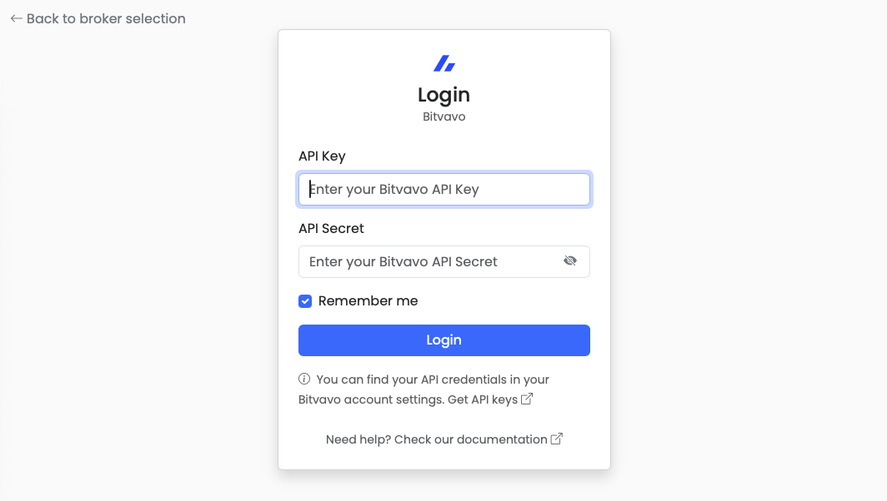
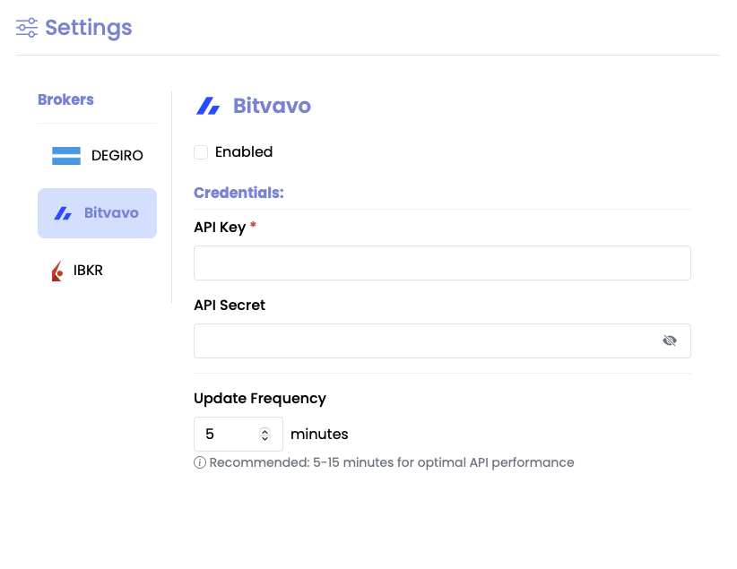

#  Bitvavo Integration Guide

> **⚠️ Bitvavo integration is not yet stable. Features and reliability may change in future releases. Use with caution.**

[Bitvavo](https://bitvavo.com/en/) is a cryptocurrency exchange supported by **Stonks Overwatch**, allowing you to track your crypto investments, portfolio value, and growth alongside your traditional investments.

## Overview

### Features

- ✅ **Crypto portfolio tracking** - Track all your crypto holdings
- ✅ **Real-time prices** - Live cryptocurrency prices
- ✅ **Trade history** - Complete transaction records
- ✅ **Asset information** - Detailed crypto asset data
- ✅ **Multi-asset support** - Bitcoin, Ethereum, and 150+ cryptocurrencies
- ✅ **API-based** - Secure API key authentication
- ✅ **Unified dashboard** - Combined view with other brokers

### Supported Assets

Bitvavo supports 150+ cryptocurrencies including:
- **Bitcoin (BTC)**
- **Ethereum (ETH)**
- **Major altcoins** - XRP, ADA, DOT, SOL, etc.
- **Stablecoins** - USDT, USDC, DAI, etc.
- **DeFi tokens** - UNI, AAVE, LINK, etc.

See the [full list on Bitvavo](https://bitvavo.com/en/markets).

---

## Prerequisites

Before configuring Bitvavo in Stonks Overwatch, you need to:

1. **Have a Bitvavo account** - [Sign up](https://bitvavo.com/en/register) if you don't have one
2. **Create API credentials** - Generate API key and secret (see below)
3. **Enable API access** - Ensure API access is enabled in your account

---

## Creating API Credentials

### Step-by-Step Guide

1. **Login to Bitvavo**
   - Visit [bitvavo.com](https://bitvavo.com/en/) and login

2. **Navigate to API settings**
   - Go to **Account** → **API**
   - Or visit: [https://account.bitvavo.com/user/api](https://account.bitvavo.com/user/api)

3. **Create New API Key**
   - Click **"Create New API"**
   - Give it a descriptive name (e.g., "Stonks Overwatch")

4. **Set Permissions**
   - ✅ Enable **"View"** (required)
   - ✅ Enable **"Trade"** if you want to see order details
   - ❌ Disable **"Withdraw"** (not needed, more secure)

5. **Save Credentials**
   - Copy the **API Key**
   - Copy the **API Secret** (shown only once!)
   - Store them securely - you'll need them for configuration

> **Security Note:** The API secret is shown only once. If you lose it, you'll need to create a new API key.

### API Permissions

| Permission | Required? | Purpose |
|------------|-----------|---------|
| **View** | ✅ Yes | Read portfolio and balance data |
| **Trade** | ❌ Optional | View detailed order information |
| **Withdraw** | ❌ No | Not needed for tracking |

**Recommendation:** Only enable **View** for maximum security.

---

## Getting Started

### Initial Setup

When you first launch Stonks Overwatch, you'll be presented with a broker selection screen. Select Bitvavo to begin the authentication process.

### Authentication



Bitvavo uses API key authentication for secure access to your portfolio data.

1. Enter your **API Key**
2. Enter your **API Secret**
3. Click "Login"

Your credentials will be validated and you'll be redirected to the dashboard.

---

## Configuring Credentials

After your initial login, you can configure Bitvavo to automatically authenticate on startup.



### Via Settings (Web Application)

1. Navigate to the **Settings** page (sidebar menu)
2. Locate the **Bitvavo** section
3. Enter your credentials:
   - API Key
   - API Secret
4. Configure additional options:
   - Enable/disable the broker
   - Set update frequency
5. Click **Save**

### Via Preferences (Native Application)

1. Open **Preferences** from the application menu
2. Select the **Brokers** tab
3. Configure Bitvavo credentials and settings
4. Click **Save**

Your credentials are encrypted and stored securely in the local database.

---

## Advanced Settings

### Portfolio Tracking

View all your cryptocurrency holdings in one place:

- Current balances
- Available vs locked amounts
- Real-time value in your base currency
- Total portfolio value

### Update Frequency

Control how often crypto prices are refreshed. Configure this in Settings (default: 5 minutes).

**Recommendations:**

- **1-2 minutes** - Active trading
- **5 minutes** (default) - Regular monitoring
- **15-30 minutes** - Long-term holding

### Unified Dashboard

Bitvavo integrates seamlessly with other brokers:

- Combined portfolio view
- Total value across all assets
- Unified transaction history
- Comprehensive diversification analysis

---

## Troubleshooting

### Common Issues

#### Invalid API Credentials

**Symptoms:** "Invalid API key" or authentication fails

**Solutions:**

1. Verify API key and secret in Settings
2. Check if you copied the full key (no extra spaces)
3. Ensure API key is still active in Bitvavo account
4. Generate new API credentials if needed

#### No Data Showing

**Symptoms:** Bitvavo enabled but no portfolio data

**Solutions:**
1. Check if you have any crypto balance on Bitvavo
2. Verify API key has **"View"** permission
3. Check logs: `data/logs/stonks-overwatch.log`
4. Try disabling and re-enabling Bitvavo

#### Connection Timeout

**Symptoms:** "Cannot connect to Bitvavo" or timeout errors

**Solutions:**
1. Check internet connection
2. Verify Bitvavo website is accessible
3. Check if using VPN (may cause issues)
4. Wait and retry - might be temporary Bitvavo API issue

#### Rate Limiting

**Symptoms:** "Rate limit exceeded" errors

**Solutions:**

1. Increase update frequency in Settings to reduce API calls
2. Wait a few minutes before retrying
3. Check if other applications are using the same API key

### Debug Mode

Enable debug logging for troubleshooting:

```bash
make run debug=true
```

Check logs at: `data/logs/stonks-overwatch.log`

---

## For Developers

### Manual Configuration via config.json

Developers can configure Bitvavo credentials directly in the `config/config.json` file for testing and development purposes.

#### Basic Configuration

**Minimal setup with API credentials:**

```json
{
  "bitvavo": {
    "enabled": true,
    "credentials": {
      "apikey": "YOUR_BITVAVO_API_KEY",
      "apisecret": "YOUR_BITVAVO_API_SECRET"
    }
  }
}
```

#### Advanced Configuration

**Complete configuration with all options:**

```json
{
  "bitvavo": {
    "enabled": true,
    "credentials": {
      "apikey": "YOUR_BITVAVO_API_KEY",
      "apisecret": "YOUR_BITVAVO_API_SECRET"
    },
    "update_frequency_minutes": 5
  }
}
```

#### Configuration Options

| Option | Type | Default | Description |
|--------|------|---------|-------------|
| `enabled` | boolean | `true` | Enable/disable Bitvavo integration |
| `credentials.apikey` | string | *required* | Your Bitvavo API key |
| `credentials.apisecret` | string | *required* | Your Bitvavo API secret |
| `update_frequency_minutes` | integer | `5` | Data refresh interval in minutes |

#### Setup Steps

1. Copy the configuration template:

   ```bash
   cp config/config.json.template config/config.json
   ```

2. Edit `config/config.json` and add your Bitvavo credentials:

   ```json
   {
     "bitvavo": {
       "enabled": true,
       "credentials": {
         "apikey": "1234567890abcdef",
         "apisecret": "fedcba0987654321"
       }
     }
   }
   ```

3. Start the application:

   ```bash
   make run
   ```

4. Verify connection - check the dashboard for your Bitvavo portfolio data

**Note:** The `config.json` file is encrypted and never committed to version control. For production use, configure credentials via the Settings UI instead.

### Test Configuration

**Verify your configuration:**

```bash
# Check if config file is valid JSON
cat config/config.json | python -m json.tool

# Run with debug mode
make run debug=true
```

---

## Technical Details

### API Client

The application uses the official [Python Bitvavo API](https://github.com/bitvavo/python-bitvavo-api), a Python wrapper around [Bitvavo's public API](https://docs.bitvavo.com/).

**Stonks Overwatch** fetches data from Bitvavo and stores it locally, providing real-time insights into your crypto portfolio.

### Database Model

The database model is defined in:
- `src/stonks_overwatch/services/brokers/bitvavo/repositories/models.py`

### Architecture

```text
┌────────────┐     ┌──────────────────┐     ┌─────────────┐
│   Stonks   │────▶│  Bitvavo API     │────▶│  Bitvavo    │
│  Overwatch │◀────│  Client(Python)  │◀────│  Platform   │
└────────────┘     └──────────────────┘     └─────────────┘
       │
       ▼
┌────────────┐
│   Local    │
│  Database  │
│  (SQLite)  │
└────────────┘
```

### Data Flow

1. **Authenticate** - API key verified with Bitvavo
2. **Fetch** - Retrieve balance and asset data
3. **Transform** - Convert to internal format
4. **Store** - Save to local database
5. **Display** - Show in dashboard

---

## Known Issues

### RFQ Transactions

**Issue:** Transactions executed using RFQ (Request for Quote) don't appear in the transaction history.

**Why:** This is a **permanent limitation** of the Bitvavo API - RFQ transactions are not exposed through the API endpoints.

**Impact:** These transactions still affect your balance correctly, but individual RFQ transaction details won't be visible in the transaction history.

**Workaround:** None available - this is an API design limitation that cannot be fixed from the client side.

### Staking Balances

**Issue:** When using staking features, the API returns only available balance, not total balance including staked amounts.

**Why:** This is a **permanent limitation** of the Bitvavo API architecture.

**Impact:** Staked amounts are included in your total value, but may not be broken down separately in the portfolio view.

**Workaround:** Check your Bitvavo account directly for detailed staking information.

---

## Security & Privacy

### Data Security

- **API keys** - Stored encrypted in config file
- **Local storage** - All data stored on your computer
- **No cloud sync** - Data never sent to external servers
- **HTTPS only** - All Bitvavo API calls use HTTPS
- **Read-only access** - API key only needs **View**

### Security Best Practices

1. **Use View only** - Don't enable Trade or Withdraw
2. **Protect config file** - Never commit `config/config.json` to git
3. **Rotate API keys** - Periodically generate new keys
4. **Monitor API usage** - Check Bitvavo for unusual activity
5. **Backup data** - Regular backups of `data/` directory

### Permissions

With the **View** API permission, Stonks Overwatch can:
- ✅ View balances and portfolio
- ✅ View transaction history
- ✅ View asset information
- ❌ Cannot place orders
- ❌ Cannot withdraw funds
- ❌ Cannot change account settings

---

## FAQ

### How do I get started with Bitvavo?

1. Create a Bitvavo account at [bitvavo.com](https://bitvavo.com/en/)
2. Complete KYC verification
3. Generate API credentials
4. Configure in Stonks Overwatch

### Can I track multiple Bitvavo accounts?

Currently, one Bitvavo account per configuration. Multi-account support is planned for a future release.

### Does this work in all countries?

Yes, if Bitvavo supports your country. Check [Bitvavo's availability](https://bitvavo.com/en/).

### Are my API keys safe?

Yes. API keys are stored encrypted and never shared. Use **View** only for maximum security.

### What if I lose my API secret?

Generate a new API key pair in your Bitvavo account and update your configuration.

---

## Support & Resources

### Documentation

- **[Quickstart Guide](Quickstart.md)** - Get started quickly
- **[FAQ](FAQ.md)** - Common questions
- **[Troubleshooting](#troubleshooting)** - Fix common issues

### Bitvavo Resources

- **[Bitvavo Website](https://bitvavo.com/en/)** - Official site
- **[Bitvavo API Docs](https://docs.bitvavo.com/)** - API documentation
- **[Create API Key](https://account.bitvavo.com/user/api)** - Generate credentials
- **[Bitvavo Support](https://bitvavo.com/en/support)** - Bitvavo help center

### Community Support

- **[GitHub Discussions](https://github.com/ctasada/stonks-overwatch/discussions)** - Ask questions
- **[GitHub Issues](https://github.com/ctasada/stonks-overwatch/issues)** - Report bugs
- **Email** - carlos.tasada@gmail.com

---

## Next Steps

After setting up Bitvavo:

1. **Configure other brokers** - [DEGIRO](DEGIRO.md) • [IBKR](IBKR.md)
2. **Explore features** - Check the [User Guide](Home.md)
3. **Customize settings** - Adjust update frequency
4. **Set up backups** - Backup your `data/` directory regularly

---

**Need help?** Check the [FAQ](FAQ.md) or [open an issue](https://github.com/ctasada/stonks-overwatch/issues)!
