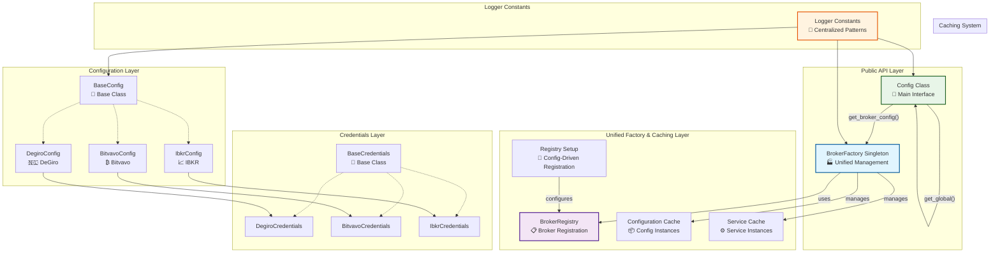

# Configuration Integration Guide

## Table of Contents

1. [Overview](#overview)
2. [Quick Start](#quick-start)
3. [File Structure](#file-structure)
4. [Architecture Features](#architecture-features)
5. [Architecture Diagram](#architecture-diagram)
6. [Key Components](#key-components)
7. [API Reference](#api-reference)
8. [How to Add a New Broker Configuration](#how-to-add-a-new-broker-configuration)
9. [Configuration File Format](#configuration-file-format)
10. [Testing Your Integration](#testing-your-integration)
11. [Performance Features](#performance-features)
12. [Best Practices](#best-practices)
13. [Troubleshooting](#troubleshooting)
14. [Benefits](#benefits)
15. [Logo Integrations](#logo-integrations)
16. [Future Enhancements](#future-enhancements)
17. [Conclusion](#conclusion)

## Overview

The configuration module implements a **unified factory architecture with intelligent caching** that uses configuration-driven broker registration, provides high performance through caching, and makes the system highly extensible for new brokers through the `BROKER_CONFIGS` dictionary approach.

## Quick Start

### Basic Usage

```python
# Get the global configuration instance
from stonks_overwatch.config.config import Config

config = Config.get_global()

# Access broker configurations
degiro_config = config.get_broker_config("degiro")
bitvavo_config = config.get_broker_config("bitvavo")

# Check if broker is enabled
if degiro_config and degiro_config.is_enabled():
    credentials = degiro_config.credentials
    # Use credentials for API calls
```

### Common Operations

```python
# Load configuration from JSON file
config = Config.from_json_file("config/config.json")

# Check if any broker is enabled for a portfolio
if config.is_enabled(PortfolioId.ALL):
    print("At least one broker is enabled")

# Reset configuration in tests
Config.reset_global_for_tests()
```

## File Structure

### Core Configuration Files

```shell
src/stonks_overwatch/
├── config/
│   ├── __init__.py
│   ├── config.py              # Main Config class
│   ├── base_config.py         # BaseConfig abstract class
│   ├── base_credentials.py    # BaseCredentials class
│   ├── degiro.py             # DEGIRO configuration
│   ├── bitvavo.py            # Bitvavo configuration
│   └── ibkr.py               # IBKR configuration
├── core/
│   ├── factories/
│   │   ├── broker_factory.py  # Unified BrokerFactory
│   │   └── broker_registry.py # BrokerRegistry
│   └── registry_setup.py      # BROKER_CONFIGS definition
└── utils/
    └── core/
        ├── logger.py          # StonksLogger implementation
        ├── logger_constants.py # Centralized logging constants
        └── singleton.py       # Singleton decorator
```

### Configuration Files

```shell
config/
└── config.json               # JSON configuration file
```

### Key Files for Broker Integration

| File | Purpose | When to Modify |
|------|---------|----------------|
| `config/your_broker.py` | New broker config & credentials | When adding new broker |
| `core/registry_setup.py` | Broker registration | When adding new broker |
| `core/factories/broker_factory.py` | Credential mapping | When adding credential updates |
| `config/config.json` | Runtime configuration | When configuring brokers |

## Architecture Features

- ✅ **Unified BrokerFactory**: Single factory for both configurations and services
- ✅ **Configuration-Driven Registration**: Brokers registered via `BROKER_CONFIGS` dictionary
- ✅ **Intelligent Caching**: Configurations and services cached for performance
- ✅ **Dynamic Configuration**: Config automatically adapts to registered brokers
- ✅ **Centralized Logging**: Consistent logger constants across all modules

## Architecture Diagram


```mermaid
graph TB
    subgraph "Public API Layer"
        Config[Config Class<br/>🎯 Main Interface]
        Config --> |"get_global()"| Config
        Config --> |"get_broker_config()"| BrokerFactory
    end

    subgraph "Unified Factory & Caching Layer"
        BrokerFactory[BrokerFactory Singleton<br/>🏭 Unified Management]
        BrokerRegistry[BrokerRegistry<br/>📋 Broker Registration]
        RegistrySetup[Registry Setup<br/>🔧 Config-Driven Registration]
        BrokerFactory --> |uses| BrokerRegistry
        BrokerFactory --> |manages| ConfigCache
        BrokerFactory --> |manages| ServiceCache
        RegistrySetup --> |configures| BrokerRegistry
    end

    subgraph "Configuration Layer"
        BaseConfig[BaseConfig<br/>🔧 Base Class]
        DegiroConfig[DegiroConfig<br/>🇳🇱 DeGiro]
        BitvavoConfig[BitvavoConfig<br/>₿ Bitvavo]
        IbkrConfig[IbkrConfig<br/>📈 IBKR]

        BaseConfig -.-> DegiroConfig
        BaseConfig -.-> BitvavoConfig
        BaseConfig -.-> IbkrConfig
    end

    subgraph "Credentials Layer"
        BaseCredentials[BaseCredentials<br/>🔐 Base Class]
        DegiroCredentials[DegiroCredentials]
        BitvavoCredentials[BitvavoCredentials]
        IbkrCredentials[IbkrCredentials]

        BaseCredentials -.-> DegiroCredentials
        BaseCredentials -.-> BitvavoCredentials
        BaseCredentials -.-> IbkrCredentials
    end

    subgraph "Caching System"
        ConfigCache[Configuration Cache<br/>📦 Config Instances]
        ServiceCache[Service Cache<br/>⚙️ Service Instances]
    end

    subgraph "Logger Constants"
        LoggerConstants[Logger Constants<br/>📝 Centralized Patterns]
        LoggerConstants --> Config
        LoggerConstants --> BaseConfig
        LoggerConstants --> BrokerFactory
    end

    %% Relationships
    DegiroConfig --> DegiroCredentials
    BitvavoConfig --> BitvavoCredentials
    IbkrConfig --> IbkrCredentials

    %% Styling
    style Config fill:#e8f5e8,stroke:#1b5e20,stroke-width:2px
    style BrokerFactory fill:#e1f5fe,stroke:#01579b,stroke-width:2px
    style BrokerRegistry fill:#f3e5f5,stroke:#4a148c,stroke-width:2px
    style LoggerConstants fill:#fff3e0,stroke:#e65100,stroke-width:2px
```

## Key Components

### 1. Config Class (Public API)

The main `Config` class provides the public interface for configuration access:

```python
class Config:
    def __init__(self, base_currency: Optional[str] = DEFAULT_BASE_CURRENCY) -> None:
        self.base_currency = base_currency or self.DEFAULT_BASE_CURRENCY
        self._factory = BrokerFactory()

    @classmethod
    def get_global(cls) -> "Config":
        """Get cached configuration (recommended for production)"""
        if not hasattr(cls, '_global_instance'):
            cls._global_instance = cls._default()
        return cls._global_instance

    @classmethod
    def _default(cls) -> "Config":
        """Create fresh configuration (internal use only)"""
        return cls()
```

**Key Methods:**

- `get_global()`: Get cached configuration (production use)
- `_default()`: Create fresh configuration (internal/tests)
- `from_dict()`: Create from dictionary
- `from_json_file()`: Load from JSON file
- `is_enabled()`: Check if any broker is enabled for selected portfolio
- `get_broker_config()`: Get specific broker configuration via BrokerFactory
- `reset_global_for_tests()`: Reset global instance for testing

### 2. BrokerFactory (Unified Factory & Caching Layer)

The `BrokerFactory` singleton provides cached access to both configurations and services with simplified credential handling:

```python
@singleton
class BrokerFactory:
    def __init__(self):
        self._registry = BrokerRegistry()
        self._config_instances: Dict[str, BaseConfig] = {}
        self._service_instances: Dict[str, Dict[ServiceType, Any]] = {}
        self._cache_enabled = True

    def create_config(self, broker_name: str, **kwargs) -> Optional[BaseConfig]:
        """Get cached configuration, creating if necessary"""
        if self._cache_enabled and not kwargs and broker_name in self._config_instances:
            return self._config_instances[broker_name]

        config_class = self._registry.get_config_class(broker_name)
        if not config_class:
            return None

        # Use new DB+JSON loading method or fallback to default
        if not kwargs:
            if hasattr(config_class, "from_db_with_json_override"):
                config = config_class.from_db_with_json_override(broker_name)
            elif hasattr(config_class, "default"):
                config = config_class.default()
            else:
                # Fallback if no default method exists
                config = config_class(credentials=None, enabled=False)
        else:
            config = config_class(**kwargs)

        if self._cache_enabled and not kwargs:
            self._config_instances[broker_name] = config
        return config

    def update_broker_credentials(self, broker_name: str, **credentials) -> None:
        """Update credentials with dynamic credential class mapping"""
        config = self.create_config(broker_name)
        if not config:
            raise BrokerFactoryError(f"No configuration found for broker: {broker_name}")

        # Handle case where no existing credentials exist
        if config.credentials is None:
            credential_classes = {
                "degiro": "stonks_overwatch.config.degiro.DegiroCredentials",
                "bitvavo": "stonks_overwatch.config.bitvavo.BitvavoCredentials",
                "ibkr": "stonks_overwatch.config.ibkr.IbkrCredentials",
            }
            # Dynamic import and credential creation logic
            credential_class_path = credential_classes.get(broker_name.lower())
            if credential_class_path:
                module_path, class_name = credential_class_path.rsplit(".", 1)
                module = __import__(module_path, fromlist=[class_name])
                credential_class = getattr(module, class_name)
                config.credentials = credential_class(**credentials)

    def clear_cache(self, broker_name: str = None) -> None:
        """Clear configuration and service cache"""
        if broker_name:
            self._config_instances.pop(broker_name, None)
            self._service_instances.pop(broker_name, None)
        else:
            self._config_instances.clear()
            self._service_instances.clear()
```

### 3. Logger Constants (Centralized Logging)

Logger constants ensure consistent logging patterns across the system:

```python
# src/stonks_overwatch/utils/core/logger_constants.py
LOGGER_CONFIG = "stonks_overwatch.config"
LOGGER_CORE = "stonks_overwatch.core"
LOGGER_SERVICES = "stonks_overwatch.services"

TAG_CONFIG = "[CONFIG]"
TAG_BASE_CONFIG = "[BASE_CONFIG]"
TAG_BROKER_FACTORY = "[BROKER_FACTORY]"
TAG_BROKER_REGISTRY = "[BROKER_REGISTRY]"

# Usage in classes:
from stonks_overwatch.utils.core.logger_constants import LOGGER_CONFIG, TAG_CONFIG

class Config:
    logger = StonksLogger.get_logger(LOGGER_CONFIG, TAG_CONFIG)
```

## API Reference

### Config Class Methods

| Method | Description | Parameters | Returns |
|--------|-------------|------------|---------|
| `get_global()` | Get cached global configuration instance (recommended for production) | None | `Config` |
| `from_dict(data)` | Create configuration from dictionary | `data: dict` | `Config` |
| `from_json_file(file_path)` | Load configuration from JSON file | `file_path: str \| Path` | `Config` |
| `get_broker_config(broker_name)` | Get specific broker configuration | `broker_name: str` | `Optional[BaseConfig]` |
| `is_enabled(portfolio_id)` | Check if broker is enabled for portfolio | `portfolio_id: PortfolioId` | `bool` |
| `reset_global_for_tests()` | Reset global instance for testing | None | `None` |

### BrokerFactory Methods

| Method | Description | Parameters | Returns |
|--------|-------------|------------|---------|
| `create_config(broker_name, **kwargs)` | Create/get cached broker configuration | `broker_name: str, **kwargs` | `Optional[BaseConfig]` |
| `update_broker_credentials(broker_name, **credentials)` | Update broker credentials | `broker_name: str, **credentials` | `None` |
| `clear_cache(broker_name)` | Clear configuration/service cache | `broker_name: Optional[str]` | `None` |
| `get_available_brokers()` | Get list of registered brokers | None | `List[str]` |

### BaseConfig Methods

| Method | Description | Parameters | Returns |
|--------|-------------|------------|---------|
| `is_enabled()` | Check if configuration is enabled | None | `bool` |
| `from_dict(data)` | Create config from dictionary (abstract) | `data: dict` | `BaseConfig` |
| `default()` | Create default configuration (abstract) | None | `BaseConfig` |
| `load_config(broker_name, json_override_path)` | Load config from DB with JSON override | `broker_name: str, json_override_path: str` | `BaseConfig` |

## How to Add a New Broker Configuration

### Step 1: Create Broker Configuration File

Create a new file `src/stonks_overwatch/config/your_broker.py`:

```python
from dataclasses import dataclass
from stonks_overwatch.config.base_config import BaseConfig
from stonks_overwatch.config.base_credentials import BaseCredentials

@dataclass
class YourBrokerCredentials(BaseCredentials):
    """Credentials for YourBroker integration."""
    username: str
    password: str
    api_key: str = ""
    api_secret: str = ""

    @classmethod
    def from_dict(cls, data: dict) -> "YourBrokerCredentials":
        """Create credentials from dictionary."""
        if not data:
            return cls("", "", "", "")
        return cls(
            username=data.get("username", ""),
            password=data.get("password", ""),
            api_key=data.get("api_key", ""),
            api_secret=data.get("api_secret", "")
        )

class YourBrokerConfig(BaseConfig):
    """Configuration for YourBroker integration."""

    config_key = "your_broker"

    def __init__(self, credentials: YourBrokerCredentials, enabled: bool = True,
                 custom_setting: str = None, update_frequency_minutes: int = 5):
        super().__init__(credentials, enabled)
        self.custom_setting = custom_setting
        self.update_frequency_minutes = update_frequency_minutes

    @classmethod
    def from_dict(cls, data: dict) -> "YourBrokerConfig":
        """Create configuration from dictionary."""
        credentials = YourBrokerCredentials.from_dict(data.get("credentials", {}))
        return cls(
            credentials=credentials,
            enabled=data.get("enabled", True),
            custom_setting=data.get("custom_setting"),
            update_frequency_minutes=data.get("update_frequency_minutes", 5)
        )

    @classmethod
    def default(cls) -> "YourBrokerConfig":
        """Create default configuration."""
        return cls(
            credentials=YourBrokerCredentials("", "", "", ""),
            enabled=False,
            custom_setting=None,
            update_frequency_minutes=5
        )
```

### Step 2: Register with Registry

Add the registration to `src/stonks_overwatch/core/registry_setup.py` in the `BROKER_CONFIGS` dictionary:

```python
BROKER_CONFIGS = {
    "degiro": {
        "config": DegiroConfig,
        "services": {
            ServiceType.PORTFOLIO: DegiroPortfolioService,
            ServiceType.TRANSACTION: DegiroTransactionService,
            # ... other services
        },
        "supports_complete_registration": True,
    },
    "bitvavo": {
        "config": BitvavoConfig,
        "services": {
            ServiceType.PORTFOLIO: BitvavoPortfolioService,
            # ... other services
        },
        "supports_complete_registration": False,
    },
    "your_broker": {  # Add this section
        "config": YourBrokerConfig,
        "services": {
            ServiceType.PORTFOLIO: YourBrokerPortfolioService,
            # Add other services as needed
        },
        "supports_complete_registration": False,
    },
}
```

And add the import at the top:

```python
from stonks_overwatch.config.your_broker import YourBrokerConfig
```

### Step 3: No Config Class Changes Needed

The `Config` class automatically adapts to new brokers through the unified BrokerFactory system. No changes are needed to the Config class itself - it will automatically discover and use your new broker configuration through the registry.

### Step 4: Optional Convenience Methods

For convenience, you can add helper methods to the `Config` class (optional):

```python
def is_your_broker_enabled(self) -> bool:
    """Check if YourBroker is enabled."""
    config = self.get_broker_config("your_broker")
    return config.is_enabled() if config else False

def get_your_broker_config(self) -> Optional[YourBrokerConfig]:
    """Get YourBroker configuration."""
    return self.get_broker_config("your_broker")
```

### Step 5: Use in Application

Your new broker is now automatically integrated:

```python
# Get configuration
config = Config.get_global()

# Check if enabled using generic method
if config.is_enabled(PortfolioId.YOUR_BROKER):  # Requires corresponding PortfolioId enum
    # Your broker is enabled
    pass

# Access configuration directly
your_broker_config = config.get_broker_config("your_broker")
if your_broker_config and your_broker_config.enabled:
    credentials = your_broker_config.credentials
    # Use credentials for API calls

# Or use convenience method if you added one
if config.is_your_broker_enabled():
    credentials = config.get_your_broker_config().credentials
```

## Configuration File Format

Add your broker configuration to the JSON file:

```json
{
  "base_currency": "EUR",
  "degiro": {
    "enabled": true,
    "credentials": {
      "username": "your_degiro_username",
      "password": "your_degiro_password",
      "totp_secret_key": "YOUR_TOTP_SECRET_KEY"
    },
    "start_date": "2023-01-01",
    "update_frequency_minutes": 5
  },
  "bitvavo": {
    "enabled": false,
    "credentials": {
      "apikey": "key",
      "apisecret": "secret"
    }
  },
  "your_broker": {
    "enabled": true,
    "credentials": {
      "username": "your_user",
      "password": "your_pass",
      "api_key": "your_api_key",
      "api_secret": "your_api_secret"
    },
    "custom_setting": "custom_value",
    "update_frequency_minutes": 10
  }
}
```

## Testing Your Integration

Create tests for your new broker configuration:

```python
def test_your_broker_config():
    # Create test configuration
    config = Config._default()

    # Test configuration access
    your_broker_config = config.get_broker_config("your_broker")

    # Test with BrokerFactory directly if needed
    from stonks_overwatch.core.factories.broker_factory import BrokerFactory
    factory = BrokerFactory()

    # Create test configuration with custom credentials
    test_config = factory.create_config(
        "your_broker",
        credentials=YourBrokerCredentials("test", "test", "key", "secret"),
        enabled=True
    )

    assert test_config.is_enabled()
    assert test_config.credentials.username == "test"
```

## Performance Features

### 1. **Intelligent Caching**

- **Configuration Cache**: Broker configurations cached by name
- **Service Cache**: Broker services cached by type and name
- **Global Config Cache**: Single configuration instance with direct singleton pattern
- **Cache Control**: Can disable caching for tests

### 2. **Simplified Architecture**

- **BrokerFactory**: Single unified factory for both configurations and services
- **Dynamic Credential Handling**: Automatic credential class mapping without hardcoded imports
- **Logger Constants**: Centralized logging patterns reduce duplication
- **Memory Efficiency**: No duplicate configuration objects

### 3. **Lazy Loading**

- **Connection Checks**: Broker-specific connection checks loaded on demand
- **Circular Dependency Prevention**: Lazy imports avoid circular dependencies

## Best Practices

### 1. **Credentials Management**

- Always extend `BaseCredentials` for your broker credentials
- Implement `from_dict()` method for JSON deserialization
- Provide sensible defaults for empty/missing data

### 2. **Configuration Design**

- Extend `BaseConfig` for your broker configuration
- Implement both `from_dict()` and `default()` methods
- Use descriptive `config_key` for JSON mapping
- Include all necessary settings with sensible defaults

### 3. **Integration**

- Register your broker in `src/stonks_overwatch/core/registry_setup.py` using the `BROKER_CONFIGS` dictionary
- Add your credential class to the BrokerFactory mapping in `update_broker_credentials()` method if using credential updates
- No need to modify the `Config` class - it adapts automatically through the BrokerFactory
- Test your integration thoroughly using the unified factory approach

### 4. **Error Handling**

- Handle missing or invalid configuration gracefully
- Provide meaningful error messages
- Use type hints for better IDE support

## Troubleshooting

### Common Issues

#### 1. **Configuration Not Found**

**Problem**: `get_broker_config()` returns `None`

**Solutions**:
- Verify broker is registered in `BROKER_CONFIGS` dictionary
- Check broker name spelling (case-sensitive)
- Ensure `register_all_brokers()` was called during initialization

```python
# Debug: List available brokers
from stonks_overwatch.core.factories.broker_factory import BrokerFactory
factory = BrokerFactory()
print("Available brokers:", factory.get_available_brokers())
```

#### 2. **Import Errors When Adding New Broker**

**Problem**: `ImportError` when registering new broker

**Solutions**:
- Verify import path in `registry_setup.py` is correct
- Ensure all required methods are implemented in config class
- Check for circular import dependencies

#### 3. **Credentials Not Loading**

**Problem**: Configuration loads but credentials are `None`

**Solutions**:
- Check JSON file format matches expected structure
- Verify `config_key` matches JSON key
- Ensure `from_dict()` method handles missing data correctly

```python
# Debug: Check raw configuration data
config = YourBrokerConfig.load_config("your_broker")
print("Config loaded:", config)
print("Credentials:", config.credentials)
```

#### 4. **Cache Issues in Tests**

**Problem**: Test configurations persist between tests

**Solutions**:
- Always call `Config.reset_global_for_tests()` in test setup
- Clear BrokerFactory cache: `factory.clear_cache()`
- Use fresh Config instances: `Config._default()`

#### 5. **Database Access Errors**

**Problem**: `LazyConfig` fails to load from database

**Solutions**:
- Ensure Django is properly initialized
- Check database connectivity
- Verify broker configuration exists in database
- Use JSON-only loading as fallback: `YourBrokerConfig.from_json_file()`

### Debug Mode

Enable debug logging to troubleshoot configuration issues:

```python
import logging
logging.getLogger("stonks_overwatch.config").setLevel(logging.DEBUG)
logging.getLogger("stonks_overwatch.core").setLevel(logging.DEBUG)
```

### Performance Issues

If experiencing slow configuration loading:

1. **Check Cache Usage**: Ensure you're using `Config.get_global()` in production
2. **Database Optimization**: Index broker configuration tables
3. **JSON File Size**: Keep configuration files small and focused
4. **Lazy Loading**: Use `from_db_with_json_override()` for deferred loading

## Benefits

### 1. **Performance**

- ✅ **Cached Access**: Single configuration instance shared across application
- ✅ **Reduced Logging**: Eliminated redundant configuration creation messages
- ✅ **Memory Efficiency**: No duplicate configuration objects
- ✅ **Fast Access**: No file I/O after initial load

### 2. **Extensibility**

- ✅ **Easy Broker Addition**: Register new brokers without modifying core code
- ✅ **Dynamic Registration**: Add/remove brokers at runtime
- ✅ **Type Safety**: Full type hints and validation

### 3. **Maintainability**

- ✅ **Reduced Duplication**: Common patterns handled by registry
- ✅ **Clear Separation**: Each component has a single responsibility
- ✅ **Testability**: Easy to test individual components

### 4. **Developer Experience**

- ✅ **Clean API**: Only `Config.get_global()` for production use
- ✅ **Clear Intent**: Private methods indicate internal use
- ✅ **Consistent Patterns**: Same integration approach for all brokers
- ✅ **Simplified Debugging**: Consistent logger constants across modules
- ✅ **Dynamic Adaptation**: Config.__repr__ automatically shows available brokers

## Logo Integrations

Asset logos are served by `AssetLogoView` (`views/asset_logos.py`). The view tries active
third-party integrations first, then falls back to free CDN sources, and finally generates an
SVG symbol as a last resort.

### File Structure

```shell
src/stonks_overwatch/
├── integrations/
│   └── logos/
│       ├── __init__.py
│       ├── types.py        # LogoType enum (shared by view + integrations)
│       ├── base.py         # LogoIntegration abstract base class
│       ├── logodev.py      # Logo.dev implementation
│       ├── logostream.py   # Logostream implementation
│       └── registry.py     # LogoIntegrationRegistry
└── views/
    └── asset_logos.py      # AssetLogoView — orchestrates integrations + fallbacks
```

### LogoType Enum

`LogoType` lives in `integrations/logos/types.py` and is the shared vocabulary between the view
and every integration:

| Value | Description |
|---|---|
| `STOCK` | Individual equities |
| `ETF` | Exchange-traded funds |
| `CASH` | Cash / currency positions |
| `CRYPTO` | Cryptocurrencies |
| `COUNTRY` | Country flag (rendered from emoji via Twemoji) |
| `SECTOR` | Sector icon (rendered from emoji via Twemoji) |
| `UNKNOWN` | Unrecognised type — view returns 404 |

```python
from stonks_overwatch.integrations.logos.types import LogoType

logo_type = LogoType.from_str("stock")  # → LogoType.STOCK
```

### Available Integrations

#### Logo Provider

A single third-party logo provider can be configured. Choose between
[Logo.dev](https://logo.dev) and [Logostream](https://logostream.dev).

**Configuration (via Settings UI):**

1. Open Settings → Integrations → Logo Provider
2. Select your provider from the dropdown (Logo.dev or Logostream); select **None** to disable
3. Paste your API key — settings save automatically on provider change or when the API key field loses focus

**Configuration (via `config/config.json` template):**

```json
"logo_provider": {
    "provider": "logodev",
    "api_key": "your-api-key-here"
}
```

> **Note:** Logo provider settings are stored in the database (under the key
> `integration_logo_provider`), not read from `config.json` at runtime. The template entry
> above is provided for documentation purposes only. Use the Settings UI to configure it, or
> set it programmatically:
>
> ```python
> from stonks_overwatch.services.brokers.encryption_utils import encrypt_integration_config
>
> Config.get_global().save_setting(
>     "integration_logo_provider",
>     encrypt_integration_config({"provider": "logodev", "api_key": "pk_..."})
> )
> ```
>
> Always wrap the payload in `encrypt_integration_config` — the API key is stored encrypted
> at rest. Omitting this call stores the key in plaintext.

**Providers:**

---

#### Logo.dev

> <https://logo.dev>

| | |
|---|---|
| Config key | `logodev` |
| Token format | `pk_...` |
| Supported types | `STOCK`, `ETF`, `CRYPTO` |

Get your public token from the [Logo.dev dashboard](https://logo.dev). The free tier covers
a generous number of requests per month.

---

#### Logostream

> <https://logostream.dev>

| | |
|---|---|
| Config key | `logostream` |
| Token format | API key from dashboard |
| Supported types | `STOCK`, `ETF`, `CRYPTO`, `CASH` (forex), `COUNTRY` |

Logostream is the only provider that also serves **forex/currency logos** (used in the
Currencies section of the Diversification view) and **country logos**. Prefer it if you
hold multi-currency positions or want richer coverage across asset classes.

---

> **Tip:** Only one provider can be active at a time. If the active provider has no logo for
> a given asset, the request falls through to the free CDN fallbacks automatically — no
> manual configuration needed.

### Fallback Chain

When no integration is active (or the integration request fails), the view falls back to:

| Logo type | Fallback source |
|---|---|
| `STOCK`, `ETF` | `https://logos.stockanalysis.com/{symbol}.svg` |
| `CRYPTO` | Cryptofonts SVG on GitHub |
| `CASH` | Generated SVG with currency symbol |
| `COUNTRY` | Twemoji CDN (flag emoji → SVG); `?enhanced=true` for circular presentation |
| `SECTOR` | Twemoji CDN |
| Any (final) | Generated SVG with the ticker text |

### How to Add a New Logo Provider

1. **Create** `src/stonks_overwatch/integrations/logos/your_provider.py`:

    ```python
    import requests
    from requests.exceptions import RequestException

    from stonks_overwatch.integrations.logos.base import LogoIntegration
    from stonks_overwatch.integrations.logos.types import LogoType
    from stonks_overwatch.utils.core.logger import StonksLogger


    class YourProviderIntegration(LogoIntegration):
        URL = "https://your-provider.com/logos/{symbol}?key={key}"

        logger = StonksLogger.get_logger("stonks_overwatch.integrations.logos", "[YOURPROVIDER|LOGO]")

        def __init__(self, api_key: str, enabled: bool = True) -> None:
            self._api_key = api_key
            self._enabled = enabled

        def is_active(self) -> bool:
            return bool(self._api_key) and self._enabled

        def supports(self, logo_type: LogoType) -> bool:
            return logo_type in {LogoType.STOCK, LogoType.ETF}

        def get_logo_url(
            self, logo_type: LogoType, symbol: str, theme: str = "light", isin: str = "", conid: str = ""
        ) -> str:
            url = self.URL.format(symbol=symbol.upper(), key=self._api_key)
            try:
                response = requests.get(url, timeout=3, stream=True)
                response.close()
                if response.status_code >= 400:
                    self.logger.debug(f"YourProvider returned {response.status_code} for {symbol.upper()}")
                    return ""
            except RequestException as e:
                self.logger.debug(f"YourProvider availability check failed for {symbol.upper()}: {e}")
                return ""
            return url
    ```

    > **Important:** always perform the streaming GET availability check before returning the URL.
    > Returning the URL unconditionally causes broken images when the provider has no logo for a
    > given symbol. Return `""` on any failure so the view falls through to the next integration
    > or CDN fallback.

2. **Register** it in `integrations/logos/registry.py` — add it to `_PROVIDER_CLASSES`:

    ```python
    from stonks_overwatch.integrations.logos.your_provider import YourProviderIntegration

    _PROVIDER_CLASSES = {
        "logodev": LogoDevIntegration,
        "logostream": LogostreamIntegration,
        "your_provider": YourProviderIntegration,
    }
    ```

3. **Add it to the allowed providers allowlist** in `views/settings.py`:

    ```python
    _ALLOWED_LOGO_PROVIDERS = frozenset({"none", "logodev", "logostream", "your_provider"})
    ```

4. **Add a dropdown option** in `templates/components/integrations/logo_provider_settings.html`
   and a corresponding entry in the `_logoProviderMeta` JS object. No other template or script
   changes are needed.

### Security Notes

- Integration API keys are **never** logged (redacted at the `Config.save_setting` level).
- The `_ALLOWED_INTEGRATIONS` and `_ALLOWED_LOGO_PROVIDERS` allowlists in `views/settings.py`
  prevent arbitrary keys from being written to the database via the settings endpoint.
- Integration logo requests are served as **HTTP redirects** — the browser fetches images
  directly from the integration CDN rather than being proxied through the server. This is
  required by Logo.dev's hotlinking model and keeps the server out of the content path.
- SVG fallback text (ticker symbols) is HTML-escaped to prevent SVG injection.

---

## Future Enhancements

### High Priority

1. **Configuration Validation**: Add schema validation for broker configurations
   - JSON schema validation for configuration files
   - Runtime validation of configuration objects
   - Better error messages for invalid configurations

2. **Enhanced Security**: Encrypt sensitive configuration data at rest
   - Credential encryption in database storage
   - Secure key management system
   - Audit logging for configuration access

### Medium Priority

1. **Hot Reloading**: Support for configuration changes without application restart
   - File system monitoring for JSON configuration changes
   - Dynamic broker registration/deregistration
   - Configuration reload API endpoints

2. **Performance Monitoring**: Add metrics for cache hit rates and factory performance
   - Cache hit/miss ratio tracking
   - Configuration loading time metrics
   - Factory operation performance monitoring

### Low Priority

1. **Plugin System**: Load broker configurations from external plugins
   - External plugin discovery mechanism
   - Plugin configuration validation
   - Plugin lifecycle management

2. **Configuration Versioning**: Support for configuration migration and versioning
   - Configuration schema versioning
   - Automatic migration scripts
   - Backward compatibility handling

### Research Items

1. **Distributed Configuration**: Support for distributed configuration management
   - Configuration synchronization across multiple instances
   - Centralized configuration management
   - Configuration distribution mechanisms

## Conclusion

The simplified unified configuration architecture with intelligent caching provides a robust foundation for adding new broker integrations. The system uses a configuration-driven approach for broker registration through the `BROKER_CONFIGS` dictionary.

**Key advantages:**
- **High Performance**: Cached access eliminates redundant creation
- **Simplified Architecture**: Single BrokerFactory handles both configs and services
- **Extensibility**: Easy to add new brokers through registry configuration
- **Maintainability**: Configuration-driven registration reduces code duplication
- **Testability**: Excellent testing support with factory isolation
- **Clean API**: Config class provides simple interface via `get_broker_config()`
- **Type Safety**: Full type hints and validation throughout
- **Dynamic Adaptation**: Configuration automatically adapts to registered brokers

**Key features:**
- ✅ **Configuration-driven registration** - brokers added via `BROKER_CONFIGS`
- ✅ **Unified factory pattern** - single point for config and service creation
- ✅ **Intelligent caching** - configs and services cached by broker name
- ✅ **Lazy loading** - database access deferred until needed
- ✅ **Centralized logging** - consistent patterns across all components
