# Configuration Integration Guide

## Table of Contents

1. [Overview](#overview)
2. [Quick Start](#quick-start)
3. [File Structure](#file-structure)
4. [Architecture Features](#architecture-features)
5. [Architecture Diagram](#architecture-diagram)
6. [Key Components](#key-components)
7. [API Reference](#api-reference)
8. [How to Add a New Broker Configuration](#how-to-add-a-new-broker-configuration)
9. [Configuration File Format](#configuration-file-format)
10. [Testing Your Integration](#testing-your-integration)
11. [Performance Features](#performance-features)
12. [Best Practices](#best-practices)
13. [Troubleshooting](#troubleshooting)
14. [Benefits](#benefits)
15. [Future Enhancements](#future-enhancements)
16. [Conclusion](#conclusion)

## Overview

The configuration module implements a **unified factory architecture with intelligent caching** that uses configuration-driven broker registration, provides high performance through caching, and makes the system highly extensible for new brokers through the `BROKER_CONFIGS` dictionary approach.

## Quick Start

### Basic Usage

```python
# Get the global configuration instance
from stonks_overwatch.config.config import Config

config = Config.get_global()

# Access broker configurations
degiro_config = config.get_broker_config("degiro")
bitvavo_config = config.get_broker_config("bitvavo")

# Check if broker is enabled
if degiro_config and degiro_config.is_enabled():
    credentials = degiro_config.credentials
    # Use credentials for API calls
```

### Common Operations

```python
# Load configuration from JSON file
config = Config.from_json_file("config/config.json")

# Check if any broker is enabled for a portfolio
if config.is_enabled(PortfolioId.ALL):
    print("At least one broker is enabled")

# Reset configuration in tests
Config.reset_global_for_tests()
```

## File Structure

### Core Configuration Files

```shell
src/stonks_overwatch/
├── config/
│   ├── __init__.py
│   ├── config.py              # Main Config class
│   ├── base_config.py         # BaseConfig abstract class
│   ├── base_credentials.py    # BaseCredentials class
│   ├── degiro.py             # DEGIRO configuration
│   ├── bitvavo.py            # Bitvavo configuration
│   └── ibkr.py               # IBKR configuration
├── core/
│   ├── factories/
│   │   ├── broker_factory.py  # Unified BrokerFactory
│   │   └── broker_registry.py # BrokerRegistry
│   └── registry_setup.py      # BROKER_CONFIGS definition
└── utils/
    └── core/
        ├── logger.py          # StonksLogger implementation
        ├── logger_constants.py # Centralized logging constants
        └── singleton.py       # Singleton decorator
```

### Configuration Files

```shell
config/
└── config.json               # JSON configuration file
```

### Key Files for Broker Integration

| File | Purpose | When to Modify |
|------|---------|----------------|
| `config/your_broker.py` | New broker config & credentials | When adding new broker |
| `core/registry_setup.py` | Broker registration | When adding new broker |
| `core/factories/broker_factory.py` | Credential mapping | When adding credential updates |
| `config/config.json` | Runtime configuration | When configuring brokers |

## Architecture Features

- ✅ **Unified BrokerFactory**: Single factory for both configurations and services
- ✅ **Configuration-Driven Registration**: Brokers registered via `BROKER_CONFIGS` dictionary
- ✅ **Intelligent Caching**: Configurations and services cached for performance
- ✅ **Dynamic Configuration**: Config automatically adapts to registered brokers
- ✅ **Centralized Logging**: Consistent logger constants across all modules

## Architecture Diagram

```mermaid
graph TB
    subgraph "Public API Layer"
        Config[Config Class<br/>🎯 Main Interface]
        Config --> |"get_global()"| Config
        Config --> |"get_broker_config()"| BrokerFactory
    end

    subgraph "Unified Factory & Caching Layer"
        BrokerFactory[BrokerFactory Singleton<br/>🏭 Unified Management]
        BrokerRegistry[BrokerRegistry<br/>📋 Broker Registration]
        RegistrySetup[Registry Setup<br/>🔧 Config-Driven Registration]
        BrokerFactory --> |uses| BrokerRegistry
        BrokerFactory --> |manages| ConfigCache
        BrokerFactory --> |manages| ServiceCache
        RegistrySetup --> |configures| BrokerRegistry
    end

    subgraph "Configuration Layer"
        BaseConfig[BaseConfig<br/>🔧 Base Class]
        DegiroConfig[DegiroConfig<br/>🇳🇱 DeGiro]
        BitvavoConfig[BitvavoConfig<br/>₿ Bitvavo]
        IbkrConfig[IbkrConfig<br/>📈 IBKR]

        BaseConfig -.-> DegiroConfig
        BaseConfig -.-> BitvavoConfig
        BaseConfig -.-> IbkrConfig
    end

    subgraph "Credentials Layer"
        BaseCredentials[BaseCredentials<br/>🔐 Base Class]
        DegiroCredentials[DegiroCredentials]
        BitvavoCredentials[BitvavoCredentials]
        IbkrCredentials[IbkrCredentials]

        BaseCredentials -.-> DegiroCredentials
        BaseCredentials -.-> BitvavoCredentials
        BaseCredentials -.-> IbkrCredentials
    end

    subgraph "Caching System"
        ConfigCache[Configuration Cache<br/>📦 Config Instances]
        ServiceCache[Service Cache<br/>⚙️ Service Instances]
    end

    subgraph "Logger Constants"
        LoggerConstants[Logger Constants<br/>📝 Centralized Patterns]
        LoggerConstants --> Config
        LoggerConstants --> BaseConfig
        LoggerConstants --> BrokerFactory
    end

    %% Relationships
    DegiroConfig --> DegiroCredentials
    BitvavoConfig --> BitvavoCredentials
    IbkrConfig --> IbkrCredentials

    %% Styling
    style Config fill:#e8f5e8,stroke:#1b5e20,stroke-width:2px
    style BrokerFactory fill:#e1f5fe,stroke:#01579b,stroke-width:2px
    style BrokerRegistry fill:#f3e5f5,stroke:#4a148c,stroke-width:2px
    style LoggerConstants fill:#fff3e0,stroke:#e65100,stroke-width:2px
```



## Key Components

### 1. Config Class (Public API)

The main `Config` class provides the public interface for configuration access:

```python
class Config:
    def __init__(self, base_currency: Optional[str] = DEFAULT_BASE_CURRENCY) -> None:
        self.base_currency = base_currency or self.DEFAULT_BASE_CURRENCY
        self._factory = BrokerFactory()

    @classmethod
    def get_global(cls) -> "Config":
        """Get cached configuration (recommended for production)"""
        if not hasattr(cls, '_global_instance'):
            cls._global_instance = cls._default()
        return cls._global_instance

    @classmethod
    def _default(cls) -> "Config":
        """Create fresh configuration (internal use only)"""
        return cls()
```

**Key Methods:**

- `get_global()`: Get cached configuration (production use)
- `_default()`: Create fresh configuration (internal/tests)
- `from_dict()`: Create from dictionary
- `from_json_file()`: Load from JSON file
- `is_enabled()`: Check if any broker is enabled for selected portfolio
- `get_broker_config()`: Get specific broker configuration via BrokerFactory
- `reset_global_for_tests()`: Reset global instance for testing

### 2. BrokerFactory (Unified Factory & Caching Layer)

The `BrokerFactory` singleton provides cached access to both configurations and services with simplified credential handling:

```python
@singleton
class BrokerFactory:
    def __init__(self):
        self._registry = BrokerRegistry()
        self._config_instances: Dict[str, BaseConfig] = {}
        self._service_instances: Dict[str, Dict[ServiceType, Any]] = {}
        self._cache_enabled = True

    def create_config(self, broker_name: str, **kwargs) -> Optional[BaseConfig]:
        """Get cached configuration, creating if necessary"""
        if self._cache_enabled and not kwargs and broker_name in self._config_instances:
            return self._config_instances[broker_name]

        config_class = self._registry.get_config_class(broker_name)
        if not config_class:
            return None

        # Use new DB+JSON loading method or fallback to default
        if not kwargs:
            if hasattr(config_class, "from_db_with_json_override"):
                config = config_class.from_db_with_json_override(broker_name)
            elif hasattr(config_class, "default"):
                config = config_class.default()
            else:
                # Fallback if no default method exists
                config = config_class(credentials=None, enabled=False)
        else:
            config = config_class(**kwargs)

        if self._cache_enabled and not kwargs:
            self._config_instances[broker_name] = config
        return config

    def update_broker_credentials(self, broker_name: str, **credentials) -> None:
        """Update credentials with dynamic credential class mapping"""
        config = self.create_config(broker_name)
        if not config:
            raise BrokerFactoryError(f"No configuration found for broker: {broker_name}")

        # Handle case where no existing credentials exist
        if config.credentials is None:
            credential_classes = {
                "degiro": "stonks_overwatch.config.degiro.DegiroCredentials",
                "bitvavo": "stonks_overwatch.config.bitvavo.BitvavoCredentials",
                "ibkr": "stonks_overwatch.config.ibkr.IbkrCredentials",
            }
            # Dynamic import and credential creation logic
            credential_class_path = credential_classes.get(broker_name.lower())
            if credential_class_path:
                module_path, class_name = credential_class_path.rsplit(".", 1)
                module = __import__(module_path, fromlist=[class_name])
                credential_class = getattr(module, class_name)
                config.credentials = credential_class(**credentials)

    def clear_cache(self, broker_name: str = None) -> None:
        """Clear configuration and service cache"""
        if broker_name:
            self._config_instances.pop(broker_name, None)
            self._service_instances.pop(broker_name, None)
        else:
            self._config_instances.clear()
            self._service_instances.clear()
```

### 3. Logger Constants (Centralized Logging)

Logger constants ensure consistent logging patterns across the system:

```python
# src/stonks_overwatch/utils/core/logger_constants.py
LOGGER_CONFIG = "stonks_overwatch.config"
LOGGER_CORE = "stonks_overwatch.core"
LOGGER_SERVICES = "stonks_overwatch.services"

TAG_CONFIG = "[CONFIG]"
TAG_BASE_CONFIG = "[BASE_CONFIG]"
TAG_BROKER_FACTORY = "[BROKER_FACTORY]"
TAG_BROKER_REGISTRY = "[BROKER_REGISTRY]"

# Usage in classes:
from stonks_overwatch.utils.core.logger_constants import LOGGER_CONFIG, TAG_CONFIG

class Config:
    logger = StonksLogger.get_logger(LOGGER_CONFIG, TAG_CONFIG)
```

## API Reference

### Config Class Methods

| Method | Description | Parameters | Returns |
|--------|-------------|------------|---------|
| `get_global()` | Get cached global configuration instance (recommended for production) | None | `Config` |
| `from_dict(data)` | Create configuration from dictionary | `data: dict` | `Config` |
| `from_json_file(file_path)` | Load configuration from JSON file | `file_path: str \| Path` | `Config` |
| `get_broker_config(broker_name)` | Get specific broker configuration | `broker_name: str` | `Optional[BaseConfig]` |
| `is_enabled(portfolio_id)` | Check if broker is enabled for portfolio | `portfolio_id: PortfolioId` | `bool` |
| `reset_global_for_tests()` | Reset global instance for testing | None | `None` |

### BrokerFactory Methods

| Method | Description | Parameters | Returns |
|--------|-------------|------------|---------|
| `create_config(broker_name, **kwargs)` | Create/get cached broker configuration | `broker_name: str, **kwargs` | `Optional[BaseConfig]` |
| `update_broker_credentials(broker_name, **credentials)` | Update broker credentials | `broker_name: str, **credentials` | `None` |
| `clear_cache(broker_name)` | Clear configuration/service cache | `broker_name: Optional[str]` | `None` |
| `get_available_brokers()` | Get list of registered brokers | None | `List[str]` |

### BaseConfig Methods

| Method | Description | Parameters | Returns |
|--------|-------------|------------|---------|
| `is_enabled()` | Check if configuration is enabled | None | `bool` |
| `from_dict(data)` | Create config from dictionary (abstract) | `data: dict` | `BaseConfig` |
| `default()` | Create default configuration (abstract) | None | `BaseConfig` |
| `load_config(broker_name, json_override_path)` | Load config from DB with JSON override | `broker_name: str, json_override_path: str` | `BaseConfig` |

## How to Add a New Broker Configuration

### Step 1: Create Broker Configuration File

Create a new file `src/stonks_overwatch/config/your_broker.py`:

```python
from dataclasses import dataclass
from stonks_overwatch.config.base_config import BaseConfig
from stonks_overwatch.config.base_credentials import BaseCredentials

@dataclass
class YourBrokerCredentials(BaseCredentials):
    """Credentials for YourBroker integration."""
    username: str
    password: str
    api_key: str = ""
    api_secret: str = ""

    @classmethod
    def from_dict(cls, data: dict) -> "YourBrokerCredentials":
        """Create credentials from dictionary."""
        if not data:
            return cls("", "", "", "")
        return cls(
            username=data.get("username", ""),
            password=data.get("password", ""),
            api_key=data.get("api_key", ""),
            api_secret=data.get("api_secret", "")
        )

class YourBrokerConfig(BaseConfig):
    """Configuration for YourBroker integration."""

    config_key = "your_broker"

    def __init__(self, credentials: YourBrokerCredentials, enabled: bool = True,
                 custom_setting: str = None, update_frequency_minutes: int = 5):
        super().__init__(credentials, enabled)
        self.custom_setting = custom_setting
        self.update_frequency_minutes = update_frequency_minutes

    @classmethod
    def from_dict(cls, data: dict) -> "YourBrokerConfig":
        """Create configuration from dictionary."""
        credentials = YourBrokerCredentials.from_dict(data.get("credentials", {}))
        return cls(
            credentials=credentials,
            enabled=data.get("enabled", True),
            custom_setting=data.get("custom_setting"),
            update_frequency_minutes=data.get("update_frequency_minutes", 5)
        )

    @classmethod
    def default(cls) -> "YourBrokerConfig":
        """Create default configuration."""
        return cls(
            credentials=YourBrokerCredentials("", "", "", ""),
            enabled=False,
            custom_setting=None,
            update_frequency_minutes=5
        )
```

### Step 2: Register with Registry

Add the registration to `src/stonks_overwatch/core/registry_setup.py` in the `BROKER_CONFIGS` dictionary:

```python
BROKER_CONFIGS = {
    "degiro": {
        "config": DegiroConfig,
        "services": {
            ServiceType.PORTFOLIO: DegiroPortfolioService,
            ServiceType.TRANSACTION: DegiroTransactionService,
            # ... other services
        },
        "supports_complete_registration": True,
    },
    "bitvavo": {
        "config": BitvavoConfig,
        "services": {
            ServiceType.PORTFOLIO: BitvavoPortfolioService,
            # ... other services
        },
        "supports_complete_registration": False,
    },
    "your_broker": {  # Add this section
        "config": YourBrokerConfig,
        "services": {
            ServiceType.PORTFOLIO: YourBrokerPortfolioService,
            # Add other services as needed
        },
        "supports_complete_registration": False,
    },
}
```

And add the import at the top:

```python
from stonks_overwatch.config.your_broker import YourBrokerConfig
```

### Step 3: No Config Class Changes Needed

The `Config` class automatically adapts to new brokers through the unified BrokerFactory system. No changes are needed to the Config class itself - it will automatically discover and use your new broker configuration through the registry.

### Step 4: Optional Convenience Methods

For convenience, you can add helper methods to the `Config` class (optional):

```python
def is_your_broker_enabled(self) -> bool:
    """Check if YourBroker is enabled."""
    config = self.get_broker_config("your_broker")
    return config.is_enabled() if config else False

def get_your_broker_config(self) -> Optional[YourBrokerConfig]:
    """Get YourBroker configuration."""
    return self.get_broker_config("your_broker")
```

### Step 5: Use in Application

Your new broker is now automatically integrated:

```python
# Get configuration
config = Config.get_global()

# Check if enabled using generic method
if config.is_enabled(PortfolioId.YOUR_BROKER):  # Requires corresponding PortfolioId enum
    # Your broker is enabled
    pass

# Access configuration directly
your_broker_config = config.get_broker_config("your_broker")
if your_broker_config and your_broker_config.enabled:
    credentials = your_broker_config.credentials
    # Use credentials for API calls

# Or use convenience method if you added one
if config.is_your_broker_enabled():
    credentials = config.get_your_broker_config().credentials
```

## Configuration File Format

Add your broker configuration to the JSON file:

```json
{
  "base_currency": "EUR",
  "degiro": {
    "enabled": true,
    "credentials": {
      "username": "your_degiro_username",
      "password": "your_degiro_password",
      "totp_secret_key": "YOUR_TOTP_SECRET_KEY"
    },
    "start_date": "2023-01-01",
    "update_frequency_minutes": 5
  },
  "bitvavo": {
    "enabled": false,
    "credentials": {
      "apikey": "key",
      "apisecret": "secret"
    }
  },
  "your_broker": {
    "enabled": true,
    "credentials": {
      "username": "your_user",
      "password": "your_pass",
      "api_key": "your_api_key",
      "api_secret": "your_api_secret"
    },
    "custom_setting": "custom_value",
    "update_frequency_minutes": 10
  }
}
```

## Testing Your Integration

Create tests for your new broker configuration:

```python
def test_your_broker_config():
    # Create test configuration
    config = Config._default()

    # Test configuration access
    your_broker_config = config.get_broker_config("your_broker")

    # Test with BrokerFactory directly if needed
    from stonks_overwatch.core.factories.broker_factory import BrokerFactory
    factory = BrokerFactory()

    # Create test configuration with custom credentials
    test_config = factory.create_config(
        "your_broker",
        credentials=YourBrokerCredentials("test", "test", "key", "secret"),
        enabled=True
    )

    assert test_config.is_enabled()
    assert test_config.credentials.username == "test"
```

## Performance Features

### 1. **Intelligent Caching**

- **Configuration Cache**: Broker configurations cached by name
- **Service Cache**: Broker services cached by type and name
- **Global Config Cache**: Single configuration instance with direct singleton pattern
- **Cache Control**: Can disable caching for tests

### 2. **Simplified Architecture**

- **BrokerFactory**: Single unified factory for both configurations and services
- **Dynamic Credential Handling**: Automatic credential class mapping without hardcoded imports
- **Logger Constants**: Centralized logging patterns reduce duplication
- **Memory Efficiency**: No duplicate configuration objects

### 3. **Lazy Loading**

- **Connection Checks**: Broker-specific connection checks loaded on demand
- **Circular Dependency Prevention**: Lazy imports avoid circular dependencies

## Best Practices

### 1. **Credentials Management**

- Always extend `BaseCredentials` for your broker credentials
- Implement `from_dict()` method for JSON deserialization
- Provide sensible defaults for empty/missing data

### 2. **Configuration Design**

- Extend `BaseConfig` for your broker configuration
- Implement both `from_dict()` and `default()` methods
- Use descriptive `config_key` for JSON mapping
- Include all necessary settings with sensible defaults

### 3. **Integration**

- Register your broker in `src/stonks_overwatch/core/registry_setup.py` using the `BROKER_CONFIGS` dictionary
- Add your credential class to the BrokerFactory mapping in `update_broker_credentials()` method if using credential updates
- No need to modify the `Config` class - it adapts automatically through the BrokerFactory
- Test your integration thoroughly using the unified factory approach

### 4. **Error Handling**

- Handle missing or invalid configuration gracefully
- Provide meaningful error messages
- Use type hints for better IDE support

## Troubleshooting

### Common Issues

#### 1. **Configuration Not Found**

**Problem**: `get_broker_config()` returns `None`

**Solutions**:
- Verify broker is registered in `BROKER_CONFIGS` dictionary
- Check broker name spelling (case-sensitive)
- Ensure `register_all_brokers()` was called during initialization

```python
# Debug: List available brokers
from stonks_overwatch.core.factories.broker_factory import BrokerFactory
factory = BrokerFactory()
print("Available brokers:", factory.get_available_brokers())
```

#### 2. **Import Errors When Adding New Broker**

**Problem**: `ImportError` when registering new broker

**Solutions**:
- Verify import path in `registry_setup.py` is correct
- Ensure all required methods are implemented in config class
- Check for circular import dependencies

#### 3. **Credentials Not Loading**

**Problem**: Configuration loads but credentials are `None`

**Solutions**:
- Check JSON file format matches expected structure
- Verify `config_key` matches JSON key
- Ensure `from_dict()` method handles missing data correctly

```python
# Debug: Check raw configuration data
config = YourBrokerConfig.load_config("your_broker")
print("Config loaded:", config)
print("Credentials:", config.credentials)
```

#### 4. **Cache Issues in Tests**

**Problem**: Test configurations persist between tests

**Solutions**:
- Always call `Config.reset_global_for_tests()` in test setup
- Clear BrokerFactory cache: `factory.clear_cache()`
- Use fresh Config instances: `Config._default()`

#### 5. **Database Access Errors**

**Problem**: `LazyConfig` fails to load from database

**Solutions**:
- Ensure Django is properly initialized
- Check database connectivity
- Verify broker configuration exists in database
- Use JSON-only loading as fallback: `YourBrokerConfig.from_json_file()`

### Debug Mode

Enable debug logging to troubleshoot configuration issues:

```python
import logging
logging.getLogger("stonks_overwatch.config").setLevel(logging.DEBUG)
logging.getLogger("stonks_overwatch.core").setLevel(logging.DEBUG)
```

### Performance Issues

If experiencing slow configuration loading:

1. **Check Cache Usage**: Ensure you're using `Config.get_global()` in production
2. **Database Optimization**: Index broker configuration tables
3. **JSON File Size**: Keep configuration files small and focused
4. **Lazy Loading**: Use `from_db_with_json_override()` for deferred loading

## Benefits

### 1. **Performance**

- ✅ **Cached Access**: Single configuration instance shared across application
- ✅ **Reduced Logging**: Eliminated redundant configuration creation messages
- ✅ **Memory Efficiency**: No duplicate configuration objects
- ✅ **Fast Access**: No file I/O after initial load

### 2. **Extensibility**

- ✅ **Easy Broker Addition**: Register new brokers without modifying core code
- ✅ **Dynamic Registration**: Add/remove brokers at runtime
- ✅ **Type Safety**: Full type hints and validation

### 3. **Maintainability**

- ✅ **Reduced Duplication**: Common patterns handled by registry
- ✅ **Clear Separation**: Each component has a single responsibility
- ✅ **Testability**: Easy to test individual components

### 4. **Developer Experience**

- ✅ **Clean API**: Only `Config.get_global()` for production use
- ✅ **Clear Intent**: Private methods indicate internal use
- ✅ **Consistent Patterns**: Same integration approach for all brokers
- ✅ **Simplified Debugging**: Consistent logger constants across modules
- ✅ **Dynamic Adaptation**: Config.__repr__ automatically shows available brokers

## Future Enhancements

### High Priority

1. **Configuration Validation**: Add schema validation for broker configurations
   - JSON schema validation for configuration files
   - Runtime validation of configuration objects
   - Better error messages for invalid configurations

2. **Enhanced Security**: Encrypt sensitive configuration data at rest
   - Credential encryption in database storage
   - Secure key management system
   - Audit logging for configuration access

### Medium Priority

1. **Hot Reloading**: Support for configuration changes without application restart
   - File system monitoring for JSON configuration changes
   - Dynamic broker registration/deregistration
   - Configuration reload API endpoints

2. **Performance Monitoring**: Add metrics for cache hit rates and factory performance
   - Cache hit/miss ratio tracking
   - Configuration loading time metrics
   - Factory operation performance monitoring

### Low Priority

1. **Plugin System**: Load broker configurations from external plugins
   - External plugin discovery mechanism
   - Plugin configuration validation
   - Plugin lifecycle management

2. **Configuration Versioning**: Support for configuration migration and versioning
   - Configuration schema versioning
   - Automatic migration scripts
   - Backward compatibility handling

### Research Items

1. **Distributed Configuration**: Support for distributed configuration management
   - Configuration synchronization across multiple instances
   - Centralized configuration management
   - Configuration distribution mechanisms

## Conclusion

The simplified unified configuration architecture with intelligent caching provides a robust foundation for adding new broker integrations. The system uses a configuration-driven approach for broker registration through the `BROKER_CONFIGS` dictionary.

**Key advantages:**
- **High Performance**: Cached access eliminates redundant creation
- **Simplified Architecture**: Single BrokerFactory handles both configs and services
- **Extensibility**: Easy to add new brokers through registry configuration
- **Maintainability**: Configuration-driven registration reduces code duplication
- **Testability**: Excellent testing support with factory isolation
- **Clean API**: Config class provides simple interface via `get_broker_config()`
- **Type Safety**: Full type hints and validation throughout
- **Dynamic Adaptation**: Configuration automatically adapts to registered brokers

**Key features:**
- ✅ **Configuration-driven registration** - brokers added via `BROKER_CONFIGS`
- ✅ **Unified factory pattern** - single point for config and service creation
- ✅ **Intelligent caching** - configs and services cached by broker name
- ✅ **Lazy loading** - database access deferred until needed
- ✅ **Centralized logging** - consistent patterns across all components
