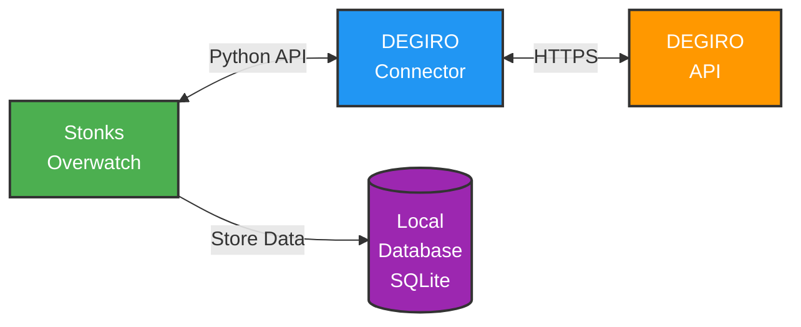

#  DEGIRO Integration Guide

DEGIRO is the primary broker supported by **Stonks Overwatch** with full-featured integration, providing real-time access to your investments, portfolio value, growth, dividends, fees, and deposits.

## Overview

### Features

- ✅ **Real-time portfolio tracking** - Live data updates
- ✅ **Transaction history** - Complete trade records
- ✅ **Dividend tracking** - Automatic dividend detection
- ✅ **Fee analysis** - Track all trading fees
- ✅ **2FA Support** - TOTP and In-App authentication
- ✅ **Offline mode** - Work without internet connection
- ✅ **Multi-currency** - Support for multiple currencies
- ✅ **Historical data** - Track portfolio performance over time

### Supported Markets

DEGIRO provides access to international markets including:
- European exchanges (Euronext, XETRA, etc.)
- US exchanges (NYSE, NASDAQ)
- Asian markets
- And more through DEGIRO's platform

---

## Authentication Methods

DEGIRO offers two authentication methods in Stonks Overwatch:

### Method 1: Manual Login (No Storage)

**Use this if you prefer not to store credentials.**

1. Open your browser at [http://127.0.0.1:8000](http://127.0.0.1:8000)
2. Enter your DEGIRO username and password
3. Enter your OTP (One-Time-Password) if 2FA is enabled
4. Click login

**Note:** You'll need to login each time you start the application.

### Method 2: Automatic Login (Stored Credentials)

**Use this for convenience - credentials stored in encrypted config file.**

1. Copy the configuration template:

   ```bash
   cp config/config.json.template config/config.json
   ```

2. Edit `config/config.json` with your DEGIRO credentials

---

## Configuration

### Basic Configuration

**Minimal setup (username and password only):**

```json
{
  "degiro": {
    "enabled": true,
    "credentials": {
      "username": "your_degiro_username",
      "password": "your_degiro_password"
    }
  }
}
```

### Configuration with 2FA (TOTP)

**For accounts with TOTP 2FA enabled:**

```json
{
  "degiro": {
    "enabled": true,
    "credentials": {
      "username": "your_degiro_username",
      "password": "your_degiro_password",
      "totp_secret_key": "YOUR_TOTP_SECRET_KEY"
    }
  }
}
```

**How to get your TOTP secret key:**

The TOTP secret is required for automatic 2FA authentication. Here's how to extract it:

1. **Open DEGIRO mobile app** and go to Settings → Two-Factor Authentication
2. **Disable 2FA** temporarily (you'll re-enable it in the next step)
3. **Re-enable 2FA** - DEGIRO will show you a QR code
4. **Extract the secret** from the QR code:
   - **Option A**: Use a QR code reader app that shows the raw text
   - **Option B**: Use an authenticator app that shows the secret (like Aegis Authenticator)
   - **Option C**: Use a tool like [qr-scanner](https://github.com/sayanarijit/qrscan) to decode the QR
5. The secret looks like: `BASE32ENCODEDSTRING` (e.g., `JBSWY3DPEHPK3PXP`)
6. Add this secret to your `config.json` as `totp_secret_key`

**Important:** Once you extract the secret, complete the 2FA setup in the DEGIRO app to keep your account secure.

**Need more help?** See the [DEGIRO Connector 2FA Guide](https://github.com/Chavithra/degiro-connector#how-to-use-2fa) for additional methods and troubleshooting.

**Alternative:** If you don't configure the TOTP secret, the application will prompt you for the OTP code each time.

### Advanced Configuration

**Complete configuration with all options:**

```json
{
  "degiro": {
    "enabled": true,
    "offline_mode": false,
    "credentials": {
      "username": "your_degiro_username",
      "password": "your_degiro_password",
      "totp_secret_key": "YOUR_TOTP_SECRET_KEY"
    },
    "base_currency": "EUR",
    "start_date": "2020-01-01",
    "update_frequency_minutes": 5
  }
}
```

### Configuration Options

| Option | Type | Default | Description |
|--------|------|---------|-------------|
| `enabled` | boolean | `true` | Enable/disable DEGIRO integration |
| `offline_mode` | boolean | `false` | Use cached data only (no API calls) |
| `credentials.username` | string | *required* | Your DEGIRO username |
| `credentials.password` | string | *required* | Your DEGIRO password |
| `credentials.totp_secret_key` | string | optional | TOTP secret for automatic 2FA |
| `base_currency` | string | DEGIRO default | Base currency for calculations (EUR, USD, etc.) |
| `start_date` | string | `2020-01-01` | Portfolio tracking start date (YYYY-MM-DD) |
| `update_frequency_minutes` | integer | `5` | Data refresh interval in minutes |

---

## In-App Authentication

If you don't have TOTP 2FA enabled, DEGIRO may require **In-App authentication** through their mobile app.

### How It Works

1. **Login attempt** - You enter username/password
2. **In-App required** - DEGIRO requests mobile confirmation
3. **Open DEGIRO app** - Notification appears in your DEGIRO mobile app
4. **Approve** - Tap to approve the login request
5. **Automatic login** - Dashboard loads automatically

### What You'll See

The application will show:
- "Open the DEGIRO app to continue"
- Animated spinner while waiting
- Automatic redirect once approved

### Troubleshooting In-App Auth

**No notification in app?**
- Ensure DEGIRO mobile app is up to date
- Check app notification settings
- Try force-closing and reopening the app

**Stuck on waiting screen?**
- Check if you approved the request in the app
- Wait up to 30 seconds for confirmation
- If still stuck, refresh the page and try again

---

## Features & Usage

### Offline Mode

Work with cached data without internet connection:

```json
{
  "degiro": {
    "offline_mode": true
  }
}
```

**Use cases:**
- Testing without API calls
- Working offline
- Reducing API load during development
- Using with demo data

### Update Frequency

Control how often data is refreshed:

```json
{
  "degiro": {
    "update_frequency_minutes": 10
  }
}
```

**Recommendations:**
- **5 minutes** (default) - Good balance
- **1-2 minutes** - Active trading
- **15-30 minutes** - Passive investing
- **60+ minutes** - Reduce API usage

### Base Currency

Override your DEGIRO base currency:

```json
{
  "degiro": {
    "base_currency": "USD"
  }
}
```

**Supported currencies:** EUR, USD, GBP, CHF, and others available in DEGIRO

---

## Troubleshooting

### Common Issues

#### Login Failed

**Symptoms:** "Invalid credentials" or login fails

**Solutions:**
1. Verify username and password in `config.json`
2. Try logging in to [DEGIRO website](https://www.degiro.com) directly
3. Check if your account is blocked or requires verification
4. Clear browser cache and try again

#### 2FA Not Working

**Symptoms:** TOTP code rejected or constantly asked for OTP

**Solutions:**
1. Verify TOTP secret key is correct
2. Check system clock is synchronized (TOTP is time-based)
3. Generate a new TOTP code and try again
4. Try extracting the TOTP secret again (see Configuration section above)
5. See [DEGIRO Connector 2FA Guide](https://github.com/Chavithra/degiro-connector#how-to-use-2fa) for troubleshooting

#### In-App Authentication Stuck

**Symptoms:** Waiting screen doesn't proceed

**Solutions:**
1. Open DEGIRO mobile app
2. Check for notification and approve
3. Wait up to 30 seconds
4. If stuck, refresh page and retry
5. Ensure mobile app is updated

#### Portfolio Data Not Updating

**Symptoms:** Old data showing, no updates

**Solutions:**
1. Check `update_frequency_minutes` setting
2. Verify internet connection
3. Check DEGIRO API status
4. Review logs: `data/logs/stonks-overwatch.log`
5. Restart application to force update

#### Connection Timeout

**Symptoms:** "Connection timeout" or "Cannot reach DEGIRO"

**Solutions:**
1. Check internet connection
2. Verify DEGIRO website is accessible
3. Check if using VPN (may cause issues)
4. Try increasing timeout in settings
5. Check firewall settings

### Debug Mode

Enable debug logging for troubleshooting:

```bash
make run debug=true
```

Check logs at: `data/logs/stonks-overwatch.log`

### Configuration Validation

**Verify your configuration:**

```bash
# Check if config file is valid JSON
cat config/config.json | python -m json.tool

# Test with demo mode first
make run demo=true
```

---

## Technical Details

### API Client

The application uses the [DEGIRO Connector](https://github.com/Chavithra/degiro-connector), a Python wrapper around DEGIRO's non-public API.

**Stonks Overwatch** fetches data from DEGIRO and stores it locally, providing real-time insights into your portfolio.

### Database Model

The database model is defined in:
- `src/stonks_overwatch/services/brokers/degiro/repositories/models.py`

The model reflects the DEGIRO API structure and normalizes the data for consistent access.

### Architecture



### Data Flow

1. **Fetch** - Connector retrieves data from DEGIRO API
2. **Transform** - Data normalized to internal format
3. **Store** - Saved to local SQLite database
4. **Display** - Dashboard shows your portfolio

---

## Advanced Topics

### Testing New Connector Versions

To test a development version of the DEGIRO connector:

1. **Clone the connector:**

   ```bash
   git clone https://github.com/Chavithra/degiro-connector
   cd degiro-connector
   ```

2. **Make your changes**

3. **Update version in `pyproject.toml`:**

   ```toml
   [tool.poetry]
   version = "3.0.29.dev1"
   ```

4. **Build and install:**

   ```bash
   # Build the package
   poetry build

   # Install in Stonks Overwatch
   cd /path/to/stonks-overwatch
   poetry add path/to/degiro-connector/dist/degiro_connector-3.0.29.dev1-py3-none-any.whl
   ```

### Using a Fork

To use a forked version of the connector:

**Update `pyproject.toml`:**

```toml
[tool.poetry.dependencies]
degiro-connector = { git = "https://github.com/YOUR_USERNAME/degiro-connector.git", branch = "main" }
```

**Then reinstall:**

```bash
poetry lock
poetry install
```

---

## Security & Privacy

### Data Security

- **Local storage** - All data stored on your computer
- **Encrypted credentials** - Config file credentials are encrypted
- **No cloud sync** - Data never sent to external servers
- **HTTPS only** - All DEGIRO API calls use HTTPS

### Security Best Practices

1. **Protect config file** - Never commit `config/config.json` to git
2. **Use strong password** - Use a strong, unique password for DEGIRO
3. **Enable 2FA** - Always enable two-factor authentication
4. **Regular updates** - Keep Stonks Overwatch and connector updated
5. **Backup data** - Regular backups of `data/` directory

### Permissions

Stonks Overwatch requires **read-only** access to your DEGIRO account. It can:
- ✅ View portfolio and positions
- ✅ View transaction history
- ✅ View account information
- ❌ Cannot execute trades
- ❌ Cannot withdraw funds
- ❌ Cannot change account settings

---

## FAQ

### How often should I update my data?

**Recommendation:** 5-10 minutes for most users. Active traders may prefer 1-2 minutes.

### Can I use multiple DEGIRO accounts?

Currently, one DEGIRO account per configuration. Multi-account support is planned for a future release.

### Does this work with DEGIRO in all countries?

Yes, the connector works with DEGIRO in all supported countries. Some features may vary by region.

### Is my data shared with anyone?

No. All data stays on your local computer. No telemetry or analytics are collected.

### What happens if DEGIRO changes their API?

The DEGIRO connector is regularly updated to adapt to API changes. Update to the latest version if you experience issues.

---

## Support & Resources

### Documentation

- **[Quickstart Guide](Quickstart.md)** - Get started quickly
- **[FAQ](FAQ.md)** - Common questions
- **[Troubleshooting](#troubleshooting)** - Fix common issues

### DEGIRO Resources

- **[DEGIRO Website](https://www.degiro.com)** - Official site
- **[DEGIRO Help Center](https://www.degiro.com/helpcenter)** - DEGIRO support
- **[DEGIRO Connector GitHub](https://github.com/Chavithra/degiro-connector)** - API client

### Community Support

- **[GitHub Discussions](https://github.com/ctasada/stonks-overwatch/discussions)** - Ask questions
- **[GitHub Issues](https://github.com/ctasada/stonks-overwatch/issues)** - Report bugs
- **Email** - carlos.tasada@gmail.com

---

## Next Steps

After setting up DEGIRO:

1. **Configure other brokers** - [Bitvavo](Bitvavo.md) • [IBKR](IBKR.md)
2. **Explore features** - Check the [User Guide](Home.md)
3. **Customize settings** - Adjust update frequency and preferences
4. **Set up backups** - Backup your `data/` directory regularly

---

**Need help?** Check the [FAQ](FAQ.md) or [open an issue](https://github.com/ctasada/stonks-overwatch/issues)!
