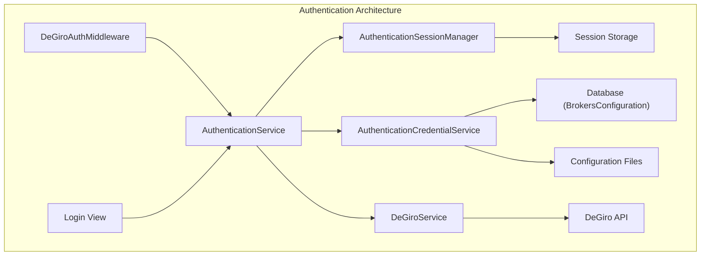

# DeGiro Authentication Architecture

## Overview

This document describes the authentication architecture for DeGiro integration in Stonks Overwatch. The system was refactored to eliminate coupling between components and provide a clean, maintainable authentication flow.

## Architecture

### Core Components

The authentication system consists of three main services:

1. **AuthenticationService**: Main orchestrator for authentication flows
2. **AuthenticationSessionManager**: Session state management
3. **AuthenticationCredentialService**: Credential validation and storage



### Service Responsibilities

#### AuthenticationService

- **Location**: `src/stonks_overwatch/services/utilities/authentication_service.py`
- **Purpose**: Main authentication orchestrator
- **Key Methods**:
  - `authenticate_user()`: Handle username/password authentication
  - `handle_totp_authentication()`: Handle 2FA flow
  - `check_degiro_connection()`: Verify DeGiro connectivity
  - `logout_user()`: Clear authentication state

#### AuthenticationSessionManager

- **Location**: `src/stonks_overwatch/services/utilities/authentication_session_manager.py`
- **Purpose**: Session state management
- **Key Methods**:
  - `is_authenticated()`: Check authentication status
  - `store_credentials()`: Store credentials for TOTP flow
  - `get_credentials()`: Retrieve stored credentials
  - `set_totp_required()`: Manage 2FA state

#### AuthenticationCredentialService

- **Location**: `src/stonks_overwatch/services/utilities/authentication_credential_service.py`
- **Purpose**: Credential validation and storage
- **Key Methods**:
  - `validate_credentials()`: Validate credential format
  - `get_effective_credentials()`: Resolve credentials from multiple sources
  - `store_credentials_in_database()`: Handle "remember me" functionality

### Service Access Pattern

Services are accessed through a service locator for performance optimization:

```python
from stonks_overwatch.core.authentication_locator import get_authentication_service

# Get optimized service instance
auth_service = get_authentication_service()
```

## Authentication Flows

### Initial Authentication Flow

1. **User submits credentials** → Login View
2. **Extract and validate** → AuthenticationCredentialService
3. **Store in session** → AuthenticationSessionManager
4. **Attempt DeGiro connection** → DeGiroService
5. **Handle result** → AuthenticationService

### TOTP (2FA) Flow

1. **DeGiro returns TOTP required** → AuthenticationService
2. **Store credentials and set TOTP flag** → Session Manager
3. **Redirect with preserved session** → Middleware
4. **User submits 2FA code** → Login View
5. **Retrieve stored credentials** → Session Manager
6. **Complete authentication** → DeGiroService

### Connection Check Flow (Middleware)

1. **Check if authenticated** → Session Manager
2. **If not authenticated, check DeGiro** → AuthenticationService
3. **Handle TOTP/errors** → Preserve or clear session
4. **Allow or redirect** → Based on result

## Error Handling

### Standardized Error Messages

All error messages are centralized in `src/stonks_overwatch/utils/core/constants.py`:

- `AuthenticationErrorMessages`: User-facing error messages
- `LogMessages`: Internal logging messages

### Authentication Results

The system uses an enum-based result system:

```python
class AuthenticationResult(Enum):
    SUCCESS = "success"
    TOTP_REQUIRED = "totp_required"
    INVALID_CREDENTIALS = "invalid_credentials"
    CONNECTION_ERROR = "connection_error"
    MAINTENANCE_MODE = "maintenance_mode"
    CONFIGURATION_ERROR = "configuration_error"
```

## Configuration

### Credential Sources (Priority Order)

1. **Session**: Stored during authentication for TOTP flow
2. **Database**: "Remember me" credentials (BrokersConfiguration)
3. **Configuration**: Default credentials from config files

### Database Schema

Credentials are stored in the `BrokersConfiguration` model:

```python
class BrokersConfiguration(models.Model):
    broker_name = models.CharField(max_length=50, unique=True)
    is_enabled = models.BooleanField(default=True)
    credentials = models.JSONField()  # Encrypted credential storage
```

## Maintenance Guidelines

### Adding New Authentication Methods

1. Extend `AuthenticationService` with new method
2. Add corresponding error handling
3. Update session manager if new state is needed
4. Add tests for new flow

### Debugging Authentication Issues

1. **Check logs**: All authentication operations are logged
2. **Session state**: Use session manager to inspect current state
3. **Credential resolution**: Verify which source is being used
4. **Connection status**: Check DeGiro API connectivity

### Performance Considerations

- Services are cached through the service locator
- Database queries are minimized through credential caching
- Session operations are optimized for frequent access

### Security Notes

- Passwords are never logged or exposed in debug output
- Session credentials are cleared on logout
- Database credentials are encrypted in storage
- TOTP codes are not persisted beyond the authentication flow

## Migration Notes

### From Legacy System

The refactored system maintains backward compatibility while providing:
- Centralized authentication logic
- Improved error handling
- Better session management
- Enhanced security

### Breaking Changes

- `DegiroHelper` class was removed (functionality moved to services)
- Direct `DeGiroService` access for authentication is deprecated
- Session management APIs have changed

## Troubleshooting

### Common Issues

1. **"Username and Password required" during TOTP**: Check credential storage in session
2. **Session cleared unexpectedly**: Verify middleware preserve_session logic
3. **Database credentials not working**: Check BrokersConfiguration table
4. **TOTP form not showing**: Verify session TOTP flag is set

### Debug Commands

```python
# Check authentication status
auth_service = get_authentication_service()
status = auth_service.get_authentication_status(request)

# Inspect session
session_data = auth_service.session_manager.get_session_data(request)

# Check credential sources
sources = auth_service.credential_service.get_credential_sources(request)
```
