# DeGiro Authentication Architecture

## Overview

This document describes the authentication architecture for DeGiro integration in Stonks Overwatch. The system underwent **major modernization in 2025**, featuring unified factory patterns, dependency injection, interface-based design, and performance optimizations while maintaining DeGiro-specific authentication flows.

## 2025 Architecture Modernization

✅ **Factory Pattern with DI**: Unified AuthenticationFactory with automatic dependency injection
✅ **Interface-Based Design**: Type-safe contracts for all authentication services
✅ **Service Locator Optimization**: High-performance caching and access patterns
✅ **Centralized Registration**: Single-point service registration and configuration
✅ **Enhanced Error Handling**: Professional exception hierarchy and recovery mechanisms

## Architecture

### Modern Factory Architecture (2025)

The authentication system now uses a sophisticated factory pattern with dependency injection:

```mermaid
graph TD
    subgraph "Modern Authentication Architecture"
        AL["AuthenticationLocator<br/>🎯 Service Access"] --> AF["AuthenticationFactory<br/>🏭 Dependency Injection"]
        AS_SETUP["AuthenticationSetup<br/>⚙️ Service Registration"] --> AF

        AF --> ASM_I["SessionManagerInterface<br/>📄 Contract"]
        AF --> ACS_I["CredentialServiceInterface<br/>📄 Contract"]
        AF --> AS_I["AuthenticationServiceInterface<br/>📄 Contract"]

        ASM_I -.-> ASM["AuthenticationSessionManager<br/>💾 Implementation"]
        ACS_I -.-> ACS["AuthenticationCredentialService<br/>🔐 Implementation"]
        AS_I -.-> AS["AuthenticationService<br/>🎪 Implementation"]

        MW["DeGiroAuthMiddleware"] --> AL
        LV["Login View"] --> AL

        AS --> DS["DeGiroService<br/>🌐 API Client"]

        ASM --> SS["Session Storage<br/>💾 Django Sessions"]
        ACS --> DB["Database<br/>🗄️ BrokersConfiguration"]
        ACS --> CFG["Configuration Files<br/>📁 JSON/YAML"]

        DS --> API["DeGiro API<br/>🌍 External Service"]
    end

    classDef modern fill:#e1f5fe,stroke:#01579b,stroke-width:2px
    classDef interface fill:#f3e5f5,stroke:#4a148c,stroke-width:2px
    classDef implementation fill:#e8f5e8,stroke:#1b5e20,stroke-width:2px
    classDef external fill:#fff3e0,stroke:#e65100,stroke-width:2px

    class AL,AF,AS_SETUP modern
    class ASM_I,ACS_I,AS_I interface
    class ASM,ACS,AS,MW,LV implementation
    class DS,API,SS,DB,CFG external
```



### Core Components

The authentication system consists of three main service layers:

1. **Service Factory Layer**: AuthenticationFactory with dependency injection
2. **Interface Layer**: Type-safe contracts for all services
3. **Implementation Layer**: Concrete service implementations

#### Service Interfaces

- **AuthenticationServiceInterface**: Main authentication contract
- **SessionManagerInterface**: Session management contract
- **CredentialServiceInterface**: Credential handling contract

### Service Responsibilities

#### AuthenticationService

- **Location**: `src/stonks_overwatch/services/utilities/authentication_service.py`
- **Purpose**: Main authentication orchestrator
- **Key Methods**:
  - `authenticate_user()`: Handle username/password authentication
  - `handle_totp_authentication()`: Handle 2FA flow
  - `check_degiro_connection()`: Verify DeGiro connectivity
  - `logout_user()`: Clear authentication state

#### AuthenticationSessionManager

- **Location**: `src/stonks_overwatch/services/utilities/authentication_session_manager.py`
- **Purpose**: Session state management
- **Key Methods**:
  - `is_authenticated()`: Check authentication status
  - `store_credentials()`: Store credentials for TOTP flow
  - `get_credentials()`: Retrieve stored credentials
  - `set_totp_required()`: Manage 2FA state

#### AuthenticationCredentialService

- **Location**: `src/stonks_overwatch/services/utilities/authentication_credential_service.py`
- **Purpose**: Credential validation and storage
- **Key Methods**:
  - `validate_credentials()`: Validate credential format
  - `get_effective_credentials()`: Resolve credentials from multiple sources
  - `store_credentials_in_database()`: Handle "remember me" functionality

### Modern Service Access Patterns

#### Service Locator Pattern (Recommended)

The optimized service locator provides high-performance access with caching:

```python
from stonks_overwatch.core.authentication_locator import get_authentication_service

# Get cached service instance (optimal performance)
auth_service = get_authentication_service()
```

#### Factory Pattern (Advanced Usage)

Direct factory access for custom configurations or dependency injection:

```python
from stonks_overwatch.core.factories.authentication_factory import AuthenticationFactory

# Create factory instance (singleton)
factory = AuthenticationFactory()

# Get service with automatic dependency injection
auth_service = factory.get_authentication_service()

# Custom configuration injection
auth_service = factory.get_authentication_service(config=custom_config)
```

#### Interface-Based Usage (Type Safety)

All services implement interfaces for type safety and testing:

```python
from stonks_overwatch.core.interfaces.authentication_service import AuthenticationServiceInterface

def process_authentication(auth_service: AuthenticationServiceInterface):
    # Guaranteed to have all required methods
    result = auth_service.authenticate_user(request, username, password)
    return result
```

## Authentication Flows

### Initial Authentication Flow

1. **User submits credentials** → Login View
2. **Extract and validate** → AuthenticationCredentialService
3. **Store in session** → AuthenticationSessionManager
4. **Attempt DeGiro connection** → DeGiroService
5. **Handle result** → AuthenticationService

### TOTP (2FA) Flow

1. **DeGiro returns TOTP required** → AuthenticationService
2. **Store credentials and set TOTP flag** → Session Manager
3. **Redirect with preserved session** → Middleware
4. **User submits 2FA code** → Login View
5. **Retrieve stored credentials** → Session Manager
6. **Complete authentication** → DeGiroService

### In-App Authentication Flow (New 2025)

When 2FA is not enabled, DEGIRO automatically triggers In-App authentication requiring mobile app confirmation:

1. **DeGiro returns In-App auth required** → AuthenticationService detects `status == 12` or `inAppTOTPNeeded`
2. **Store credentials with in_app_token** → Session Manager stores token from error details
3. **Set in_app_auth_required flag** → Session Manager sets UI state
4. **Redirect to login with In-App UI** → Middleware preserves session
5. **User sees "Open DEGIRO app" message** → Login template shows waiting UI
6. **JavaScript auto-submits form** → Browser automatically posts `in_app_auth=true`
7. **Enter waiting loop** → Login View calls `_handle_in_app_authentication()`
8. **Create TradingAPI with token** → Initialize API client with stored `in_app_token`
9. **Continuous polling** → Call `trading_api.connect()` every 5 seconds
10. **Check connection status** → Handle different error statuses:
    - `status == 3`: Continue waiting (user hasn't confirmed yet)
    - Success: Authentication completed
    - Other errors: Unrecoverable, show error
11. **On success** → Clear session flags, set authenticated, redirect to dashboard
12. **On error** → Clear session state, show error message

### Connection Check Flow (Middleware)

1. **Check if authenticated** → Session Manager
2. **If not authenticated, check DeGiro** → AuthenticationService
3. **Handle TOTP/In-App/errors** → Preserve or clear session
4. **Allow or redirect** → Based on result

## In-App Authentication Implementation Details (2025)

### Overview

In-App authentication is DEGIRO's newer security mechanism that requires users to confirm login attempts through their mobile app. This feature is automatically enabled when traditional 2FA (TOTP) is not configured on the account.

### Technical Architecture

#### Error Detection

The system detects In-App authentication requirements through DeGiro API responses:
- **Status Code**: `error_details.status == 12`
- **Status Text**: `error_details.status_text == "inAppTOTPNeeded"`
- **In-App Token**: `error_details.in_app_token` contains the authentication token

#### Session Management

```python
# Storing In-App authentication state
self.session_manager.store_credentials(
    request=request,
    username=username,
    password=password,
    in_app_token=degiro_error.error_details.in_app_token,
    remember_me=remember_me
)
self.session_manager.set_in_app_auth_required(request, True)
```

#### UI State Management

The login template supports four states:
- **Initial**: Username/password form
- **TOTP**: 2FA code input
- **In-App**: Waiting for mobile app confirmation
- **Loading**: Portfolio update in progress

#### Waiting Loop Implementation

```python
def _wait_for_in_app_confirmation(self, credentials) -> bool:
    """Wait for user confirmation in DEGIRO mobile app."""
    trading_api = TradingApi(credentials=api_credentials)

    while True:
        sleep(5)  # Wait 5 seconds between attempts
        try:
            trading_api.connect()
            return True  # Success
        except DeGiroConnectionError as retry_error:
            if retry_error.error_details.status == 3:
                continue  # Still waiting for confirmation
            else:
                raise retry_error  # Unrecoverable error
```

### Error Status Codes

| Status | Meaning | Action |
|--------|---------|---------|
| `3` | Waiting for user confirmation | Continue polling |
| `12` | In-App authentication required | Start In-App flow |
| `4` | Account blocked | Show error, stop |
| Other | Various authentication errors | Show error, stop |

### User Experience Flow

1. **Login Form**: User enters username/password
2. **API Response**: DEGIRO returns In-App auth required
3. **UI Update**: Page shows "Open the DEGIRO app" message with spinner
4. **Auto-Submit**: JavaScript automatically submits form with `in_app_auth=true`
5. **Backend Polling**: Server starts 5-second polling loop
6. **Mobile Confirmation**: User approves login in DEGIRO mobile app
7. **Success**: Automatic redirect to dashboard with portfolio update

### Implementation Files

- **Login View**: `src/stonks_overwatch/views/login.py`
  - `_handle_in_app_authentication()`: Main handler method
  - `_wait_for_in_app_confirmation()`: Polling loop implementation
- **Session Manager**: `src/stonks_overwatch/services/utilities/authentication_session_manager.py`
  - `set_in_app_auth_required()`: Set UI state flag
  - `is_in_app_auth_required()`: Check UI state flag
  - `store_credentials()`: Store token with credentials
- **Authentication Service**: `src/stonks_overwatch/services/utilities/authentication_service.py`
  - `_handle_in_app_auth_required_error()`: Error handler
- **Template**: `src/stonks_overwatch/templates/login.html`
  - In-App UI section with spinner and auto-submit logic
- **Middleware**: `src/stonks_overwatch/middleware/degiro_auth.py`
  - Handles In-App auth redirects and session preservation

### Security Considerations

- **Token Storage**: In-App tokens are stored temporarily in session only
- **Session Cleanup**: Tokens are cleared on successful authentication or errors
- **Timeout Handling**: No explicit timeout - relies on DEGIRO API timeout behavior
- **Error Recovery**: Unrecoverable errors clear session and return to login form

### Troubleshooting

#### Common Issues

1. **"No in-app token found"**: Check that In-App auth was properly triggered and token stored
2. **Infinite waiting**: User may need to check DEGIRO mobile app for notification
3. **Connection timeouts**: Network issues or DEGIRO API problems

#### Debug Commands

```python
# Check In-App session state
session_data = auth_service.session_manager.get_session_data(request)
print(f"In-App required: {session_data.get('in_app_auth_required')}")

# Check stored credentials include token
credentials = auth_service.session_manager.get_credentials(request)
print(f"Has in-app token: {bool(credentials and credentials.in_app_token)}")
```

## Error Handling

### Standardized Error Messages

All error messages are centralized in `src/stonks_overwatch/utils/core/constants.py`:

- `AuthenticationErrorMessages`: User-facing error messages
- `LogMessages`: Internal logging messages

### Authentication Results

The system uses an enum-based result system:

```python
class AuthenticationResult(Enum):
    SUCCESS = "success"
    TOTP_REQUIRED = "totp_required"
    INVALID_CREDENTIALS = "invalid_credentials"
    CONNECTION_ERROR = "connection_error"
    MAINTENANCE_MODE = "maintenance_mode"
    CONFIGURATION_ERROR = "configuration_error"
```

## Modern Service Registration

### Authentication Service Setup

The modern architecture uses centralized service registration:

```python
# From: src/stonks_overwatch/core/authentication_setup.py
from stonks_overwatch.core.authentication_setup import register_authentication_services

def register_authentication_services():
    """Register all authentication services with dependency injection."""
    auth_factory = AuthenticationFactory()

    # Register service implementations with interfaces
    auth_factory.register_session_manager(AuthenticationSessionManager)
    auth_factory.register_credential_service(AuthenticationCredentialService)
    auth_factory.register_authentication_service(AuthenticationService)
```

### Factory Benefits

✅ **Automatic Dependency Injection**: Services receive dependencies automatically
✅ **Interface Compliance**: Type-safe service contracts enforced
✅ **Performance Caching**: Service instances cached for optimal performance
✅ **Memory Management**: Efficient cache management and cleanup
✅ **Configuration Support**: Optional configuration injection for customization

### Service Lifecycle

1. **Registration**: Services registered with factory at startup
2. **Creation**: Services created with automatic dependency injection
3. **Caching**: Instances cached for performance optimization
4. **Access**: High-performance access through service locator
5. **Cleanup**: Automatic cache management and memory optimization

## Configuration

### Credential Sources (Priority Order)

1. **Session**: Stored during authentication for TOTP flow
2. **Database**: "Remember me" credentials (BrokersConfiguration)
3. **Configuration**: Default credentials from config files

### Database Schema

Credentials are stored in the `BrokersConfiguration` model:

```python
class BrokersConfiguration(models.Model):
    broker_name = models.CharField(max_length=50, unique=True)
    is_enabled = models.BooleanField(default=True)
    credentials = models.JSONField()  # Encrypted credential storage
```

## Maintenance Guidelines

### Adding New Authentication Methods

1. Extend `AuthenticationService` with new method
2. Add corresponding error handling
3. Update session manager if new state is needed
4. Add tests for new flow

### Debugging Authentication Issues

1. **Check logs**: All authentication operations are logged
2. **Session state**: Use session manager to inspect current state
3. **Credential resolution**: Verify which source is being used
4. **Connection status**: Check DeGiro API connectivity

### Performance Considerations

- Services are cached through the service locator
- Database queries are minimized through credential caching
- Session operations are optimized for frequent access

### Security Notes

- Passwords are never logged or exposed in debug output
- Session credentials are cleared on logout
- Database credentials are encrypted in storage
- TOTP codes are not persisted beyond the authentication flow

## Migration Notes

### 2025 Modern Architecture Migration

The 2025 modernization represents a **major architectural upgrade** while maintaining full backward compatibility:

#### What's New

✅ **Factory Pattern**: Unified AuthenticationFactory replaces manual service instantiation
✅ **Dependency Injection**: Automatic configuration and service injection
✅ **Interface Contracts**: Type-safe service interfaces for better development experience
✅ **Service Locator**: High-performance caching and optimized access patterns
✅ **Error Handling**: Professional exception hierarchy and recovery mechanisms

#### Migration Path

**Old Pattern (Pre-2025)**:

```python
# Manual service creation
session_manager = AuthenticationSessionManager()
credential_service = AuthenticationCredentialService()
auth_service = AuthenticationService(session_manager, credential_service)
```

**New Pattern (2025+)**:

```python
# Optimized service locator (recommended)
from stonks_overwatch.core.authentication_locator import get_authentication_service
auth_service = get_authentication_service()  # All dependencies injected automatically
```

#### Breaking Changes

- ❌ **Manual Service Instantiation**: Deprecated in favor of factory pattern
- ❌ **Direct Service Dependencies**: Services now auto-inject dependencies
- ⚠️ **API Changes**: Some method signatures updated for better type safety

#### Backward Compatibility

✅ **Core APIs**: All main authentication methods remain unchanged
✅ **DeGiro Flows**: TOTP and authentication flows work identically
✅ **Session Management**: Session APIs maintain compatibility
✅ **Error Handling**: Enhanced but backward-compatible error responses

## Troubleshooting

### Common Issues

1. **"Username and Password required" during TOTP**: Check credential storage in session
2. **Session cleared unexpectedly**: Verify middleware preserve_session logic
3. **Database credentials not working**: Check BrokersConfiguration table
4. **TOTP form not showing**: Verify session TOTP flag is set

### Debug Commands

```python
from stonks_overwatch.core.authentication_locator import get_authentication_service, get_authentication_cache_status

# Check authentication status
auth_service = get_authentication_service()
status = auth_service.get_authentication_status(request)
print(f"Auth Status: {status}")

# Inspect session data (passwords masked for security)
session_data = auth_service.session_manager.get_session_data(request)
print(f"Session authenticated: {session_data.get('is_authenticated')}")
print(f"TOTP required: {session_data.get('totp_required')}")
print(f"Session ID: {session_data.get('session_id')}")  # Partially masked

# Check credential sources (returns tuple)
has_session, has_database, has_config = auth_service.credential_service.get_credential_sources(request)
print(f"Credential sources - Session: {has_session}, Database: {has_database}, Config: {has_config}")

# Monitor service locator performance
cache_status = get_authentication_cache_status()
print(f"Cache performance: {cache_status}")
```
