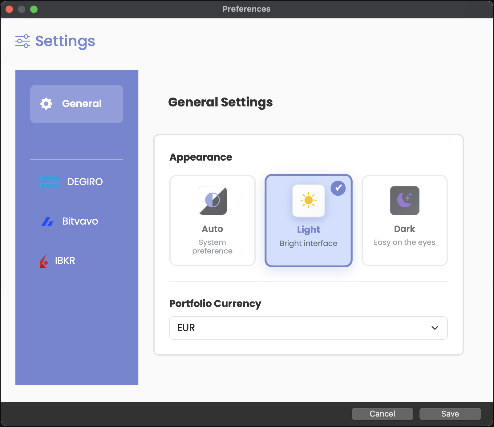

# Frequently Asked Questions (FAQ)

## General Questions

### What is Stonks Overwatch?

Stonks Overwatch is an open-source investment portfolio tracker that helps you manage and monitor your investments across multiple brokers. It runs entirely on your local machine, ensuring your financial data remains private and secure.

### Is Stonks Overwatch free?

Yes! Stonks Overwatch is 100% free and open-source under the MIT License. There are no subscriptions, no hidden costs, and no premium features. The entire source code is available on [GitHub](https://github.com/ctasada/stonks-overwatch).

### Which platforms are supported?

Stonks Overwatch runs on:

- **Windows** (10, 11)
- **macOS** (10.13 and later)
- **Linux** (most distributions)

Both web-based and native desktop applications are available.

### Which brokers are supported?

Currently supported brokers:

- **DEGIRO** - Full support with real-time data
- **Bitvavo 🧪️(experimental)** - Cryptocurrency exchange
- **IBKR  🧪️(experimental)** (Interactive Brokers) - International markets

More brokers can be added through our plugin architecture. Check the [CHANGELOG](../CHANGELOG.md) for updates and planned integrations.

## Installation & Setup

### How do I install Stonks Overwatch?

See our [Quickstart Guide](Quickstart.md) for step-by-step installation instructions. The basic process:

1. Install Python 3.13+ and Git
2. Clone the repository
3. Run `make start` to install dependencies
4. Configure your brokers
5. Run `make run` to start

### What are the system requirements?

**Minimum Requirements:**
- Python 3.13 or higher
- 2 GB RAM
- 500 MB disk space
- Internet connection (for broker data sync)

**Recommended:**
- Python 3.13+
- 4 GB RAM
- 1 GB disk space
- Broadband internet connection

### Can I run it without installing Python?

Yes! Use Docker to run Stonks Overwatch in a container:

```bash
make docker-run
```

This doesn't require Python installation on your system. See the [Quickstart Guide](Quickstart.md#docker-alternative) for Docker setup instructions.

### How do I update to the latest version?

```bash
cd stonks-overwatch
git pull origin main
make update  # Update all dependencies to latest versions
make run
```

> **Tip**: `make update` will update Poetry itself, all Python packages, Node.js dependencies, and regenerate third-party licenses automatically.

## Data & Privacy

### Where is my data stored?

All data is stored locally on your computer in the `data/` directory:
- **Database**: `data/db.sqlite3`
- **Cache**: `data/cache/`
- **Logs**: `data/logs/`

Your data **never** leaves your machine unless you explicitly configure backup services.

### Is my financial data secure?

Yes. Stonks Overwatch:
- Stores all data locally on your computer
- Does not send data to external servers
- Encrypts sensitive credentials in the database
- Never shares or sells your data
- Is fully open-source for transparency

### Can I backup my data?

Yes! You can backup your data in several ways:

**Manual Backup:**

```bash
# Backup the entire data directory
cp -r data/ data_backup/

# Or use the built-in export tool
poetry run python ./scripts/dump_db.py dump --output my_backup.json
```

**Automatic Backup:**
The application creates automatic backups in `data/db.sqlite3.backup`.

### How do I restore from a backup?

```bash
# Restore from JSON export
poetry run python ./scripts/dump_db.py load --input my_backup.json

# Or restore database file
cp data_backup/db.sqlite3 data/db.sqlite3
```

## Configuration

### How do I configure my brokers?

Each broker has specific setup instructions:
- [DEGIRO Configuration](DEGIRO.md)
- [Bitvavo Configuration](Bitvavo.md)
- [IBKR Configuration](IBKR.md)

General steps:
1. Copy `config/config.json.template` to `config/config.json`
2. Edit the file with your broker credentials
3. Set `enabled: true` for brokers you want to use
4. Restart the application

### Where should I store my config file?

The config file should be at `config/config.json`. This location is ignored by Git, so your credentials won't be accidentally committed.

**Never commit your config file to version control!**

### Can I use multiple brokers simultaneously?

Yes! You can enable and use multiple brokers at the same time. Your portfolio will show a unified view across all enabled brokers.

### How do I disable a broker?

In your `config/config.json`, set `enabled: false` for the broker:

```json
{
  "degiro": {
    "enabled": false
  }
}
```

## Features & Usage

### Can I try it without broker credentials?

Yes! Run in demo mode to explore features with sample data:

```bash
make run demo=true
```

### How often is my portfolio data updated?

By default:
- **DEGIRO**: Every 5 minutes
- **Bitvavo**: Every 5 minutes
- **IBKR**: Every 15 minutes

You can customize update frequency in `config.json`:

```json
{
  "degiro": {
    "update_frequency_minutes": 10
  }
}
```

### Can I use it offline?

Yes! Enable offline mode in your config:

```json
{
  "degiro": {
    "offline_mode": true
  }
}
```

In offline mode, the application uses cached data without connecting to broker APIs.

### Does it support multiple currencies?

Yes! You can set your base currency in the config:

```json
{
  "base_currency": "EUR"
}
```

Supported currencies: EUR, USD, GBP, and most major currencies.

### Can I export my data?

Yes! Export your portfolio data:

```bash
# Export to JSON
poetry run python ./scripts/dump_db.py dump --output portfolio.json

# Export from the UI
Navigate to Settings > Export Data
```

### Can I change the theme or appearance?

Yes! Stonks Overwatch supports three theme options:

- **Light Theme** - Traditional bright interface
- **Dark Theme** - Modern dark interface that's easier on the eyes
- **System Theme** - Automatically follows your OS theme preference

**To change themes:**

**Native App:**
1. Open Preferences from the application menu
2. Go to General tab
3. Select your preferred theme

**Web Version:**
1. Click Settings in the sidebar
2. Navigate to Preferences section
3. Choose your theme preference

The system theme option will automatically switch between light and dark modes when your operating system changes its theme, providing a seamless experience.


*UI Mode Selector*

## Troubleshooting

### The application won't start

**Check Python version:**

```bash
python --version  # Must be 3.13+
```

**Reinstall dependencies:**

```bash
make start
```

**Check for error messages:**

```bash
make run debug=true
```

### I can't login to DEGIRO

**Common issues:**
1. **2FA enabled**: You need to set up TOTP in your config. See [DEGIRO setup](DEGIRO.md)
2. **Wrong credentials**: Double-check username/password
3. **Account blocked**: Check if you can login via DEGIRO website
4. **Maintenance**: DEGIRO may be under maintenance

**In-App authentication required:**
If DEGIRO asks for mobile app confirmation:
1. Open the DEGIRO mobile app
2. Approve the login request
3. The dashboard will load automatically

### My portfolio data is not updating

**Check broker connection:**
1. Verify credentials in `config.json`
2. Check if broker's website is accessible
3. Review logs in `data/logs/stonks-overwatch.log`

**Force refresh:**
Restart the application to trigger an immediate update.

### I'm seeing "Port already in use" error

Another service is using port 8000. Either:
1. Stop the other service
2. Change the port in settings (advanced)

### Database errors

**Reset the database:**

```bash
rm data/db.sqlite3
make start
```

**Note**: This will delete all local data. Export first if you want to keep it.

### Performance is slow

**Optimize:**
1. Reduce update frequency in config
2. Close other browser tabs
3. Check system resources
4. Clear cache: `rm -rf data/cache/*`

## Development & Contributing

### How can I contribute?

We welcome all contributions! See [Contributing Guidelines](../CONTRIBUTING.md) for details.

Ways to contribute:
- Report bugs
- Suggest features
- Improve documentation
- Submit code changes
- Add broker integrations

### How do I report a bug?

[Open a bug report](https://github.com/ctasada/stonks-overwatch/issues/new?template=bug_report.md) on GitHub. Our bug report template will guide you through providing:

- Description of the problem
- Steps to reproduce
- Expected vs actual behavior
- Error messages/logs
- Your OS and Python version
- Configuration details

The more details you provide, the faster we can help!

### How do I request a feature?

[Open a feature request](https://github.com/ctasada/stonks-overwatch/issues/new?template=feature_request.md) describing:

- What you want to achieve
- Why it would be useful
- How you imagine it working
- Alternative solutions you've considered

Our feature request template helps ensure we understand your needs.

### Can I add support for my broker?

Yes! We have an extensible plugin architecture. See:
- [Broker Architecture Guide](ARCHITECTURE_BROKERS.md)
- [Developer Guide](Developing-Stonks-Overwatch.md)

Or open an issue requesting the broker, and someone from the community might implement it.

### How do I run tests?

```bash
make test
```

This runs the full test suite and generates a coverage report.

### Where can I find the code style guidelines?

We follow PEP 8 for Python code. Check style with:

```bash
make lint-check
```

Auto-fix issues with:

```bash
make lint-fix
```

## Support & Community

### Where can I get help?

- **Documentation**: [Read the docs](Home.md)
- **FAQ**: You're reading it!
- **Discussions**: [GitHub Discussions](https://github.com/ctasada/stonks-overwatch/discussions)
- **Issues**: [GitHub Issues](https://github.com/ctasada/stonks-overwatch/issues)
- **Email**: carlos.tasada@gmail.com

### How do I stay updated?

- **Star** the repository on GitHub
- **Watch** for releases
- Check the [CHANGELOG](../CHANGELOG.md) for updates
- Join discussions

### Is there a community chat?

We use [GitHub Discussions](https://github.com/ctasada/stonks-overwatch/discussions) for community interaction. Feel free to ask questions, share ideas, or showcase your setup!

### Can I use this for commercial purposes?

Yes! The MIT License allows commercial use. You're free to use, modify, and distribute Stonks Overwatch for any purpose, including commercial applications.

## Miscellaneous

### What does "Stonks" mean?

"Stonks" is internet slang for "stocks," often used humorously in memes about the stock market. We chose the name to reflect the project's approachable, community-driven nature.

### Why did you build this?

To provide a privacy-focused, open-source alternative to commercial portfolio trackers that often charge fees and collect user data. Everyone should have access to good portfolio management tools without sacrificing privacy.

### What's planned for the future?

Planned features include:
- Mobile applications
- More broker integrations
- Advanced analytics
- Plugin marketplace
- And much more!

### How can I support the project?

- **⭐ Star** the repository on GitHub - Helps others discover the project
- **💰 Sponsor** development - [Support via GitHub Sponsors](https://github.com/sponsors/ctasada)
- **💻 Contribute** code, documentation, or ideas - See [Contributing Guide](../CONTRIBUTING.md)
- **🐛 Report** bugs and suggest improvements - [Open an issue](https://github.com/ctasada/stonks-overwatch/issues)
- **📢 Share** with others who might find it useful

For more information about sponsorship and why it matters, see the [Support & Sponsorship](Home.md#support--sponsorship) section in the documentation.

---

**Still have questions?** Ask in [GitHub Discussions](https://github.com/ctasada/stonks-overwatch/discussions) or check our [full documentation](Home.md)!
