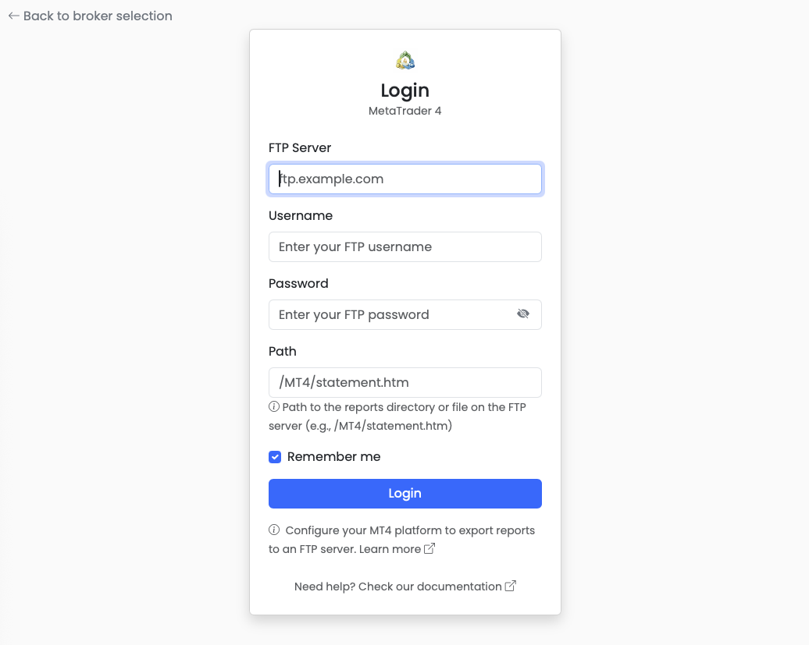
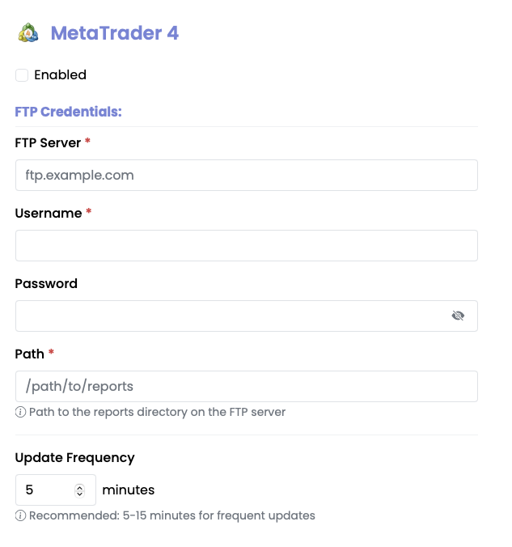

#  MetaTrader 4 Integration Guide

> **⚠️ MetaTrader 4 integration is not yet stable. Features and reliability may change in future releases. Use with caution.**

MetaTrader 4 (MT4) is a popular forex and CFD trading platform supported by **Stonks Overwatch**, providing comprehensive trading capabilities through FTP-based data access.

## Overview

### Features

- ✅ **Automated Data Collection** - Reports are automatically generated and uploaded by MT4
- ✅ **Comprehensive Trading Data** - Access to closed transactions, open trades, working orders, and account summaries
- ✅ **Real-time Updates** - Configurable update frequency for fresh data
- ✅ **Historical Analysis** - Track your trading performance over time
- ✅ **Multi-Currency Support** - Automatic currency conversion to your base currency
- ✅ **FTP-based Integration** - Secure FTP access to HTML reports
- ✅ **Performance Analytics** - Calculate ROI and track trading performance

### Supported Data Types

- **Portfolio Data** - Current open positions with unrealized P&L
- **Transaction History** - Complete record of closed trades with profit/loss
- **Account Information** - Balance, equity, margin, and account currency
- **Trading Statistics** - Win/loss ratios, total profit/loss, and ROI calculations
- **Fees and Commissions** - Detailed breakdown of trading costs

---

## Prerequisites

Before configuring MetaTrader 4 in Stonks Overwatch, you need to:

1. **Have an active MT4 account** - With a broker that supports MT4
2. **Enable FTP Publishing** - Configure your MT4 platform to publish reports to an FTP server
3. **FTP Server Access** - You need access to an FTP server where MT4 can upload reports
4. **Report Generation** - Ensure MT4 is configured to generate HTML statement reports

---

## FTP Server Setup

### Requirements

Your FTP server should be configured to:
- Accept connections from your MT4 platform
- Allow file uploads to a specific directory
- Maintain report files for Stonks Overwatch to access

### MetaTrader 4 Configuration

1. **Enable FTP Publishing** - Configure your MT4 platform to publish reports to an FTP server
2. **FTP Server Access** - You need access to an FTP server where MT4 can upload reports
3. **Report Generation** - Ensure MT4 is configured to generate HTML statement reports

---

## Getting Started

### Initial Setup

When you first launch Stonks Overwatch, you'll be presented with a broker selection screen. Select MetaTrader 4 to begin the authentication process.

### Authentication



MetaTrader 4 uses FTP-based authentication for secure access to your trading reports.

1. Enter your **FTP Server** (hostname or IP address)
2. Enter your **Username**
3. Enter your **Password**
4. Enter the **Path** to the reports directory or specific report file
5. Click "Login"

Your credentials will be validated, and you'll be redirected to the dashboard.

---

## Configuring Credentials

After your initial login, you can configure MetaTrader 4 to automatically authenticate on startup.



### Via Settings (Web Application)

1. Navigate to the **Settings** page (sidebar menu)
2. Locate the **MetaTrader 4** section
3. Enter your credentials:
   - FTP Server
   - Username
   - Password
   - Path
4. Configure additional options:
   - Enable/disable the broker
   - Set update frequency
   - Set start date for historical data
5. Click **Save**

### Via Preferences (Native Application)

1. Open **Preferences** from the application menu
2. Select the **Brokers** tab
3. Configure MetaTrader 4 credentials and settings
4. Click **Save**

Your credentials are encrypted and stored securely in the local database.

---

## Advanced Settings

### Portfolio Tracking

View your trading portfolio:

- Current open positions across all instruments
- Multi-currency support
- Real-time valuations
- Position P&L tracking

### Update Frequency

Control how often data is refreshed from your FTP server. Configure this in Settings (default: 5 minutes).

**Recommendations:**

- **1-2 minutes** - Active trading
- **5 minutes** (default) - Regular monitoring
- **15-30 minutes** - Long-term positions
- **Higher frequency** - May increase FTP server load

### Unified Dashboard

MetaTrader 4 integrates seamlessly with other brokers:

- Combined portfolio view
- Total value across all accounts
- Comprehensive asset allocation
- Global diversification analysis

---

## Troubleshooting

### Common Issues

#### FTP Connection Problems

**Symptoms:** "FTP connection failed" or connection timeout errors

**Solutions:**

1. Verify the FTP server hostname is correct
2. Check username and password are valid
3. Test network access to the FTP server
4. Ensure FTP ports (21, 20) are not blocked by firewall
5. Check if using passive/active FTP mode

#### Authentication Failures

**Symptoms:** "Authentication failed" or "Invalid credentials"

**Solutions:**
1. Verify FTP username and password in Settings
2. Check that FTP account is still active
3. Ensure you have read access to the reports directory
4. Test FTP connection manually using an FTP client

#### No Data Showing

**Symptoms:** MetaTrader 4 enabled but no portfolio data

**Solutions:**
1. Check if you have open positions on MT4
2. Verify MT4 is generating and uploading HTML reports
3. Check logs: `data/logs/stonks-overwatch.log`
4. Ensure the report path exists on FTP server

#### Data Import Issues

**Symptoms:** "No data available" or parsing errors

**Solutions:**
1. Ensure MT4 is generating HTML format reports
2. Verify reports contain all required sections
3. Check file encoding (should be UTF-8)
4. Verify report completeness

#### Path Does Not Exist

**Symptoms:** "Path does not exist" error

**Solutions:**

1. Confirm the report path exists on FTP server
2. Check file permissions for the reports directory
3. Use absolute paths instead of relative paths
4. Verify the report filename is correct

### Debug Mode

Enable debug logging for troubleshooting:

```bash
make run debug=true
```

Check logs at: `data/logs/stonks-overwatch.log`

---

## For Developers

### Manual Configuration via config.json

Developers can configure MetaTrader 4 credentials directly in the `config/config.json` file for testing and development purposes.

#### Basic Configuration

**Minimal setup with FTP credentials:**

```json
{
  "metatrader4": {
    "enabled": true,
    "credentials": {
      "ftp_server": "ftp.example.com",
      "username": "your_ftp_username",
      "password": "your_ftp_password",
      "path": "/MT4/statement.htm"
    }
  }
}
```

#### Advanced Configuration

**Complete configuration with all options:**

```json
{
  "metatrader4": {
    "enabled": true,
    "credentials": {
      "ftp_server": "ftp.example.com",
      "username": "your_ftp_username",
      "password": "your_ftp_password",
      "path": "/MT4/statement.htm"
    },
    "start_date": "2020-01-01",
    "update_frequency_minutes": 5
  }
}
```

#### Configuration Options

| Option | Type | Default | Description |
|--------|------|---------|-------------|
| `enabled` | boolean | `true` | Enable/disable MetaTrader 4 integration |
| `credentials.ftp_server` | string | *required* | FTP server hostname or IP address |
| `credentials.username` | string | *required* | FTP username |
| `credentials.password` | string | *required* | FTP password |
| `credentials.path` | string | *required* | Path to reports directory or specific report file |
| `start_date` | string | `2020-01-01` | Historical data collection start date |
| `update_frequency_minutes` | integer | `5` | Data refresh interval in minutes |

#### Setup Steps

1. Copy the configuration template:

   ```bash
   cp config/config.json.template config/config.json
   ```

2. Edit `config/config.json` and add your MetaTrader 4 credentials:

   ```json
   {
     "metatrader4": {
       "enabled": true,
       "credentials": {
         "ftp_server": "ftp.example.com",
         "username": "mt4user",
         "password": "mt4password",
         "path": "/MT4/statement.htm"
       }
     }
   }
   ```

3. Start the application:

   ```bash
   make run
   ```

4. Verify connection - check the dashboard for your MetaTrader 4 portfolio data

**Note:** The `config.json` file is encrypted and never committed to version control. For production use, configure credentials via the Settings UI instead.

### Test Configuration

**Verify your configuration:**

```bash
# Check if config file is valid JSON
cat config/config.json | python -m json.tool

# Run with debug mode
make run debug=true
```

### Manual Data Import

You can also manually import MT4 data using the command-line script:

```bash
# Parse local HTML file
poetry run python scripts/mt4/mt4.py statement.htm -o output.json

# Retrieve from FTP and parse
poetry run python scripts/mt4/mt4.py -v

# Show calendar aggregation
poetry run python scripts/mt4/mt4.py statement.htm --show_calendar
```

### API Access

The MT4 integration provides programmatic access through service interfaces:

```python
from stonks_overwatch.core.factories.broker_factory import BrokerFactory
from stonks_overwatch.core.service_types import ServiceType

factory = BrokerFactory()

# Get portfolio data
portfolio_service = factory.create_service("metatrader4", ServiceType.PORTFOLIO)
portfolio = portfolio_service.get_portfolio

# Get transaction history
transaction_service = factory.create_service("metatrader4", ServiceType.TRANSACTION)
transactions = transaction_service.get_transactions()
```

---

## Technical Details

### API Client

The application uses FTP-based data retrieval to access HTML reports generated by MetaTrader 4. The integration processes these reports locally to extract trading data.

**Stonks Overwatch** fetches data from your FTP server and stores it locally, providing real-time insights into your MT4 trading performance.

### Database Model

The database model is defined in:
- `src/stonks_overwatch/services/brokers/metatrader4/repositories/models.py`

### Architecture

```text
┌─────────────┐      ┌──────────────────┐      ┌──────────────┐
│   Stonks    │─────▶│   FTP Client     │─────▶│   FTP Server │
│  Overwatch  │◀─────│   (Python)       │◀─────│   (Reports)  │
└─────────────┘      └──────────────────┘      └──────────────┘
       │                                               ▲
       ▼                                               │
┌─────────────┐                               ┌──────────────┐
│   Local     │                               │  MetaTrader  │
│  Database   │                               │      4       │
│  (SQLite)   │                               │   Platform   │
└─────────────┘                               └──────────────┘
```

### Data Flow

1. **Generate** - MT4 platform generates HTML reports
2. **Upload** - Reports are uploaded to FTP server
3. **Fetch** - Retrieve reports via FTP
4. **Parse** - Process HTML content into structured data
5. **Store** - Save to local database
6. **Display** - Show in dashboard

### Data Models

The integration uses structured data models:

```python
@dataclass
class Metatrader4Trade:
    ticket: str
    open_time: datetime
    trade_type: str
    size: float
    item: str
    open_price: float
    close_time: datetime
    close_price: float
    commission: float
    profit: float
```

### Service Implementation

All MT4 services implement their respective interfaces:

- `PortfolioServiceInterface` - Portfolio data and calculations
- `TransactionServiceInterface` - Transaction history and analysis
- `AuthenticationServiceInterface` - FTP credential validation
- `AccountServiceInterface` - Account information and settings

---

## Security & Privacy

### Data Security

- **FTP credentials** - Stored encrypted in config file
- **Local storage** - All data stored on your computer
- **No cloud sync** - Data never sent to external servers
- **Secure FTP** - Use SFTP when possible for additional security
- **Read-only access** - Only reads report files from FTP server

### Security Best Practices

1. **Use secure FTP (SFTP)** - When possible for encrypted connections
2. **Protect config file** - Never commit `config/config.json` to git
3. **Regular credential rotation** - Periodically change FTP passwords
4. **Monitor FTP access** - Check FTP logs for unusual activity
5. **Backup data** - Regular backups of `data/` directory

### Network Security

- Use secure FTP (SFTP) when possible
- Consider VPN access for additional security
- Regularly rotate FTP credentials

### Permissions

With FTP access, Stonks Overwatch can:
- ✅ Read HTML report files
- ✅ Access reports directory
- ❌ Cannot execute trades
- ❌ Cannot modify MT4 settings
- ❌ Cannot access other FTP directories

---

## Known Issues

### Current Limitations

- **Historical Data** - Limited to data available in MT4 reports
- **Real-time Updates** - Depends on MT4 report generation frequency
- **Product Types** - Generic classification (specific instrument types not detected)
- **Multi-Account** - Single account per configuration

### Future Enhancements

- Direct MT4 API integration
- Enhanced product type detection
- Multi-account support
- Real-time data streaming

---

## FAQ

### How complex is MetaTrader 4 setup?

MT4 setup requires configuring FTP publishing in your MT4 platform and providing FTP server credentials. The process is straightforward once FTP is configured.

### Can I use multiple MT4 accounts?

Currently, one MT4 account per configuration. Multi-account support is planned for a future release.

### Why do I need an FTP server?

MT4 doesn't provide a direct API for third-party applications. FTP-based report access is the standard method for external data integration.

### What if my FTP credentials change?

Update your credentials in the Settings page. The system will automatically use the new credentials for future data retrieval.

### Does this work with MT5?

Currently only MT4 is supported. MT5 support may be added in future releases.

---

## Support & Resources

### Documentation

- **[Quickstart Guide](Quickstart.md)** - Get started quickly
- **[FAQ](FAQ.md)** - Common questions
- **[Troubleshooting](#troubleshooting)** - Fix common issues

### MetaTrader 4 Resources

- **[MT4 Official Documentation](https://www.metatrader4.com/en/trading-platform/help)** - Official MT4 help
- **[FTP Setup Guide](https://www.metatrader4.com/en/trading-platform/help/setup/setup_publisher)** - Configure FTP publishing
- **[Stonks Overwatch Architecture](ARCHITECTURE.md)** - Technical details

### Community Support

- **[GitHub Discussions](https://github.com/ctasada/stonks-overwatch/discussions)** - Ask questions
- **[GitHub Issues](https://github.com/ctasada/stonks-overwatch/issues)** - Report bugs
- **Email** - carlos.tasada@gmail.com

---

## Next Steps

After setting up MetaTrader 4:

1. **Configure other brokers** - [DEGIRO](DEGIRO.md) • [IBKR](IBKR.md) • [Bitvavo](Bitvavo.md)
2. **Explore features** - Check the [User Guide](Home.md)
3. **Customize settings** - Adjust update frequency
4. **Set up backups** - Backup your `data/` directory regularly

---

**Need help?** Check the [FAQ](FAQ.md) or [open an issue](https://github.com/ctasada/stonks-overwatch/issues)!
