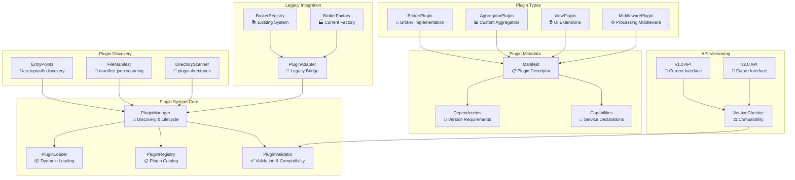

# Plugin Architecture - Comprehensive Proposal & Implementation Guide

---

**📋 DOCUMENT STATUS**

- **Type**: Comprehensive Proposal with Implementation Guide
- **Status**: 🔴 Not Started (0% Complete)
- **Approval**: ⏳ Pending Review
- **Target Timeline**: 16-22 weeks (post-approval)
- **Last Updated**: November 2025

**⚠️ IMPORTANT**: This document describes a **proposed future architecture** with detailed implementation guidance. The current system uses a static broker registry as documented in [ARCHITECTURE_BROKERS.md](ARCHITECTURE_BROKERS.md).

**🤖 AI Agent Note**: This document is designed to be comprehensive for AI-assisted development. All phases include detailed implementation guidance with code examples.

---

## Table of Contents

1. [Executive Summary](#executive-summary)
2. [Related Documentation](#related-documentation)
3. [Current State Analysis](#current-state-as-of-november-2025)
4. [Proposed Architecture](#proposed-enhancement-dynamic-plugin-architecture)
5. [Implementation Benefits](#implementation-benefits)
6. [Prerequisites](#prerequisites)
7. [Implementation Status](#implementation-status)
8. [Decision Gates](#decision-gates)
9. [Detailed Implementation Phases](#detailed-implementation-phases)
   - [Phase 1: Foundation](#phase-1-foundation--standards-2-3-weeks)
   - [Phase 2: Plugin Core](#phase-2-plugin-core-system-3-4-weeks)
   - [Phase 3: Discovery System](#phase-3-discovery-system-2-3-weeks)
   - [Phase 4: Lifecycle Management](#phase-4-lifecycle-management-3-4-weeks)
   - [Phase 5: Legacy Migration](#phase-5-legacy-migration-2-3-weeks)
   - [Phase 6: Advanced Features](#phase-6-advanced-features-4-5-weeks)
10. [Risk Mitigation](#risk-mitigation--success-criteria)
11. [Success Criteria](#success-criteria)
12. [Testing Strategy](#testing-strategy)

---

## Executive Summary

This document outlines a comprehensive proposal to evolve the current broker architecture from a static registry-based system to a dynamic plugin architecture. The goal is to create a truly extensible system where brokers can be developed, distributed, and deployed independently while maintaining type safety and backward compatibility.

**Key Objectives:**
- Enable dynamic broker discovery and loading
- Support independent broker distribution as packages
- Provide plugin isolation and sandboxing
- Implement API versioning for compatibility
- Maintain 100% backward compatibility
- Reduce broker development time by 50%

## Related Documentation

- **[Current Broker Architecture](ARCHITECTURE_BROKERS.md)** - How brokers work today (implemented)
- **[Architecture Overview](ARCHITECTURE.md)** - Core system design principles
- **[Authentication Architecture](ARCHITECTURE_AUTHENTICATION.md)** - Authentication patterns

## Current State (As of November 2025)

The current broker architecture uses a static registry system. See [ARCHITECTURE_BROKERS.md](ARCHITECTURE_BROKERS.md) for complete implementation details.

### Strengths

- ✅ **Broker Registry**: Central registry for broker management
- ✅ **Factory Pattern**: Consistent broker creation with dependency injection
- ✅ **Interface Contracts**: Type-safe service interfaces
- ✅ **3-Layer Architecture**: Clear separation of concerns (client/services/repositories)
- ✅ **Configuration-Driven**: Declarative broker definitions

### Limitations

- ❌ **Static Discovery**: Hard-coded imports in `registry_setup.py`
- ❌ **Compile-Time Binding**: All brokers must be present at build time
- ❌ **Manual Registration**: New brokers require core code changes
- ❌ **No Isolation**: Brokers share the same process space without boundaries
- ❌ **Version Coupling**: No API versioning for broker compatibility
- ❌ **Distribution Challenges**: Cannot distribute brokers as separate packages

## Proposed Enhancement: Dynamic Plugin Architecture

### Architecture Overview



### Plugin Metadata Standard

Example `plugin_manifest.json` structure:

```json
{
  "plugin": {
    "name": "degiro-broker",
    "version": "1.0.0",
    "type": "broker",
    "display_name": "DeGiro Broker Plugin",
    "description": "DeGiro broker integration for Stonks Overwatch",
    "author": "Stonks Overwatch Team",
    "license": "MIT",
    "homepage": "https://github.com/stonks-overwatch/degiro-plugin"
  },
  "api": {
    "min_version": "1.0.0",
    "max_version": "2.0.0",
    "interfaces": [
      "BrokerServiceInterface",
      "PortfolioServiceInterface",
      "TransactionServiceInterface"
    ]
  },
  "dependencies": {
    "python": ">=3.11",
    "stonks-overwatch-core": ">=2.0.0,<3.0.0",
    "degiro-connector": ">=3.0.0"
  },
  "capabilities": {
    "services": [
      "portfolio",
      "trade",
      "deposit",
      "dividend",
      "fee",
      "account"
    ],
    "features": [
      "real_time_data",
      "historical_data",
      "order_execution"
    ],
    "supported_markets": ["XAMS", "XNYS", "XNAS"],
    "supported_currencies": ["EUR", "USD", "GBP"]
  },
  "configuration": {
    "config_class": "degiro.config.DegiroConfig",
    "required_credentials": [
      "username",
      "password",
      "int_account"
    ],
    "optional_settings": [
      "use_2fa",
      "session_timeout"
    ]
  },
  "services": {
    "portfolio": "degiro.services.PortfolioService",
    "trade": "degiro.services.TradeService",
    "deposit": "degiro.services.DepositService",
    "dividend": "degiro.services.DividendService",
    "fee": "degiro.services.FeeService",
    "account": "degiro.services.AccountService"
  },
  "entry_points": {
    "main": "degiro.plugin:DegiroPlugin",
    "config": "degiro.config:DegiroConfig"
  }
}
```

## Implementation Benefits

### Comparison: Current vs Proposed

| Aspect | Current System | Proposed Plugin System |
|--------|----------------|------------------------|
| **Broker Discovery** | Hard-coded imports | Dynamic entry points + file system |
| **Installation** | Modify core code | Install package or drop in plugins/ |
| **Distribution** | Part of core | Independent packages |
| **Versioning** | Coupled to core | Independent versions with API compatibility |
| **Isolation** | Shared process | Sandboxed execution |
| **Hot Reload** | Requires restart | Dynamic load/unload |
| **Third-Party Dev** | Not supported | Fully supported |
| **Time to Add Broker** | 2-4 hours + core PR | 1-2 hours, no core changes |

### For Developers

- 🚀 **Faster Development**: Independent broker development and testing
- 🔄 **Hot Reloading**: Update brokers without restarting the application
- 📦 **Distribution**: Distribute brokers as separate packages
- 🧪 **Testing**: Isolated testing environment for each broker
- 📚 **Documentation**: Auto-generated API documentation

### For Users

- 🔌 **Plug & Play**: Easy installation of new brokers
- 🎛️ **Configurability**: Fine-grained control over broker features
- 🔧 **Customization**: Custom broker implementations for specific needs
- 📊 **Monitoring**: Real-time plugin health and performance monitoring
- 🔄 **Updates**: Independent broker updates without core changes

### For the System

- 🏗️ **Scalability**: Better resource isolation and management
- 🛡️ **Stability**: Plugin failures don't crash the entire system
- 🔄 **Maintainability**: Clear separation of concerns
- 🚀 **Performance**: Lazy loading and resource optimization
- 🔒 **Security**: Sandboxed plugin execution

### Success Metrics

- ✅ **Reduced Core Changes**: 90% reduction in core code changes for new brokers
- ✅ **Development Speed**: 50% faster broker development cycle
- ✅ **System Stability**: 99.9% uptime with plugin isolation
- ✅ **Community Growth**: Enable third-party broker development
- ✅ **Maintenance Cost**: 60% reduction in maintenance overhead

## Prerequisites

Before starting Phase 1, ensure the following prerequisites are met:

### Documentation & Planning

- [ ] Current broker architecture is fully documented (see ARCHITECTURE_BROKERS.md) ✅ **Complete**
- [ ] Plugin architecture proposal has been reviewed and approved
- [ ] Success criteria and metrics are defined and agreed upon
- [ ] Risk mitigation strategies are documented

### Resources & Capacity

- [ ] Development team has capacity for 16-22 weeks of focused work
- [ ] 2-3 senior developers assigned to the project
- [ ] Code review resources allocated
- [ ] QA/Testing resources available

### Technical Readiness

- [ ] All existing brokers are working and tested ✅ **Current state**
- [ ] Current test suite passes with > 80% coverage
- [ ] Development environment is stable
- [ ] CI/CD pipeline is operational

### Stakeholder Alignment

- [ ] Stakeholders have approved the proposal and timeline
- [ ] Communication plan established for progress updates
- [ ] Rollback plan documented in case of critical issues

## Implementation Status

**Overall Progress**: 0% Complete (0/6 phases)

| Phase | Status | Owner | Start Date | Target Date | Actual Date | Progress |
|-------|--------|-------|------------|-------------|-------------|----------|
| Phase 1: Foundation | 🔴 Not Started | TBD | TBD | TBD | - | 0% |
| Phase 2: Plugin Core | 🔴 Not Started | TBD | TBD | TBD | - | 0% |
| Phase 3: Discovery | 🔴 Not Started | TBD | TBD | TBD | - | 0% |
| Phase 4: Lifecycle | 🔴 Not Started | TBD | TBD | TBD | - | 0% |
| Phase 5: Migration | 🔴 Not Started | TBD | TBD | TBD | - | 0% |
| Phase 6: Advanced | 🔴 Not Started | TBD | TBD | TBD | - | 0% |

**Legend:** 🔴 Not Started | 🟡 In Progress | 🟢 Complete | ⏸️ Blocked | ⚠️ At Risk

## Decision Gates

### Phase 0: Pre-Implementation Decisions

**Must be completed before Phase 1 begins:**

#### Strategic Approval

- [ ] **Approve plugin architecture proposal**
  - Decision maker: [Name/Role]
  - Required by: [Date]
  - Status: ⏳ Pending

- [ ] **Allocate development resources**
  - Team size: 2-3 developers
  - Duration: 16-22 weeks
  - Budget: [Amount]
  - Status: ⏳ Pending

- [ ] **Define and approve success criteria**
  - Performance targets: < 5% overhead
  - Compatibility: 100% backward compatible
  - Testing: 90% code coverage
  - Uptime: 99.9% with plugin isolation
  - Status: ⏳ Pending

#### Technical Decisions

- [ ] **Plugin discovery mechanism**
  - Options: Entry points, file system, or both
  - Recommendation: Both for maximum flexibility
  - Decision: TBD

- [ ] **API versioning strategy**
  - Semantic versioning for plugin API
  - Compatibility matrix maintenance
  - Decision: TBD

- [ ] **Security/sandboxing approach**
  - Process isolation vs permission system
  - Resource limits and tracking
  - Decision: TBD

- [ ] **Dependency management**
  - Virtual environments per plugin
  - Shared dependencies with version constraints
  - Decision: TBD

### Phase Completion Gates

Each phase requires sign-off before proceeding to the next:

- [ ] **Phase 1 Gate**: All deliverables complete, tests passing, documentation updated
- [ ] **Phase 2 Gate**: Plugin loading functional, integration tests pass
- [ ] **Phase 3 Gate**: Discovery working, plugins can be found and loaded
- [ ] **Phase 4 Gate**: Lifecycle management stable, health monitoring operational
- [ ] **Phase 5 Gate**: At least one legacy broker successfully migrated
- [ ] **Phase 6 Gate**: All features complete, production-ready

---

## Detailed Implementation Phases

## Phase 1: Foundation & Standards (2-3 weeks)

### Goals

- Establish plugin metadata standards
- Create base plugin interfaces
- Define plugin directory structure
- Set up basic validation framework

### Tasks

#### 1.1 Plugin Metadata Standard (Week 1)

**File**: `src/stonks_overwatch/plugins/models.py`

```python
from dataclasses import dataclass
from typing import Dict, List, Optional
from enum import Enum

class PluginType(Enum):
    BROKER = "broker"
    AGGREGATOR = "aggregator"
    MIDDLEWARE = "middleware"
    VIEW = "view"

@dataclass
class PluginManifest:
    """Standard plugin manifest structure."""

    # Basic plugin information
    name: str
    version: str
    type: PluginType
    display_name: str
    description: str
    author: str
    license: str
    homepage: Optional[str] = None

    # API compatibility
    min_api_version: str
    max_api_version: str
    required_interfaces: List[str]

    # Dependencies
    python_version: str
    core_dependencies: Dict[str, str]
    plugin_dependencies: Dict[str, str]

    # Capabilities
    services: List[str]
    features: List[str]
    supported_markets: List[str]
    supported_currencies: List[str]

    # Configuration
    config_class: str
    required_credentials: List[str]
    optional_settings: List[str]

    # Entry points
    service_mappings: Dict[str, str]
    main_entry_point: str
    config_entry_point: str

@dataclass
class PluginInfo:
    """Runtime plugin information."""

    manifest: PluginManifest
    path: str
    state: str
    load_time: Optional[float] = None
    error: Optional[str] = None
    metrics: Optional[Dict[str, any]] = None
```

#### 1.2 Base Plugin Interface (Week 1)

**File**: `src/stonks_overwatch/plugins/interfaces.py`

```python
from abc import ABC, abstractmethod
from typing import Dict, List, Type, Any
from stonks_overwatch.core.service_types import ServiceType
from stonks_overwatch.config.base_config import BaseConfig

class PluginInterface(ABC):
    """Base interface all plugins must implement."""

    @property
    @abstractmethod
    def manifest(self) -> PluginManifest:
        """Return plugin manifest."""
        pass

    @abstractmethod
    def initialize(self) -> bool:
        """Initialize the plugin. Return True on success."""
        pass

    @abstractmethod
    def shutdown(self) -> bool:
        """Shutdown plugin and cleanup. Return True on success."""
        pass

    @abstractmethod
    def health_check(self) -> Dict[str, Any]:
        """Return plugin health status and metrics."""
        pass

class BrokerPluginInterface(PluginInterface):
    """Interface specific to broker plugins."""

    @abstractmethod
    def get_config_class(self) -> Type[BaseConfig]:
        """Return broker configuration class."""
        pass

    @abstractmethod
    def get_services(self) -> Dict[ServiceType, Type]:
        """Return mapping of service types to implementation classes."""
        pass

    @abstractmethod
    def validate_configuration(self, config: BaseConfig) -> List[str]:
        """Validate configuration. Return list of errors (empty if valid)."""
        pass
```

#### 1.3 Plugin Directory Structure (Week 1)

```shell
src/stonks_overwatch/
├── plugins/
│   ├── __init__.py
│   ├── models.py                   # Plugin data models
│   ├── interfaces.py              # Plugin interfaces
│   ├── exceptions.py              # Plugin-specific exceptions
│   ├── manager/
│   │   ├── __init__.py
│   │   ├── plugin_manager.py      # Core plugin manager
│   │   ├── discovery.py           # Plugin discovery logic
│   │   ├── loader.py              # Plugin loading logic
│   │   ├── validator.py           # Plugin validation
│   │   └── lifecycle.py           # Lifecycle management
│   ├── registry/
│   │   ├── __init__.py
│   │   ├── plugin_registry.py     # Plugin registry
│   │   └── capabilities.py       # Capability management
│   └── utils/
│       ├── __init__.py
│       ├── manifest.py            # Manifest parsing
│       ├── dependencies.py       # Dependency resolution
│       └── versioning.py          # Version compatibility
```

#### 1.4 Plugin Validation Framework (Week 2)

**File**: `src/stonks_overwatch/plugins/manager/validator.py`

```python
from typing import List, Dict, Any
from stonks_overwatch.plugins.models import PluginManifest, PluginInfo

class ValidationResult:
    def __init__(self):
        self.is_valid = True
        self.errors: List[str] = []
        self.warnings: List[str] = []

    def add_error(self, message: str):
        self.errors.append(message)
        self.is_valid = False

    def add_warning(self, message: str):
        self.warnings.append(message)

class PluginValidator:
    """Validates plugin compatibility and requirements."""

    def validate_manifest(self, manifest: PluginManifest) -> ValidationResult:
        """Validate plugin manifest structure and content."""
        result = ValidationResult()

        # Validate required fields
        if not manifest.name:
            result.add_error("Plugin name is required")

        if not manifest.version:
            result.add_error("Plugin version is required")

        # Validate version format
        if not self._is_valid_version(manifest.version):
            result.add_error(f"Invalid version format: {manifest.version}")

        # Validate API compatibility
        if not self._is_api_compatible(manifest.min_api_version, manifest.max_api_version):
            result.add_error("Plugin is not compatible with current API version")

        return result

    def validate_dependencies(self, manifest: PluginManifest) -> ValidationResult:
        """Validate plugin dependencies are available."""
        result = ValidationResult()

        # Check Python version
        if not self._check_python_version(manifest.python_version):
            result.add_error(f"Python version {manifest.python_version} not satisfied")

        # Check core dependencies
        for dep, version_spec in manifest.core_dependencies.items():
            if not self._check_dependency(dep, version_spec):
                result.add_error(f"Dependency {dep}{version_spec} not satisfied")

        return result

    def _is_valid_version(self, version: str) -> bool:
        """Check if version string is valid semantic version."""
        # Implementation for semantic version validation
        import re
        pattern = r'^\d+\.\d+\.\d+$'
        return bool(re.match(pattern, version))

    def _is_api_compatible(self, min_version: str, max_version: str) -> bool:
        """Check if plugin is compatible with current API version."""
        # Implementation for API compatibility check
        # Compare with current system API version
        return True  # Placeholder

    def _check_python_version(self, requirement: str) -> bool:
        """Check if Python version requirement is satisfied."""
        import sys
        from packaging import version, specifiers

        current_version = f"{sys.version_info.major}.{sys.version_info.minor}.{sys.version_info.micro}"
        spec = specifiers.SpecifierSet(requirement)
        return version.parse(current_version) in spec

    def _check_dependency(self, package: str, version_spec: str) -> bool:
        """Check if package dependency is satisfied."""
        try:
            import importlib.metadata
            from packaging import version, specifiers

            installed_version = importlib.metadata.version(package)
            spec = specifiers.SpecifierSet(version_spec)
            return version.parse(installed_version) in spec
        except importlib.metadata.PackageNotFoundError:
            return False
```

### Deliverables

- [ ] Plugin metadata models and manifest structure
- [ ] Base plugin interfaces and abstract classes
- [ ] Plugin validation framework
- [ ] Plugin directory structure setup
- [ ] Unit tests for validation logic
- [ ] Documentation for plugin standards

---

## Phase 2: Plugin Core System (3-4 weeks)

### Goals

- Implement core plugin management functionality
- Create plugin registry and lifecycle management
- Build plugin loading and unloading mechanisms
- Establish error handling and logging

### Tasks

#### 2.1 Plugin Registry (Week 1)

**File**: `src/stonks_overwatch/plugins/registry/plugin_registry.py`

```python
from typing import Dict, List, Optional
from stonks_overwatch.plugins.models import PluginInfo, PluginManifest
from stonks_overwatch.plugins.interfaces import PluginInterface

class PluginRegistry:
    """Central registry for managing discovered and loaded plugins."""

    def __init__(self):
        self._discovered_plugins: Dict[str, PluginInfo] = {}
        self._loaded_plugins: Dict[str, PluginInterface] = {}
        self._plugin_capabilities: Dict[str, List[str]] = {}

    def register_discovered_plugin(self, plugin_info: PluginInfo):
        """Register a discovered plugin."""
        self._discovered_plugins[plugin_info.manifest.name] = plugin_info

    def register_loaded_plugin(self, plugin_name: str, plugin: PluginInterface):
        """Register a successfully loaded plugin."""
        self._loaded_plugins[plugin_name] = plugin

    def unregister_plugin(self, plugin_name: str):
        """Unregister a plugin (remove from loaded)."""
        if plugin_name in self._loaded_plugins:
            del self._loaded_plugins[plugin_name]

    def get_discovered_plugins(self) -> List[PluginInfo]:
        """Get list of all discovered plugins."""
        return list(self._discovered_plugins.values())

    def get_loaded_plugins(self) -> List[PluginInterface]:
        """Get list of all loaded plugins."""
        return list(self._loaded_plugins.values())

    def get_plugin_by_name(self, name: str) -> Optional[PluginInterface]:
        """Get loaded plugin by name."""
        return self._loaded_plugins.get(name)

    def is_plugin_loaded(self, name: str) -> bool:
        """Check if plugin is currently loaded."""
        return name in self._loaded_plugins

    def get_plugins_by_capability(self, capability: str) -> List[PluginInterface]:
        """Get all plugins that provide a specific capability."""
        result = []
        for plugin_name, capabilities in self._plugin_capabilities.items():
            if capability in capabilities:
                plugin = self._loaded_plugins.get(plugin_name)
                if plugin:
                    result.append(plugin)
        return result
```

#### 2.2 Plugin Loader (Week 1-2)

**File**: `src/stonks_overwatch/plugins/manager/loader.py`

```python
import importlib
import importlib.util
import sys
from pathlib import Path
from typing import Optional, Type
from stonks_overwatch.plugins.models import PluginInfo, PluginManifest
from stonks_overwatch.plugins.interfaces import PluginInterface

class PluginLoadError(Exception):
    """Raised when plugin loading fails."""
    pass

class PluginLoader:
    """Handles dynamic loading and unloading of plugins."""

    def __init__(self):
        self._loaded_modules: Dict[str, any] = {}

    def load_plugin_from_path(self, plugin_path: Path) -> PluginInterface:
        """Load plugin from file system path."""

        # Load manifest
        manifest_path = plugin_path / "plugin_manifest.json"
        if not manifest_path.exists():
            raise PluginLoadError(f"Manifest not found: {manifest_path}")

        manifest = self._load_manifest(manifest_path)

        # Load plugin module
        plugin_module = self._load_plugin_module(plugin_path, manifest)

        # Get plugin class
        plugin_class = self._get_plugin_class(plugin_module, manifest)

        # Instantiate plugin
        plugin_instance = plugin_class(manifest)

        # Store module reference for cleanup
        self._loaded_modules[manifest.name] = plugin_module

        return plugin_instance

    def load_plugin_from_entry_point(self, entry_point) -> PluginInterface:
        """Load plugin from setuptools entry point."""

        try:
            plugin_class = entry_point.load()

            # Get manifest from plugin class
            if hasattr(plugin_class, 'get_manifest'):
                manifest = plugin_class.get_manifest()
            else:
                raise PluginLoadError(f"Plugin {entry_point.name} missing get_manifest method")

            # Instantiate plugin
            plugin_instance = plugin_class(manifest)

            return plugin_instance

        except Exception as e:
            raise PluginLoadError(f"Failed to load plugin from entry point {entry_point.name}: {e}")

    def unload_plugin(self, plugin_name: str) -> bool:
        """Unload plugin and cleanup modules."""

        if plugin_name in self._loaded_modules:
            # Remove from sys.modules
            module = self._loaded_modules[plugin_name]
            if hasattr(module, '__name__') and module.__name__ in sys.modules:
                del sys.modules[module.__name__]

            # Remove from our tracking
            del self._loaded_modules[plugin_name]

            return True

        return False

    def _load_manifest(self, manifest_path: Path) -> PluginManifest:
        """Load and parse plugin manifest."""
        import json

        try:
            with open(manifest_path, 'r') as f:
                manifest_data = json.load(f)

            # Convert to PluginManifest object
            return self._parse_manifest(manifest_data)

        except Exception as e:
            raise PluginLoadError(f"Failed to load manifest {manifest_path}: {e}")

    def _parse_manifest(self, data: dict) -> PluginManifest:
        """Parse manifest JSON into PluginManifest object."""
        plugin_data = data.get('plugin', {})
        api_data = data.get('api', {})
        deps_data = data.get('dependencies', {})
        caps_data = data.get('capabilities', {})
        config_data = data.get('configuration', {})
        services_data = data.get('services', {})
        entry_data = data.get('entry_points', {})

        return PluginManifest(
            name=plugin_data.get('name'),
            version=plugin_data.get('version'),
            type=plugin_data.get('type'),
            display_name=plugin_data.get('display_name'),
            description=plugin_data.get('description'),
            author=plugin_data.get('author'),
            license=plugin_data.get('license'),
            homepage=plugin_data.get('homepage'),
            min_api_version=api_data.get('min_version'),
            max_api_version=api_data.get('max_version'),
            required_interfaces=api_data.get('interfaces', []),
            python_version=deps_data.get('python'),
            core_dependencies={k: v for k, v in deps_data.items() if k != 'python'},
            plugin_dependencies=deps_data.get('plugin_dependencies', {}),
            services=caps_data.get('services', []),
            features=caps_data.get('features', []),
            supported_markets=caps_data.get('supported_markets', []),
            supported_currencies=caps_data.get('supported_currencies', []),
            config_class=config_data.get('config_class'),
            required_credentials=config_data.get('required_credentials', []),
            optional_settings=config_data.get('optional_settings', []),
            service_mappings=services_data,
            main_entry_point=entry_data.get('main'),
            config_entry_point=entry_data.get('config')
        )

    def _load_plugin_module(self, plugin_path: Path, manifest: PluginManifest):
        """Load plugin module from path."""

        module_name = f"plugin_{manifest.name}"

        # Add plugin path to sys.path temporarily
        plugin_path_str = str(plugin_path)
        if plugin_path_str not in sys.path:
            sys.path.insert(0, plugin_path_str)

        try:
            # Import the main module
            spec = importlib.util.spec_from_file_location(
                module_name,
                plugin_path / "__init__.py"
            )

            if spec is None:
                raise PluginLoadError(f"Could not load plugin spec from {plugin_path}")

            module = importlib.util.module_from_spec(spec)

            # Execute the module
            spec.loader.exec_module(module)

            return module

        except Exception as e:
            raise PluginLoadError(f"Failed to load plugin module: {e}")
        finally:
            # Remove from sys.path
            if plugin_path_str in sys.path:
                sys.path.remove(plugin_path_str)

    def _get_plugin_class(self, module, manifest: PluginManifest) -> Type[PluginInterface]:
        """Extract plugin class from loaded module."""

        # Parse entry point to get class name
        entry_point = manifest.main_entry_point
        if ':' in entry_point:
            module_path, class_name = entry_point.split(':')
        else:
            raise PluginLoadError(f"Invalid entry point format: {entry_point}")

        # Get the class from module
        if hasattr(module, class_name):
            plugin_class = getattr(module, class_name)

            # Verify it implements PluginInterface
            if not issubclass(plugin_class, PluginInterface):
                raise PluginLoadError(f"Plugin class {class_name} does not implement PluginInterface")

            return plugin_class
        else:
            raise PluginLoadError(f"Plugin class {class_name} not found in module")
```

#### 2.3 Plugin Manager (Week 2-3)

**File**: `src/stonks_overwatch/plugins/manager/plugin_manager.py`

```python
from typing import List, Optional, Dict, Any
from pathlib import Path
from stonks_overwatch.plugins.models import PluginInfo, PluginManifest
from stonks_overwatch.plugins.interfaces import PluginInterface, BrokerPluginInterface
from stonks_overwatch.plugins.registry.plugin_registry import PluginRegistry
from stonks_overwatch.plugins.manager.loader import PluginLoader
from stonks_overwatch.plugins.manager.validator import PluginValidator
from stonks_overwatch.plugins.manager.discovery import PluginDiscovery
from stonks_overwatch.utils.core.logger import StonksLogger
from stonks_overwatch.utils.core.logger_constants import LOGGER_PLUGINS

class PluginManager:
    """Central manager for all plugin operations."""

    def __init__(self):
        self.logger = StonksLogger.get_logger(LOGGER_PLUGINS, "[PLUGIN_MANAGER]")
        self.registry = PluginRegistry()
        self.loader = PluginLoader()
        self.validator = PluginValidator()
        self.discovery = PluginDiscovery()

    def discover_all_plugins(self) -> List[PluginInfo]:
        """Discover all available plugins from all sources."""

        self.logger.info("Starting plugin discovery...")

        discovered = []

        # Discover from entry points
        entry_point_plugins = self.discovery.discover_from_entry_points()
        discovered.extend(entry_point_plugins)

        # Discover from file system
        fs_plugins = self.discovery.discover_from_filesystem()
        discovered.extend(fs_plugins)

        # Register discovered plugins
        for plugin_info in discovered:
            self.registry.register_discovered_plugin(plugin_info)

        self.logger.info(f"Discovered {len(discovered)} plugins")
        return discovered

    def load_plugin(self, plugin_name: str, auto_validate: bool = True) -> bool:
        """Load a specific plugin by name."""

        self.logger.info(f"Loading plugin: {plugin_name}")

        # Get plugin info
        discovered_plugins = self.registry.get_discovered_plugins()
        plugin_info = next((p for p in discovered_plugins if p.manifest.name == plugin_name), None)

        if not plugin_info:
            self.logger.error(f"Plugin not found: {plugin_name}")
            return False

        try:
            # Validate plugin if requested
            if auto_validate:
                validation_result = self.validator.validate_manifest(plugin_info.manifest)
                if not validation_result.is_valid:
                    self.logger.error(f"Plugin validation failed: {validation_result.errors}")
                    return False

                dep_result = self.validator.validate_dependencies(plugin_info.manifest)
                if not dep_result.is_valid:
                    self.logger.error(f"Plugin dependency validation failed: {dep_result.errors}")
                    return False

            # Load the plugin
            if plugin_info.path:
                # Load from file system
                plugin = self.loader.load_plugin_from_path(Path(plugin_info.path))
            else:
                # Load from entry point
                self.logger.error("Entry point loading not yet implemented")
                return False

            # Initialize plugin
            if not plugin.initialize():
                self.logger.error(f"Plugin initialization failed: {plugin_name}")
                return False

            # Register loaded plugin
            self.registry.register_loaded_plugin(plugin_name, plugin)

            self.logger.info(f"Successfully loaded plugin: {plugin_name}")
            return True

        except Exception as e:
            self.logger.error(f"Failed to load plugin {plugin_name}: {e}")
            return False

    def unload_plugin(self, plugin_name: str) -> bool:
        """Unload a specific plugin."""

        self.logger.info(f"Unloading plugin: {plugin_name}")

        plugin = self.registry.get_plugin_by_name(plugin_name)
        if not plugin:
            self.logger.warning(f"Plugin not loaded: {plugin_name}")
            return False

        try:
            # Shutdown plugin
            if not plugin.shutdown():
                self.logger.warning(f"Plugin shutdown returned false: {plugin_name}")

            # Unload from loader
            self.loader.unload_plugin(plugin_name)

            # Unregister from registry
            self.registry.unregister_plugin(plugin_name)

            self.logger.info(f"Successfully unloaded plugin: {plugin_name}")
            return True

        except Exception as e:
            self.logger.error(f"Failed to unload plugin {plugin_name}: {e}")
            return False

    def get_broker_plugins(self) -> List[BrokerPluginInterface]:
        """Get all loaded broker plugins."""

        broker_plugins = []
        for plugin in self.registry.get_loaded_plugins():
            if isinstance(plugin, BrokerPluginInterface):
                broker_plugins.append(plugin)

        return broker_plugins

    def get_plugin_health(self, plugin_name: str) -> Optional[Dict[str, Any]]:
        """Get health status of a specific plugin."""

        plugin = self.registry.get_plugin_by_name(plugin_name)
        if plugin:
            return plugin.health_check()
        return None

    def reload_plugin(self, plugin_name: str) -> bool:
        """Reload a plugin (unload and load again)."""

        self.logger.info(f"Reloading plugin: {plugin_name}")

        if self.registry.is_plugin_loaded(plugin_name):
            if not self.unload_plugin(plugin_name):
                return False

        return self.load_plugin(plugin_name)
```

### Deliverables

- [ ] Plugin registry implementation
- [ ] Plugin loader with file system and entry point support
- [ ] Core plugin manager with lifecycle operations
- [ ] Error handling and logging framework
- [ ] Unit tests for core functionality
- [ ] Integration tests for plugin loading/unloading

---

## Phase 3: Discovery System (2-3 weeks)

### Goals

- Implement multiple plugin discovery mechanisms
- Support entry points (setuptools) discovery
- Support file system discovery with manifest scanning
- Create plugin metadata parsing and validation

### Tasks

#### 3.1 Plugin Discovery (Week 1-2)

**File**: `src/stonks_overwatch/plugins/manager/discovery.py`

```python
import pkg_resources
from typing import List, Iterator
from pathlib import Path
from stonks_overwatch.plugins.models import PluginInfo, PluginManifest
from stonks_overwatch.utils.core.logger import StonksLogger
from stonks_overwatch.utils.core.logger_constants import LOGGER_PLUGINS

class PluginDiscovery:
    """Handles discovery of plugins from multiple sources."""

    ENTRY_POINT_GROUP = "stonks_overwatch.brokers"
    PLUGIN_DIRECTORIES = [
        Path.cwd() / "plugins",
        Path.home() / ".stonks_overwatch" / "plugins",
        Path("/usr/local/share/stonks_overwatch/plugins"),
    ]

    def __init__(self):
        self.logger = StonksLogger.get_logger(LOGGER_PLUGINS, "[PLUGIN_DISCOVERY]")

    def discover_from_entry_points(self) -> List[PluginInfo]:
        """Discover plugins using setuptools entry points."""

        plugins = []

        try:
            for entry_point in pkg_resources.iter_entry_points(self.ENTRY_POINT_GROUP):
                try:
                    # Load the plugin class to get manifest
                    plugin_class = entry_point.load()

                    if hasattr(plugin_class, 'get_manifest'):
                        manifest = plugin_class.get_manifest()

                        plugin_info = PluginInfo(
                            manifest=manifest,
                            path="",  # Entry point has no path
                            state="discovered"
                        )

                        plugins.append(plugin_info)

                except Exception as e:
                    self.logger.warning(f"Failed to load entry point {entry_point.name}: {e}")

        except Exception as e:
            self.logger.error(f"Error discovering entry points: {e}")

        return plugins

    def discover_from_filesystem(self) -> List[PluginInfo]:
        """Discover plugins by scanning file system directories."""

        plugins = []

        for directory in self.PLUGIN_DIRECTORIES:
            if directory.exists() and directory.is_dir():
                plugins.extend(self._scan_directory(directory))

        return plugins

    def _scan_directory(self, directory: Path) -> List[PluginInfo]:
        """Scan a directory for plugin manifests."""

        plugins = []

        for item in directory.iterdir():
            if item.is_dir():
                manifest_file = item / "plugin_manifest.json"
                if manifest_file.exists():
                    try:
                        manifest = self._load_manifest_file(manifest_file)

                        plugin_info = PluginInfo(
                            manifest=manifest,
                            path=str(item),
                            state="discovered"
                        )

                        plugins.append(plugin_info)

                    except Exception as e:
                        self.logger.warning(f"Failed to load manifest {manifest_file}: {e}")

        return plugins

    def _load_manifest_file(self, manifest_path: Path) -> PluginManifest:
        """Load and parse a manifest file."""
        import json

        with open(manifest_path, 'r') as f:
            data = json.load(f)

        # Extract nested structure and flatten for PluginManifest
        plugin_data = data.get('plugin', {})
        api_data = data.get('api', {})
        deps_data = data.get('dependencies', {})
        caps_data = data.get('capabilities', {})
        config_data = data.get('configuration', {})
        services_data = data.get('services', {})
        entry_data = data.get('entry_points', {})

        return PluginManifest(
            name=plugin_data.get('name'),
            version=plugin_data.get('version'),
            type=plugin_data.get('type'),
            display_name=plugin_data.get('display_name'),
            description=plugin_data.get('description'),
            author=plugin_data.get('author'),
            license=plugin_data.get('license'),
            homepage=plugin_data.get('homepage'),
            min_api_version=api_data.get('min_version'),
            max_api_version=api_data.get('max_version'),
            required_interfaces=api_data.get('interfaces', []),
            python_version=deps_data.get('python'),
            core_dependencies={k: v for k, v in deps_data.items() if k != 'python'},
            plugin_dependencies=deps_data.get('plugin_dependencies', {}),
            services=caps_data.get('services', []),
            features=caps_data.get('features', []),
            supported_markets=caps_data.get('supported_markets', []),
            supported_currencies=caps_data.get('supported_currencies', []),
            config_class=config_data.get('config_class'),
            required_credentials=config_data.get('required_credentials', []),
            optional_settings=config_data.get('optional_settings', []),
            service_mappings=services_data,
            main_entry_point=entry_data.get('main'),
            config_entry_point=entry_data.get('config')
        )
```

### Deliverables

- [ ] Entry points discovery implementation
- [ ] File system discovery with manifest parsing
- [ ] Plugin directory scanning logic
- [ ] Manifest validation and parsing
- [ ] Discovery integration tests
- [ ] Performance optimization for large plugin directories

---

## Phase 4: Lifecycle Management (3-4 weeks)

### Goals

- Implement comprehensive plugin state management
- Create plugin event system
- Build health monitoring and metrics
- Add plugin configuration hot-reloading

### Tasks

#### 4.1 Plugin State Management (Week 1)

**File**: `src/stonks_overwatch/plugins/manager/lifecycle.py`

```python
from enum import Enum
from typing import Dict, List, Callable, Any
from dataclasses import dataclass
from datetime import datetime

class PluginState(Enum):
    DISCOVERED = "discovered"
    LOADING = "loading"
    LOADED = "loaded"
    ACTIVE = "active"
    ERROR = "error"
    DISABLED = "disabled"
    UNLOADING = "unloading"

@dataclass
class PluginStateTransition:
    from_state: PluginState
    to_state: PluginState
    timestamp: datetime
    reason: str

class PluginLifecycleManager:
    """Manages plugin lifecycle states and transitions."""

    def __init__(self):
        self._plugin_states: Dict[str, PluginState] = {}
        self._state_history: Dict[str, List[PluginStateTransition]] = {}
        self._event_handlers: Dict[str, List[Callable]] = {}

    def set_plugin_state(self, plugin_name: str, new_state: PluginState, reason: str = ""):
        """Set plugin state and record transition."""

        old_state = self._plugin_states.get(plugin_name, PluginState.DISCOVERED)

        if old_state != new_state:
            # Record transition
            transition = PluginStateTransition(
                from_state=old_state,
                to_state=new_state,
                timestamp=datetime.now(),
                reason=reason
            )

            # Update state
            self._plugin_states[plugin_name] = new_state

            # Record history
            if plugin_name not in self._state_history:
                self._state_history[plugin_name] = []
            self._state_history[plugin_name].append(transition)

            # Trigger events
            self._trigger_state_change_event(plugin_name, transition)

    def get_plugin_state(self, plugin_name: str) -> PluginState:
        """Get current state of plugin."""
        return self._plugin_states.get(plugin_name, PluginState.DISCOVERED)

    def get_plugins_by_state(self, state: PluginState) -> List[str]:
        """Get all plugins in a specific state."""
        return [name for name, s in self._plugin_states.items() if s == state]

    def register_event_handler(self, event_type: str, handler: Callable):
        """Register event handler for lifecycle events."""
        if event_type not in self._event_handlers:
            self._event_handlers[event_type] = []
        self._event_handlers[event_type].append(handler)

    def _trigger_state_change_event(self, plugin_name: str, transition: PluginStateTransition):
        """Trigger state change event."""
        event_type = f"state_change.{transition.to_state.value}"

        if event_type in self._event_handlers:
            for handler in self._event_handlers[event_type]:
                try:
                    handler(plugin_name, transition)
                except Exception as e:
                    # Log error but don't stop other handlers
                    pass
```

#### 4.2 Health Monitoring (Week 2)

**File**: `src/stonks_overwatch/plugins/monitoring/health.py`

```python
from typing import Dict, Any, List
from dataclasses import dataclass
from datetime import datetime, timedelta
from stonks_overwatch.plugins.interfaces import PluginInterface

@dataclass
class HealthMetric:
    name: str
    value: Any
    unit: str
    timestamp: datetime

@dataclass
class HealthStatus:
    plugin_name: str
    is_healthy: bool
    status_message: str
    metrics: List[HealthMetric]
    last_check: datetime

class PluginHealthMonitor:
    """Monitors plugin health and collects metrics."""

    def __init__(self):
        self._health_history: Dict[str, List[HealthStatus]] = {}
        self._metric_thresholds: Dict[str, Dict[str, Any]] = {}

    def check_plugin_health(self, plugin: PluginInterface) -> HealthStatus:
        """Perform health check on a plugin."""

        try:
            # Get health data from plugin
            health_data = plugin.health_check()

            # Convert to metrics
            metrics = []
            for key, value in health_data.items():
                metric = HealthMetric(
                    name=key,
                    value=value,
                    unit=self._get_metric_unit(key),
                    timestamp=datetime.now()
                )
                metrics.append(metric)

            # Determine overall health
            is_healthy = self._evaluate_health(plugin.manifest.name, metrics)
            status_message = "Healthy" if is_healthy else "Unhealthy"

            status = HealthStatus(
                plugin_name=plugin.manifest.name,
                is_healthy=is_healthy,
                status_message=status_message,
                metrics=metrics,
                last_check=datetime.now()
            )

            # Store in history
            self._store_health_status(status)

            return status

        except Exception as e:
            # Plugin health check failed
            status = HealthStatus(
                plugin_name=plugin.manifest.name,
                is_healthy=False,
                status_message=f"Health check failed: {e}",
                metrics=[],
                last_check=datetime.now()
            )

            self._store_health_status(status)
            return status

    def get_health_history(self, plugin_name: str, hours: int = 24) -> List[HealthStatus]:
        """Get health history for a plugin."""

        if plugin_name not in self._health_history:
            return []

        cutoff = datetime.now() - timedelta(hours=hours)

        return [
            status for status in self._health_history[plugin_name]
            if status.last_check >= cutoff
        ]

    def set_metric_threshold(self, plugin_name: str, metric_name: str,
                           min_value: Any = None, max_value: Any = None):
        """Set health thresholds for plugin metrics."""

        if plugin_name not in self._metric_thresholds:
            self._metric_thresholds[plugin_name] = {}

        self._metric_thresholds[plugin_name][metric_name] = {
            'min': min_value,
            'max': max_value
        }

    def _evaluate_health(self, plugin_name: str, metrics: List[HealthMetric]) -> bool:
        """Evaluate if plugin is healthy based on metrics and thresholds."""

        if plugin_name not in self._metric_thresholds:
            return True  # No thresholds defined, assume healthy

        thresholds = self._metric_thresholds[plugin_name]

        for metric in metrics:
            if metric.name in thresholds:
                threshold = thresholds[metric.name]

                if threshold['min'] is not None and metric.value < threshold['min']:
                    return False

                if threshold['max'] is not None and metric.value > threshold['max']:
                    return False

        return True

    def _store_health_status(self, status: HealthStatus):
        """Store health status in history."""

        if status.plugin_name not in self._health_history:
            self._health_history[status.plugin_name] = []

        self._health_history[status.plugin_name].append(status)

        # Keep only last 1000 entries per plugin
        if len(self._health_history[status.plugin_name]) > 1000:
            self._health_history[status.plugin_name] = self._health_history[status.plugin_name][-1000:]

    def _get_metric_unit(self, metric_name: str) -> str:
        """Get unit for metric name."""
        unit_map = {
            'memory_usage': 'MB',
            'cpu_usage': '%',
            'request_count': 'count',
            'error_rate': '%',
            'response_time': 'ms'
        }
        return unit_map.get(metric_name, '')
```

### Deliverables

- [ ] Plugin state management system
- [ ] Lifecycle event system
- [ ] Health monitoring and metrics collection
- [ ] Plugin performance tracking
- [ ] State transition history
- [ ] Automated health checks and alerting

---

## Phase 5: Legacy Migration (2-3 weeks)

### Goals

- Create adapters for existing broker implementations
- Enable side-by-side operation of legacy and plugin systems
- Provide migration tools and utilities
- Maintain backward compatibility

### Tasks

#### 5.1 Legacy Bridge Adapter (Week 1)

**File**: `src/stonks_overwatch/plugins/legacy/bridge.py`

```python
from typing import Dict, Type, List
from stonks_overwatch.plugins.interfaces import BrokerPluginInterface
from stonks_overwatch.plugins.models import PluginManifest, PluginType
from stonks_overwatch.core.service_types import ServiceType
from stonks_overwatch.config.base_config import BaseConfig

class LegacyBrokerAdapter(BrokerPluginInterface):
    """Adapter to wrap legacy broker implementations as plugins."""

    def __init__(self, broker_name: str, broker_config: dict):
        self.broker_name = broker_name
        self.broker_config = broker_config
        self._manifest = self._create_manifest()
        self._services = {}
        self._config_class = None

        # Extract legacy components
        self._extract_legacy_components()

    @property
    def manifest(self) -> PluginManifest:
        return self._manifest

    def initialize(self) -> bool:
        """Initialize legacy broker adapter."""
        try:
            # Initialize any legacy components if needed
            return True
        except Exception:
            return False

    def shutdown(self) -> bool:
        """Shutdown legacy broker adapter."""
        try:
            # Cleanup legacy components if needed
            return True
        except Exception:
            return False

    def health_check(self) -> Dict[str, any]:
        """Basic health check for legacy broker."""
        return {
            'status': 'legacy_adapter',
            'broker_name': self.broker_name,
            'services_count': len(self._services),
            'config_available': self._config_class is not None
        }

    def get_config_class(self) -> Type[BaseConfig]:
        """Return legacy broker configuration class."""
        return self._config_class

    def get_services(self) -> Dict[ServiceType, Type]:
        """Return legacy broker services."""
        return self._services

    def validate_configuration(self, config: BaseConfig) -> List[str]:
        """Validate legacy configuration (basic validation)."""
        errors = []

        if not config:
            errors.append("Configuration is required")

        return errors

    def _create_manifest(self) -> PluginManifest:
        """Create plugin manifest from legacy broker config."""

        # Extract information from legacy config
        supports_complete = self.broker_config.get("supports_complete_registration", False)
        services = list(self.broker_config.get("services", {}).keys())

        return PluginManifest(
            name=f"{self.broker_name}-legacy",
            version="1.0.0",
            type=PluginType.BROKER,
            display_name=f"{self.broker_name.title()} (Legacy)",
            description=f"Legacy adapter for {self.broker_name} broker",
            author="Stonks Overwatch",
            license="MIT",
            min_api_version="1.0.0",
            max_api_version="2.0.0",
            required_interfaces=["BrokerServiceInterface"],
            python_version=">=3.11",
            core_dependencies={},
            plugin_dependencies={},
            services=[service.value for service in services],
            features=["legacy_adapter"],
            supported_markets=[],
            supported_currencies=[],
            config_class=f"{self.broker_name}.config",
            required_credentials=[],
            optional_settings=[],
            service_mappings={},
            main_entry_point=f"{self.broker_name}_legacy:LegacyAdapter",
            config_entry_point=f"{self.broker_name}.config:Config"
        )

    def _extract_legacy_components(self):
        """Extract services and config from legacy broker config."""

        # Get config class
        self._config_class = self.broker_config.get("config")

        # Get services
        legacy_services = self.broker_config.get("services", {})
        for service_type, service_class in legacy_services.items():
            if isinstance(service_type, ServiceType):
                self._services[service_type] = service_class
```

#### 5.2 Migration Utilities (Week 2)

**File**: `src/stonks_overwatch/plugins/legacy/migration.py`

```python
from pathlib import Path
from typing import Dict, Any
import json
from stonks_overwatch.core.registry_setup import BROKER_CONFIGS
from stonks_overwatch.plugins.models import PluginManifest

class BrokerMigrationTool:
    """Tools for migrating legacy brokers to plugin format."""

    def __init__(self, output_dir: Path = None):
        self.output_dir = output_dir or Path("./migrated_plugins")

    def migrate_all_legacy_brokers(self):
        """Migrate all brokers from BROKER_CONFIGS to plugin format."""

        for broker_name, broker_config in BROKER_CONFIGS.items():
            self.migrate_broker(broker_name, broker_config)

    def migrate_broker(self, broker_name: str, broker_config: dict):
        """Migrate a single broker to plugin format."""

        print(f"Migrating broker: {broker_name}")

        # Create plugin directory
        plugin_dir = self.output_dir / f"{broker_name}-plugin"
        plugin_dir.mkdir(parents=True, exist_ok=True)

        # Generate manifest
        manifest = self._generate_manifest(broker_name, broker_config)
        manifest_path = plugin_dir / "plugin_manifest.json"

        with open(manifest_path, 'w') as f:
            json.dump(manifest, f, indent=2)

        # Generate plugin wrapper
        self._generate_plugin_wrapper(broker_name, broker_config, plugin_dir)

        # Setup plugin structure
        self._setup_plugin_structure(broker_name, plugin_dir)

        print(f"Migration complete: {plugin_dir}")

    def _generate_manifest(self, broker_name: str, broker_config: dict) -> dict:
        """Generate plugin manifest from legacy config."""

        services = broker_config.get("services", {})
        config_class = broker_config.get("config")

        manifest_data = {
            "plugin": {
                "name": f"{broker_name}-broker",
                "version": "1.0.0",
                "type": "broker",
                "display_name": f"{broker_name.title()} Broker",
                "description": f"Migrated {broker_name} broker plugin",
                "author": "Stonks Overwatch Team",
                "license": "MIT"
            },
            "api": {
                "min_version": "1.0.0",
                "max_version": "2.0.0",
                "interfaces": [
                    "BrokerServiceInterface",
                    "PortfolioServiceInterface",
                    "TransactionServiceInterface"
                ]
            },
            "dependencies": {
                "python": ">=3.11",
                "stonks-overwatch-core": ">=2.0.0"
            },
            "capabilities": {
                "services": [service_type.value for service_type in services.keys()],
                "features": ["migrated_legacy"],
                "supported_markets": [],
                "supported_currencies": []
            },
            "configuration": {
                "config_class": f"{broker_name}.config.{config_class.__name__}" if config_class else "",
                "required_credentials": [],
                "optional_settings": []
            },
            "services": {
                service_type.value: f"{broker_name}.services.{service_class.__name__}"
                for service_type, service_class in services.items()
            },
            "entry_points": {
                "main": f"{broker_name}.plugin:{broker_name.title()}Plugin",
                "config": f"{broker_name}.config:{config_class.__name__}" if config_class else ""
            }
        }

        return manifest_data

    def _generate_plugin_wrapper(self, broker_name: str, broker_config: dict, plugin_dir: Path):
        """Generate plugin wrapper class."""

        config_class_name = broker_config.get("config", "Config").__name__
        plugin_class_name = f"{broker_name.title()}Plugin"

        plugin_code = f'''"""
Migrated {broker_name} broker plugin.

This is an automatically generated plugin wrapper for the legacy {broker_name} broker.
"""

from typing import Dict, Type, List
from stonks_overwatch.plugins.interfaces import BrokerPluginInterface
from stonks_overwatch.plugins.models import PluginManifest
from stonks_overwatch.core.service_types import ServiceType
from stonks_overwatch.config.base_config import BaseConfig

# Import legacy components
from stonks_overwatch.config.{broker_name} import {config_class_name}
{self._generate_service_imports(broker_name, broker_config)}

class {plugin_class_name}(BrokerPluginInterface):
    """Plugin wrapper for {broker_name} broker."""

    def __init__(self, manifest: PluginManifest):
        self._manifest = manifest

    @property
    def manifest(self) -> PluginManifest:
        return self._manifest

    def initialize(self) -> bool:
        """Initialize {broker_name} plugin."""
        try:
            return True
        except Exception:
            return False

    def shutdown(self) -> bool:
        """Shutdown {broker_name} plugin."""
        try:
            return True
        except Exception:
            return False

    def health_check(self) -> Dict[str, any]:
        """Health check for {broker_name} plugin."""
        return {{
            'status': 'ok',
            'broker': '{broker_name}',
            'plugin_type': 'migrated_legacy'
        }}

    def get_config_class(self) -> Type[BaseConfig]:
        """Return {broker_name} configuration class."""
        return {config_class_name}

    def get_services(self) -> Dict[ServiceType, Type]:
        """Return {broker_name} services."""
        return {{
{self._generate_service_mappings(broker_config)}
        }}

    def validate_configuration(self, config: BaseConfig) -> List[str]:
        """Validate {broker_name} configuration."""
        errors = []

        if not isinstance(config, {config_class_name}):
            errors.append("Invalid configuration type")

        return errors

    @classmethod
    def get_manifest(cls) -> PluginManifest:
        """Get plugin manifest."""
        import json
        from pathlib import Path

        manifest_path = Path(__file__).parent / "plugin_manifest.json"
        with open(manifest_path, 'r') as f:
            data = json.load(f)

        # Parse and return manifest
        # Implementation would need full conversion logic
        pass
'''

        plugin_file = plugin_dir / "__init__.py"
        with open(plugin_file, 'w') as f:
            f.write(plugin_code)

    def _generate_service_imports(self, broker_name: str, broker_config: dict) -> str:
        """Generate import statements for services."""

        imports = []
        services = broker_config.get("services", {})

        for service_type, service_class in services.items():
            module_path = f"stonks_overwatch.services.brokers.{broker_name}.services"
            imports.append(f"from {module_path} import {service_class.__name__}")

        return "\n".join(imports)

    def _generate_service_mappings(self, broker_config: dict) -> str:
        """Generate service type mappings."""

        mappings = []
        services = broker_config.get("services", {})

        for service_type, service_class in services.items():
            mappings.append(f"            ServiceType.{service_type.name}: {service_class.__name__},")

        return "\n".join(mappings)

    def _setup_plugin_structure(self, broker_name: str, plugin_dir: Path):
        """Set up plugin directory structure."""

        # Create subdirectories
        (plugin_dir / "config").mkdir(exist_ok=True)
        (plugin_dir / "services").mkdir(exist_ok=True)
        (plugin_dir / "client").mkdir(exist_ok=True)
        (plugin_dir / "repositories").mkdir(exist_ok=True)

        # Create __init__.py files
        for subdir in ["config", "services", "client", "repositories"]:
            init_file = plugin_dir / subdir / "__init__.py"
            init_file.touch()

        print(f"Created plugin structure in {plugin_dir}")
```

### Deliverables

- [ ] Legacy broker adapter implementation
- [ ] Migration utilities and tools
- [ ] Side-by-side operation support
- [ ] Backward compatibility testing
- [ ] Migration documentation and guides
- [ ] Automated migration scripts

---

## Phase 6: Advanced Features (4-5 weeks)

### Goals

- Implement advanced plugin capabilities
- Add security and sandboxing
- Create plugin marketplace features
- Build comprehensive monitoring and analytics

### Tasks

#### 6.1 Plugin Security & Sandboxing (Week 1-2)

**Considerations:**
- Resource limits per plugin (memory, CPU)
- Permission system for file access
- Network access control
- Process isolation options

#### 6.2 Plugin Dependencies & Versioning (Week 2-3)

**Considerations:**
- Semantic versioning enforcement
- Dependency conflict resolution
- Virtual environment per plugin
- Shared dependency optimization

#### 6.3 Plugin Marketplace Features (Week 3-4)

**Considerations:**
- Plugin catalog/directory
- Plugin ratings and reviews
- Automatic updates
- Plugin signing and verification

#### 6.4 Advanced Monitoring & Analytics (Week 4-5)

**Considerations:**
- Performance metrics collection
- Resource usage tracking
- Error rate monitoring
- Usage analytics

### Deliverables

- [ ] Security and sandboxing framework
- [ ] Dependency resolution system
- [ ] Plugin marketplace infrastructure
- [ ] Advanced monitoring and analytics
- [ ] Performance optimization
- [ ] Production readiness testing

---

## Risk Mitigation & Success Criteria

### Technical Risks

| Risk | Impact | Probability | Mitigation |
|------|--------|-------------|------------|
| Performance degradation | High | Medium | Benchmarking, caching, lazy loading |
| Memory leaks from plugins | High | Medium | Resource tracking, automatic cleanup |
| Plugin compatibility issues | Medium | High | Comprehensive validation, version checks |
| Security vulnerabilities | High | Low | Sandboxing, permission system |

### Operational Risks

- **Migration**: Gradual migration with fallback to current system
- **Testing**: Comprehensive test suite for plugin validation
- **Documentation**: Clear migration guides and examples
- **Support**: Backward compatibility for existing integrations

## Success Criteria

- [ ] **Zero Breaking Changes**: Existing functionality continues to work
- [ ] **Performance Maintained**: <5% performance impact for core operations
- [ ] **Easy Plugin Development**: New broker plugin in <1 day
- [ ] **Reliable Operations**: 99.9% uptime with plugin failures isolated
- [ ] **Community Adoption**: Enable 3rd party broker development

## Testing Strategy

### Unit Testing

- 90% code coverage for all plugin components
- Mock plugin implementations for testing
- Validation logic testing
- Dependency resolution testing

### Integration Testing

- Full plugin lifecycle testing (discover → load → initialize → use → unload)
- Multi-plugin scenarios
- Legacy adapter testing
- Configuration validation

### Performance Testing

- Load testing with multiple plugins
- Memory leak detection
- CPU usage profiling
- Startup time impact

### Security Testing

- Plugin isolation verification
- Permission system testing
- Malicious plugin simulation
- Resource limit enforcement

### Compatibility Testing

- Cross-version plugin compatibility
- API version compatibility matrix
- Legacy broker compatibility
- Python version compatibility

---

## Next Steps

### If This Proposal is Approved

1. **Phase 0: Preparation** (1-2 weeks)
   - Finalize all decision gates
   - Assign development team
   - Set up project tracking
   - Create detailed sprint plans

2. **Phase 1: Start Implementation** (Week 1)
   - Begin with plugin metadata and interfaces
   - Set up development environment
   - Create initial documentation structure

3. **Regular Reviews**
   - Weekly progress reviews
   - Phase completion gate reviews
   - Stakeholder updates

### If This Proposal is Not Approved

- Archive this document for future reference
- Document reasons for rejection
- Consider alternative approaches to extensibility
- Focus on incremental improvements to current system

---

*Last Updated: November 2025*
*Document Type: Comprehensive Proposal with Implementation Guide*
*Status: Pending Approval*
