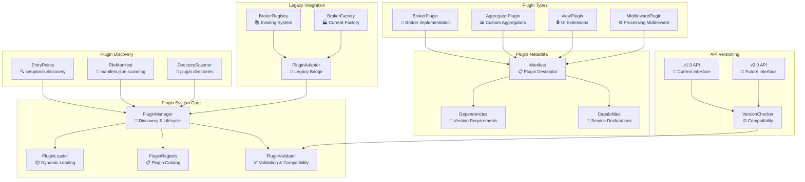

# Plugin Architecture Evolution Plan

## Executive Summary

This document outlines a comprehensive plan to evolve the current broker architecture from a static registry-based system to a dynamic plugin architecture. The goal is to create a truly extensible system where brokers can be developed, distributed, and deployed independently while maintaining type safety and backward compatibility.

## Current Architecture Analysis

### Strengths

- ✅ **Unified Registry**: Central registry for broker management
- ✅ **Factory Pattern**: Consistent broker creation with dependency injection
- ✅ **Interface Contracts**: Type-safe service interfaces
- ✅ **3-Layer Architecture**: Clear separation of concerns (client/services/repositories)
- ✅ **Configuration-Driven**: Declarative broker definitions

### Limitations

- ❌ **Static Discovery**: Hard-coded imports in `registry_setup.py`
- ❌ **Compile-Time Binding**: All brokers must be present at build time
- ❌ **Manual Registration**: New brokers require core code changes
- ❌ **No Isolation**: Brokers share the same process space without boundaries
- ❌ **Version Coupling**: No API versioning for broker compatibility
- ❌ **Distribution Challenges**: Cannot distribute brokers as separate packages

## Proposed Plugin Architecture

### Architecture Overview



## Phase 1: Foundation - Plugin Discovery System

### 1.1 Plugin Metadata Standard

Create a standardized plugin descriptor system:

**`plugin_manifest.json`** (per plugin):

```json
{
  "plugin": {
    "name": "degiro-broker",
    "version": "1.0.0",
    "type": "broker",
    "display_name": "DeGiro Broker Plugin",
    "description": "DeGiro broker integration for Stonks Overwatch",
    "author": "Stonks Overwatch Team",
    "license": "MIT",
    "homepage": "https://github.com/stonks-overwatch/degiro-plugin"
  },
  "api": {
    "min_version": "1.0.0",
    "max_version": "2.0.0",
    "interfaces": [
      "BrokerServiceInterface",
      "PortfolioServiceInterface",
      "TransactionServiceInterface"
    ]
  },
  "dependencies": {
    "python": ">=3.11",
    "stonks-overwatch-core": ">=2.0.0,<3.0.0",
    "degiro-connector": ">=3.0.0"
  },
  "capabilities": {
    "services": [
      "portfolio",
      "transaction",
      "deposit",
      "dividend",
      "fee",
      "account"
    ],
    "features": [
      "real_time_data",
      "historical_data",
      "order_execution"
    ],
    "supported_markets": ["XAMS", "XNYS", "XNAS"],
    "supported_currencies": ["EUR", "USD", "GBP"]
  },
  "configuration": {
    "config_class": "degiro.config.DegiroConfig",
    "required_credentials": [
      "username",
      "password",
      "int_account"
    ],
    "optional_settings": [
      "use_2fa",
      "session_timeout"
    ]
  },
  "services": {
    "portfolio": "degiro.services.PortfolioService",
    "transaction": "degiro.services.TransactionService",
    "deposit": "degiro.services.DepositService",
    "dividend": "degiro.services.DividendService",
    "fee": "degiro.services.FeeService",
    "account": "degiro.services.AccountService"
  },
  "entry_points": {
    "main": "degiro.plugin:DegiroPlugin",
    "config": "degiro.config:DegiroConfig"
  }
}
```

### 1.2 Dynamic Plugin Discovery

**Entry Points Discovery** (using setuptools):

```python
# In plugin's setup.py or pyproject.toml
[project.entry-points."stonks_overwatch.brokers"]
degiro = "degiro_plugin:DegiroPlugin"
bitvavo = "bitvavo_plugin:BitvavoPlugin"
```

**File System Discovery**:

```shell
plugins/
├── degiro-broker/
│   ├── plugin_manifest.json
│   ├── __init__.py
│   ├── config/
│   ├── services/
│   └── client/
├── bitvavo-broker/
│   ├── plugin_manifest.json
│   ├── __init__.py
│   └── ...
└── custom-broker/
    ├── plugin_manifest.json
    └── ...
```

### 1.3 Plugin Manager Core

```python
class PluginManager:
    """Central manager for plugin discovery, loading, and lifecycle management."""

    def __init__(self):
        self.registry = PluginRegistry()
        self.loader = PluginLoader()
        self.validator = PluginValidator()

    def discover_plugins(self) -> List[PluginDescriptor]:
        """Discover all available plugins from multiple sources."""

    def load_plugin(self, plugin_name: str) -> Plugin:
        """Dynamically load a plugin with validation."""

    def unload_plugin(self, plugin_name: str) -> bool:
        """Safely unload a plugin and cleanup resources."""

    def validate_plugin(self, plugin: Plugin) -> ValidationResult:
        """Validate plugin compatibility and requirements."""

    def get_available_plugins(self) -> List[PluginInfo]:
        """Get list of all discoverable plugins."""

    def get_active_plugins(self) -> List[Plugin]:
        """Get list of currently loaded plugins."""
```

## Phase 2: Plugin Lifecycle Management

### 2.1 Plugin States

```python
class PluginState(Enum):
    DISCOVERED = "discovered"     # Found but not loaded
    LOADING = "loading"          # Currently being loaded
    LOADED = "loaded"            # Successfully loaded
    ACTIVE = "active"            # Loaded and providing services
    ERROR = "error"              # Failed to load or runtime error
    DISABLED = "disabled"        # Manually disabled
    UNLOADING = "unloading"      # Currently being unloaded
```

### 2.2 Plugin Lifecycle Events

```python
class PluginLifecycleEvents:
    """Event system for plugin lifecycle management."""

    @event("plugin.before_load")
    def on_before_load(self, plugin: PluginDescriptor):
        """Called before plugin loading starts."""

    @event("plugin.loaded")
    def on_plugin_loaded(self, plugin: Plugin):
        """Called after successful plugin load."""

    @event("plugin.failed")
    def on_plugin_failed(self, plugin: PluginDescriptor, error: Exception):
        """Called when plugin loading fails."""

    @event("plugin.before_unload")
    def on_before_unload(self, plugin: Plugin):
        """Called before plugin unloading."""
```

### 2.3 Plugin Isolation

```python
class PluginSandbox:
    """Provides isolation and resource management for plugins."""

    def __init__(self, plugin: Plugin):
        self.plugin = plugin
        self.resource_tracker = ResourceTracker()
        self.permission_manager = PermissionManager()

    def execute_in_sandbox(self, func: callable, *args, **kwargs):
        """Execute plugin code within controlled environment."""

    def track_resources(self, resource_type: str, resource_id: str):
        """Track plugin resource usage."""

    def cleanup_resources(self):
        """Clean up all plugin resources."""
```

## Phase 3: Enhanced Configuration System

### 3.1 Dynamic Configuration Loading

```python
class DynamicConfigSystem:
    """Enhanced configuration system supporting plugin configs."""

    def load_plugin_config(self, plugin_name: str) -> BaseConfig:
        """Load configuration for a specific plugin."""

    def merge_configurations(self, base: BaseConfig, plugin: PluginConfig) -> BaseConfig:
        """Merge base and plugin-specific configurations."""

    def validate_configuration(self, config: BaseConfig, schema: dict) -> ValidationResult:
        """Validate configuration against plugin schema."""

    def hot_reload_config(self, plugin_name: str, new_config: dict):
        """Hot reload configuration without restarting plugin."""
```

### 3.2 Configuration Schema Validation

```python
# Example plugin configuration schema
DEGIRO_CONFIG_SCHEMA = {
    "type": "object",
    "properties": {
        "credentials": {
            "type": "object",
            "properties": {
                "username": {"type": "string", "minLength": 1},
                "password": {"type": "string", "minLength": 1},
                "int_account": {"type": "integer"}
            },
            "required": ["username", "password", "int_account"]
        },
        "settings": {
            "type": "object",
            "properties": {
                "use_2fa": {"type": "boolean", "default": False},
                "session_timeout": {"type": "integer", "default": 3600}
            }
        }
    },
    "required": ["credentials"]
}
```

## Phase 4: API Versioning & Compatibility

### 4.1 Interface Versioning

```python
class InterfaceVersion:
    """Represents an interface version with compatibility checking."""

    def __init__(self, major: int, minor: int, patch: int):
        self.major = major
        self.minor = minor
        self.patch = patch

    def is_compatible_with(self, other: 'InterfaceVersion') -> bool:
        """Check if this version is compatible with another."""

class VersionedInterface:
    """Base class for versioned interfaces."""

    @property
    def interface_version(self) -> InterfaceVersion:
        """Return the interface version."""

    @classmethod
    def get_supported_versions(cls) -> List[InterfaceVersion]:
        """Return list of supported interface versions."""
```

### 4.2 Backward Compatibility Layer

```python
class CompatibilityAdapter:
    """Adapter for maintaining backward compatibility."""

    def adapt_v1_to_v2(self, v1_service: V1BrokerService) -> V2BrokerService:
        """Adapt v1 service to v2 interface."""

    def adapt_v2_to_v1(self, v2_service: V2BrokerService) -> V1BrokerService:
        """Adapt v2 service to v1 interface (if possible)."""
```

## Phase 5: Plugin Development Framework

### 5.1 Plugin Base Classes

```python
class BaseBrokerPlugin(ABC):
    """Base class for broker plugins."""

    def __init__(self, manifest: PluginManifest):
        self.manifest = manifest
        self.state = PluginState.DISCOVERED

    @abstractmethod
    def initialize(self) -> bool:
        """Initialize the plugin."""

    @abstractmethod
    def shutdown(self) -> bool:
        """Shutdown the plugin and cleanup resources."""

    @abstractmethod
    def get_services(self) -> Dict[ServiceType, Type]:
        """Return available services."""

    @abstractmethod
    def get_config_class(self) -> Type[BaseConfig]:
        """Return configuration class."""

    def health_check(self) -> HealthStatus:
        """Check plugin health status."""

    def get_metrics(self) -> Dict[str, Any]:
        """Return plugin metrics."""
```

### 5.2 Plugin Testing Framework

```python
class PluginTestSuite:
    """Comprehensive testing framework for plugins."""

    def test_plugin_interfaces(self, plugin: BaseBrokerPlugin) -> TestResult:
        """Test all plugin interfaces for compliance."""

    def test_plugin_lifecycle(self, plugin: BaseBrokerPlugin) -> TestResult:
        """Test plugin load/unload cycles."""

    def test_plugin_configuration(self, plugin: BaseBrokerPlugin) -> TestResult:
        """Test plugin configuration validation."""

    def benchmark_plugin_performance(self, plugin: BaseBrokerPlugin) -> BenchmarkResult:
        """Benchmark plugin performance metrics."""
```

## Phase 6: Migration Strategy

### 6.1 Legacy Bridge

```python
class LegacyBrokerAdapter:
    """Adapter to convert existing brokers to plugin format."""

    def __init__(self, broker_config: dict):
        self.broker_config = broker_config

    def create_plugin_manifest(self) -> PluginManifest:
        """Generate plugin manifest from legacy broker config."""

    def wrap_legacy_services(self) -> Dict[ServiceType, Type]:
        """Wrap existing services in plugin interface."""

    def migrate_configuration(self) -> Type[BaseConfig]:
        """Migrate existing configuration to plugin format."""
```

### 6.2 Gradual Migration Plan

1. **Phase 6.1**: Create plugin adapters for existing brokers
2. **Phase 6.2**: Implement plugin discovery alongside existing registry
3. **Phase 6.3**: Convert one broker at a time to plugin format
4. **Phase 6.4**: Deprecate legacy registry system
5. **Phase 6.5**: Remove legacy code and complete migration

## Implementation Benefits

### For Developers

- 🚀 **Faster Development**: Independent broker development and testing
- 🔄 **Hot Reloading**: Update brokers without restarting the application
- 📦 **Distribution**: Distribute brokers as separate packages
- 🧪 **Testing**: Isolated testing environment for each broker
- 📚 **Documentation**: Auto-generated API documentation

### For Users

- 🔌 **Plug & Play**: Easy installation of new brokers
- 🎛️ **Configurability**: Fine-grained control over broker features
- 🔧 **Customization**: Custom broker implementations for specific needs
- 📊 **Monitoring**: Real-time plugin health and performance monitoring
- 🔄 **Updates**: Independent broker updates without core changes

### For the System

- 🏗️ **Scalability**: Better resource isolation and management
- 🛡️ **Stability**: Plugin failures don't crash the entire system
- 🔄 **Maintainability**: Clear separation of concerns
- 🚀 **Performance**: Lazy loading and resource optimization
- 🔒 **Security**: Sandboxed plugin execution

## Risk Mitigation

### Technical Risks

- **Complexity**: Start with simple plugin wrapper around existing code
- **Performance**: Implement caching and lazy loading strategies
- **Compatibility**: Maintain strict API versioning and testing
- **Dependencies**: Use virtual environments and dependency isolation

### Operational Risks

- **Migration**: Gradual migration with fallback to legacy system
- **Testing**: Comprehensive test suite for plugin validation
- **Documentation**: Clear migration guides and examples
- **Support**: Backward compatibility for existing integrations

## Success Metrics

- ✅ **Reduced Core Changes**: 90% reduction in core code changes for new brokers
- ✅ **Development Speed**: 50% faster broker development cycle
- ✅ **System Stability**: 99.9% uptime with plugin isolation
- ✅ **Community Growth**: Enable third-party broker development
- ✅ **Maintenance Cost**: 60% reduction in maintenance overhead

This plugin architecture evolution will transform Stonks Overwatch into a truly extensible platform where the broker ecosystem can grow independently while maintaining the high standards of reliability and performance that users expect.
