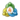

# 📚 Navigation

## Getting Started

- [🏠 Home](Home)
- [🚀 Quickstart](Quickstart)
- [❓ FAQ](FAQ)

## Broker Setup

- [ DEGIRO](DEGIRO)
- [ Bitvavo](Bitvavo)
- [ IBKR](IBKR)
- [ MetaTrader4](MetaTrader4.md)

## User Guides

- [💻 Application](Application)
- [⚙️ Configuration](Configuration-Integration)

## Development

- [👨‍💻 Developer Guide](Developing-Stonks-Overwatch)
- [🏗️ Architecture](ARCHITECTURE)
- [🏦 Broker Integration](ARCHITECTURE_BROKERS)
- [🔐 Authentication](ARCHITECTURE_AUTHENTICATION)
- [🎨 User Interface](User-Interface)

## Advanced

- [📋 Pending Tasks](PENDING_TASKS)
- [🔌 Plugin Architecture](PLUGIN_ARCHITECTURE)

## Contributing

- [🤝 Contributing Guide](../CONTRIBUTING)
- [📜 Code of Conduct](../CODE_OF_CONDUCT)

---

[⭐ Star on GitHub](https://github.com/ctasada/stonks-overwatch)
